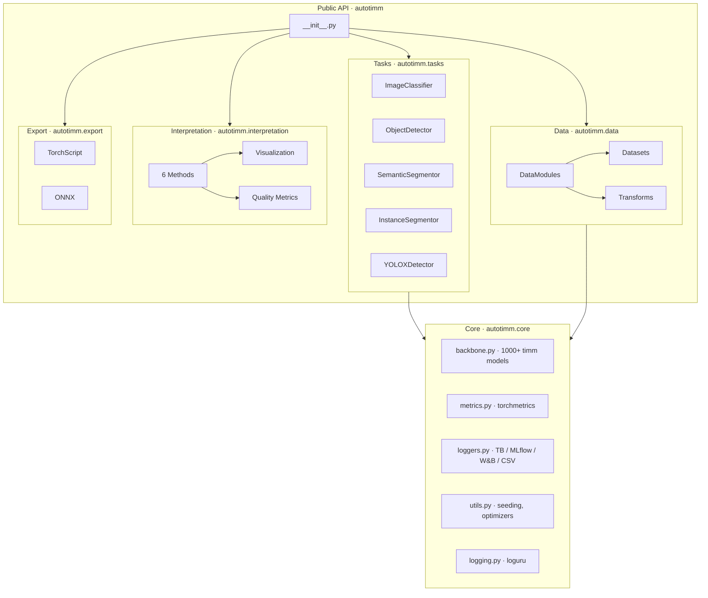

<div align="center">

<br>


<br>

### Train state-of-the-art vision models with minimal code.

Production-ready computer vision framework powered by
[timm](https://github.com/huggingface/pytorch-image-models) and [PyTorch Lightning](https://github.com/Lightning-AI/pytorch-lightning).

<br>

[](https://pypi.org/project/autotimm/)
[](LICENSE)
[](../../stargazers)
[](../../issues)
[](../../pulls)
[](../../commits)

<br>


<br>

[](https://github.com/huggingface/pytorch-image-models)
[](https://huggingface.co)
[](https://github.com/Lightning-AI/torchmetrics)

<br>

[Overview](#overview) · [Features](#features) · [Quick Start](#quick-start) · [Tasks](#task-examples) · [Architecture](#architecture) · [Docs](#documentation--examples) · [Contributing](#contributing) · [License](#license)

<br>

</div>

<!-- ------------------------------------------------------------------ -->

## Overview

**AutoTimm** is a **production-ready** computer vision framework that combines [timm](https://github.com/huggingface/pytorch-image-models) (1000+ pretrained models) with [PyTorch Lightning](https://github.com/Lightning-AI/pytorch-lightning). Train image classifiers, object detectors, and segmentation models with any timm backbone using a simple, intuitive API.

Whether you're training an image classifier, an object detector, or a segmentation model, AutoTimm handles:

- **Automated model training** with auto-tuning of learning rate and batch size
- **4 vision tasks** — classification (single & multi-label), object detection, semantic & instance segmentation
- **1000+ backbones** — ResNet, EfficientNet, ViT, ConvNeXt, Swin, and more via timm + HuggingFace Hub
- **Model interpretation** — GradCAM, Integrated Gradients, Attention Rollout, and more
- **Production export** — TorchScript and ONNX for deployment anywhere

> **From prototype to production in minutes, not hours.**

---

## How It Compares

| | Manual PyTorch | AutoTimm |
| :--- | :---: | :---: |
| **Boilerplate** | Hundreds of lines per task | 5–10 lines for any task |
| **Backbone variety** | Wire up manually | 1000+ backbones, swap with one arg |
| **Auto-tuning** | Implement yourself | LR + batch size finding built-in |
| **Experiment tracking** | External tooling needed | Multi-logger (TensorBoard, MLflow, W&B, CSV) |
| **Reproducibility** | Manual seed management | Opt-in deterministic mode (`seed=42`) |
| **Model export** | Custom export scripts | One-line TorchScript & ONNX |
| **Interpretation** | Separate libraries | 6 methods + metrics built-in |

---

## Features

<table>
<tr>
<td width="50%" valign="top">

### Vision Tasks

- **Image Classification** — single-label and multi-label with any timm backbone
- **Object Detection** — FCOS and YOLOX architectures (official + custom)
- **Semantic Segmentation** — DeepLabV3+ and FCN with combined losses
- **Instance Segmentation** — FCOS + Mask R-CNN style mask head

</td>
<td width="50%" valign="top">

### Smart Training

- **Auto-tuning** — automatic LR and batch size discovery
- **torch.compile** — PyTorch 2.0+ optimization enabled by default
- **Reproducibility** — deterministic seeding across Python, NumPy, PyTorch
- **Mixed precision** — 16-bit and bf16 training out of the box
- **Multi-GPU** — distributed training with zero config

</td>
</tr>
<tr>
<td width="50%" valign="top">

### Interpretation & Export

- **6 explanation methods** — GradCAM, GradCAM++, Integrated Gradients, SmoothGrad, Attention Rollout, Attention Flow
- **6 quality metrics** — faithfulness, sensitivity, localization, sanity checks
- **Interactive visualizations** — Plotly-powered HTML reports
- **Model export** — TorchScript (.pt) and ONNX (.onnx) for production

</td>
<td width="50%" valign="top">

### Data & Integration

- **Flexible data loading** — folder structure, COCO JSON, CSV, HuggingFace datasets
- **Smart transforms** — AI-powered backend selection, unified TransformConfig
- **HuggingFace Hub** — load models with `hf-hub:` prefix
- **Multi-logger** — TensorBoard, MLflow, W&B, CSV simultaneously
- **CLI** — YAML-driven training from the command line

</td>
</tr>
</table>

<table>
<tr>
<td width="100%" align="center">

### Who Is It For?

**Researchers** needing reproducible experiments · **Engineers** building production ML systems ·
**Students** learning computer vision · **Startups** rapidly prototyping vision applications

</td>
</tr>
</table>

---

## Quick Start

### Installation

```bash
pip install autotimm
```

**Everything included:** PyTorch, timm, PyTorch Lightning, torchmetrics, albumentations, and more.

<details>
<summary><b>Optional extras</b></summary>

```bash
pip install autotimm[tensorboard]  # TensorBoard
pip install autotimm[wandb]        # Weights & Biases
pip install autotimm[mlflow]       # MLflow
pip install autotimm[onnx]         # ONNX export (onnx + onnxruntime + onnxscript)
pip install autotimm[all]          # Everything
```

</details>

### Your First Model

```python
import autotimm as at  # recommended alias
from autotimm import AutoTrainer, ImageClassifier, ImageDataModule, MetricConfig

# Data
data = ImageDataModule(
    data_dir="./data",
    dataset_name="CIFAR10",
    image_size=224,
    batch_size=64,
)

# Metrics
metrics = [
    MetricConfig(
        name="accuracy",
        backend="torchmetrics",
        metric_class="Accuracy",
        params={"task": "multiclass"},
        stages=["train", "val", "test"],
        prog_bar=True,
    )
]

# Model — try efficientnet_b0, vit_base_patch16_224, hf-hub:timm/resnet50.a1_in1k, etc.
model = ImageClassifier(backbone="resnet18", num_classes=10, metrics=metrics, lr=1e-3)

# Train with auto-tuning (finds optimal LR and batch size automatically)
trainer = AutoTrainer(max_epochs=10)
trainer.fit(model, datamodule=data)
```

> **Auto-tuning is enabled by default.** Disable with `tuner_config=False` for manual control.

### Command-Line Interface

Train from YAML configs — no Python scripts needed:

```bash
autotimm fit --config config.yaml
autotimm test --config config.yaml --ckpt_path best.ckpt
```

```yaml
model:
  class_path: autotimm.ImageClassifier
  init_args:
    backbone: resnet18
    num_classes: 10

data:
  class_path: autotimm.ImageDataModule
  init_args:
    dataset_name: CIFAR10
    data_dir: ./data
    batch_size: 32
    image_size: 224

trainer:
  max_epochs: 10
  accelerator: auto
```

---

## Task Examples

### Image Classification

```python
from autotimm import ImageClassifier

model = ImageClassifier(
    backbone="efficientnet_b0",  # or "hf-hub:timm/resnet50.a1_in1k"
    num_classes=10,
    metrics=metrics,
)

trainer = AutoTrainer(max_epochs=10)
trainer.fit(model, datamodule=data)
```

### Object Detection with YOLOX

```python
from autotimm import YOLOXDetector, DetectionDataModule

model = YOLOXDetector(
    model_name="yolox-s",  # nano, tiny, s, m, l, x
    num_classes=80,
    lr=0.01,
    optimizer="sgd",
    scheduler="yolox",
    total_epochs=300,
)

trainer = AutoTrainer(max_epochs=300, precision="16-mixed")
trainer.fit(model, datamodule=DetectionDataModule(data_dir="./coco", image_size=640))
```

### Semantic Segmentation

```python
from autotimm import SemanticSegmentor, SegmentationDataModule

model = SemanticSegmentor(
    backbone="resnet50",
    num_classes=19,
    head_type="deeplabv3plus",
    loss_type="combined",  # CE + Dice for better boundaries
)

data = SegmentationDataModule(data_dir="./cityscapes", format="cityscapes", image_size=512)

trainer = AutoTrainer(max_epochs=100)
trainer.fit(model, datamodule=data)
```

### Instance Segmentation

```python
from autotimm import InstanceSegmentor, InstanceSegmentationDataModule

model = InstanceSegmentor(backbone="resnet50", num_classes=80, mask_loss_weight=1.0)

trainer = AutoTrainer(max_epochs=100)
trainer.fit(model, datamodule=InstanceSegmentationDataModule(data_dir="./coco"))
```

### Multi-Label Classification

```python
from autotimm import ImageClassifier, MultiLabelImageDataModule, MetricConfig

data = MultiLabelImageDataModule(
    train_csv="train.csv", image_dir="./images", val_csv="val.csv",
    image_size=224, batch_size=32,
)
data.setup("fit")

model = ImageClassifier(
    backbone="resnet50",
    num_classes=data.num_labels,
    multi_label=True,
    threshold=0.5,
    metrics=[MetricConfig(
        name="accuracy", backend="torchmetrics", metric_class="MultilabelAccuracy",
        params={"num_labels": data.num_labels}, stages=["train", "val"], prog_bar=True,
    )],
)

trainer = AutoTrainer(max_epochs=10)
trainer.fit(model, datamodule=data)
```

---

## Model Interpretation

```python
from autotimm.interpretation import (
    GradCAM, GradCAMPlusPlus, IntegratedGradients,
    SmoothGrad, AttentionRollout, AttentionFlow,
    ExplanationMetrics, InteractiveVisualizer,
)

# Explain a prediction
explainer = GradCAM(model)
heatmap = explainer.explain(image, target_class=5)
explainer.visualize(image, heatmap, save_path="gradcam.png")

# Quantitative evaluation
metrics = ExplanationMetrics(model, explainer)
deletion = metrics.deletion(image, target_class=5, steps=50)
insertion = metrics.insertion(image, target_class=5, steps=50)

# Interactive comparison
viz = InteractiveVisualizer(model)
viz.compare_methods(image, {
    'GradCAM': GradCAM(model),
    'IntegratedGradients': IntegratedGradients(model),
}, save_path="comparison.html")
```

---

## Model Export

```python
from autotimm import ImageClassifier, export_to_torchscript, export_to_onnx
import torch

model = ImageClassifier.load_from_checkpoint("model.ckpt")
example_input = torch.randn(1, 3, 224, 224)

# TorchScript
export_to_torchscript(model, "model.pt", example_input=example_input)

# ONNX
export_to_onnx(model, "model.onnx", example_input=example_input)
```

| Format | Use Case | Runtimes |
| :--- | :--- | :--- |
| **TorchScript** | PyTorch ecosystem, C++, mobile | LibTorch, PyTorch Mobile |
| **ONNX** | Cross-platform, hardware-optimized | ONNX Runtime, TensorRT, OpenVINO, CoreML |

---

## Architecture



<details>
<summary><b>Package Structure</b></summary>
<br>

| Module | Purpose |
| :--- | :--- |
| `autotimm` | Public API — all exports via `__init__.py` |
| `autotimm.core` | Backbone factory, metrics, loggers, logging, utilities |
| `autotimm.tasks` | Task models (LightningModule subclasses) |
| `autotimm.data` | DataModules, datasets, and transform pipelines |
| `autotimm.heads` | Task-specific prediction heads (Classification, Detection, FPN, DeepLabV3+, Mask, YOLOX) |
| `autotimm.losses` | Loss functions and registry (Focal, GIoU, Dice, Tversky, etc.) |
| `autotimm.models` | YOLOX-specific components (CSPDarknet, PAFPN) |
| `autotimm.interpretation` | Explanation methods, metrics, visualization, callbacks |
| `autotimm.export` | TorchScript and ONNX export utilities + CLIs |
| `autotimm.training` | AutoTrainer wrapper with auto-tuning |
| `autotimm.cli` | Command-line interface (fit/test/validate + interpretation CLI) |
| `autotimm.callbacks` | JSON progress callback for frontend integration |

</details>

---

## Documentation & Examples

| Section | Description |
| :--- | :--- |
| [Quick Start](https://theja-vanka.github.io/AutoTimm/getting-started/quickstart/) | Get up and running in 5 minutes |
| [User Guide](https://theja-vanka.github.io/AutoTimm/user-guide/data-loading/) | In-depth guides for all features |
| [Interpretation Guide](https://theja-vanka.github.io/AutoTimm/user-guide/interpretation/) | Model explainability and visualization |
| [YOLOX Guide](https://theja-vanka.github.io/AutoTimm/user-guide/models/yolox-detector/) | Complete YOLOX implementation guide |
| [CLI Guide](https://theja-vanka.github.io/AutoTimm/user-guide/training/cli/) | Train from YAML configs on the command line |
| [API Reference](https://theja-vanka.github.io/AutoTimm/api/) | Complete API documentation |
| [Examples](https://theja-vanka.github.io/AutoTimm/examples/) | 50+ runnable code examples |

<details>
<summary><b>Ready-to-Run Examples</b></summary>
<br>

**Getting Started** — [classify_cifar10.py](examples/getting_started/classify_cifar10.py) · [classify_custom_folder.py](examples/getting_started/classify_custom_folder.py) · [vit_finetuning.py](examples/getting_started/vit_finetuning.py)

**Computer Vision** — [yolox_official.py](examples/computer_vision/yolox_official.py) · [object_detection_yolox.py](examples/computer_vision/object_detection_yolox.py) · [semantic_segmentation.py](examples/computer_vision/semantic_segmentation.py) · [instance_segmentation.py](examples/computer_vision/instance_segmentation.py)

**HuggingFace Hub** — [huggingface_hub_models.py](examples/huggingface/huggingface_hub_models.py) · [hf_interpretation.py](examples/huggingface/hf_interpretation.py) · [hf_transfer_learning.py](examples/huggingface/hf_transfer_learning.py) · [hf_ensemble.py](examples/huggingface/hf_ensemble.py) · [hf_deployment.py](examples/huggingface/hf_deployment.py)

**Data & Training** — [csv_classification.py](examples/data_training/csv_classification.py) · [csv_detection.py](examples/data_training/csv_detection.py) · [multilabel_classification.py](examples/data_training/multilabel_classification.py) · [multi_gpu_training.py](examples/data_training/multi_gpu_training.py)

**Interpretation** — [interpretation_demo.py](examples/interpretation/interpretation_demo.py) · [interpretation_metrics_demo.py](examples/interpretation/interpretation_metrics_demo.py) · [interactive_visualization_demo.py](examples/interpretation/interactive_visualization_demo.py)

**CLI Configs** — [classification.yaml](examples/cli/classification.yaml) · [detection.yaml](examples/cli/detection.yaml) · [segmentation.yaml](examples/cli/segmentation.yaml)

[Browse all examples](https://theja-vanka.github.io/AutoTimm/examples/)

</details>

---

## Testing

```bash
# Run all tests
pytest tests/ -v

# Specific modules
pytest tests/test_classification.py
pytest tests/test_yolox.py
pytest tests/test_interpretation.py

# With coverage
pytest tests/ --cov=autotimm --cov-report=html
```

---

## Contributing

Contributions, issues, and feature requests are welcome! See the [issues page](../../issues) to get started.

1. **Fork** the repository
2. **Create** a feature branch — `git checkout -b feat/your-feature`
3. **Commit** your changes — `git commit -m 'feat: add your feature'`
4. **Push** to the branch — `git push origin feat/your-feature`
5. **Open** a Pull Request

```bash
git clone https://github.com/theja-vanka/AutoTimm.git && cd AutoTimm
pip install -e ".[dev,all]"
pytest tests/ -v
```

---

## Citation

```bibtex
@software{autotimm,
  author = {Krishnatheja Vanka},
  title = {AutoTimm: Automatic PyTorch Image Models},
  url = {https://github.com/theja-vanka/AutoTimm},
  year = {2026},
}
```

---

## License

Distributed under the **Apache License 2.0**. See [`LICENSE`](LICENSE) for details.

---

<div align="center">
<br>

**Built with care by [Krishnatheja Vanka](https://github.com/theja-vanka)**

If AutoTimm saves you time, consider giving it a &#11088;

<br>

<a href="https://www.buymeacoffee.com/theja.vanka" target="_blank"></a>

<br>
</div>
