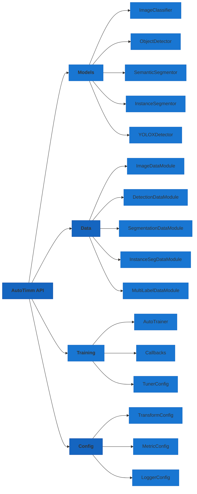

# API Reference

This section provides detailed API documentation for all AutoTimm classes and functions.

## API Organization



## Core Classes

### Task Models

| Class | Description |
|-------|-------------|
| [ImageClassifier](classifier.md) | End-to-end image classifier with timm backbone |
| [ObjectDetector](detection.md) | FCOS-style anchor-free object detector |
| [SemanticSegmentor](segmentation.md#semanticsegmentor) | DeepLabV3+ / FCN semantic segmentation |
| [InstanceSegmentor](segmentation.md#instancesegmentor) | Mask R-CNN style instance segmentation |

### Data Modules

| Class | Description |
|-------|-------------|
| [ImageDataModule](data.md) | Image classification (folder/built-in/CSV) |
| [MultiLabelImageDataModule](multilabel_data.md) | Multi-label classification from CSV |
| [DetectionDataModule](detection_data.md) | Object detection (COCO/CSV) |
| [SegmentationDataModule](segmentation.md#segmentationdatamodule) | Semantic segmentation |
| [InstanceSegmentationDataModule](segmentation.md#instancesegmentationdatamodule) | Instance segmentation (COCO/CSV) |

### CSV Datasets

For direct CSV dataset usage without DataModules, see [CSV Data Loading API](csv_data.md):

| Dataset | Task | Description |
|---------|------|-------------|
| [CSVImageDataset](csv_data.md#csvimagedataset) | Classification | Single-label from CSV |
| [MultiLabelImageDataset](csv_data.md#multilabelimagedataset) | Multi-Label | Multi-label from CSV |
| [CSVDetectionDataset](csv_data.md#csvdetectiondataset) | Detection | Bounding boxes from CSV |
| [CSVInstanceDataset](csv_data.md#csvinstancedataset) | Instance Seg | Masks from CSV |

### Training

| Class | Description |
|-------|-------------|
| [AutoTrainer](trainer.md) | Configured PyTorch Lightning Trainer |

## Configuration Classes

| Class | Description |
|-------|-------------|
| [BackboneConfig](backbone.md#autotimm.BackboneConfig) | Timm backbone configuration |
| [FeatureBackboneConfig](backbone.md#featurebackboneconfig) | Feature extraction backbone configuration |
| [TransformConfig](transforms.md) | Unified transform configuration for models and data |
| [MetricConfig](metrics.md#autotimm.MetricConfig) | Single metric configuration |
| [MetricManager](metrics.md#autotimm.MetricManager) | Multiple metrics manager |
| [LoggingConfig](metrics.md#autotimm.LoggingConfig) | Enhanced logging options |
| [LoggerConfig](loggers.md#autotimm.LoggerConfig) | Logger backend configuration |
| [LoggerManager](loggers.md#autotimm.LoggerManager) | Multiple loggers manager |
| [TunerConfig](trainer.md#autotimm.TunerConfig) | Auto-tuning configuration |

## Manager Classes API

`MetricManager` and `LoggerManager` share a consistent interface:

| Method | MetricManager | LoggerManager |
|--------|---------------|---------------|
| `len(manager)` | Number of configs | Number of loggers |
| `iter(manager)` | Iterate over configs | Iterate over loggers |
| `manager[i]` | Get config by index | Get logger by index |
| `manager.configs` | List of MetricConfig | List of LoggerConfig |
| Get by name | `get_metric_by_name(name)` | `get_logger_by_backend(name)` |
| Get config | `get_config_by_name(name)` | - |

## Heads

| Head | Description |
|------|-------------|
| [ClassificationHead](heads.md#classificationhead) | Simple classification head with dropout |
| [DetectionHead](heads.md#detectionhead) | FCOS-style detection head (cls, bbox, centerness) |
| [DeepLabV3PlusHead](segmentation.md#deeplabv3plushead) | DeepLabV3+ head with ASPP and decoder |
| [FCNHead](segmentation.md#fcnhead) | Fully Convolutional Network head |
| [MaskHead](segmentation.md#maskhead) | Mask prediction head for instance segmentation |
| [FPN](heads.md#fpn) | Feature Pyramid Network for multi-scale features |
| [ASPP](segmentation.md#aspp) | Atrous Spatial Pyramid Pooling module |

## Loss Functions

### Detection Losses

| Loss | Description |
|------|-------------|
| [FocalLoss](losses.md#focalloss) | Focal loss for addressing class imbalance |
| [GIoULoss](losses.md#giouloss) | Generalized IoU loss for bounding box regression |
| [CenternessLoss](losses.md#centernessloss) | Binary cross-entropy for centerness prediction |
| [FCOSLoss](losses.md#fcosloss) | Combined FCOS detection loss |

### Segmentation Losses

| Loss | Description |
|------|-------------|
| [DiceLoss](segmentation.md#diceloss) | Dice loss for handling class imbalance in segmentation |
| [FocalLossPixelwise](segmentation.md#focallosspixelwise) | Pixel-wise focal loss for segmentation |
| [TverskyLoss](segmentation.md#tverskyloss) | Generalized Dice with FP/FN control |
| [MaskLoss](segmentation.md#maskloss) | Binary cross-entropy for instance masks |
| [CombinedSegmentationLoss](segmentation.md#combinedsegmentationloss) | Combined CE + Dice loss |

## Logging

| Symbol | Description |
|--------|-------------|
| [logger](utils.md#logger) | Shared loguru logger instance for the entire library |
| [log_table](utils.md#log_table) | Log a formatted ASCII table via loguru |

## Utility Functions

| Function | Description |
|----------|-------------|
| [create_backbone](backbone.md#autotimm.create_backbone) | Create a headless timm model |
| [create_feature_backbone](backbone.md#create_feature_backbone) | Create a feature extraction backbone |
| [list_backbones](backbone.md#autotimm.list_backbones) | Search available timm models |
| [get_feature_info](backbone.md#get_feature_info) | Get feature information from backbone |
| [get_feature_channels](backbone.md#get_feature_channels) | Extract feature channels for each level |
| [get_feature_strides](backbone.md#get_feature_strides) | Get stride information for FPN construction |
| [resolve_backbone_data_config](transforms.md#resolve_backbone_data_config) | Get model-specific preprocessing config |
| [get_transforms_from_backbone](transforms.md#get_transforms_from_backbone) | Create transforms with model normalization |
| [create_inference_transform](transforms.md#create_inference_transform) | Create simple inference transforms |
| [seed_everything](utils.md#seed_everything) | Set random seeds for reproducibility |
| [count_parameters](utils.md#autotimm.count_parameters) | Count model parameters |
| [list_optimizers](utils.md#autotimm.list_optimizers) | List available optimizers |
| [list_schedulers](utils.md#autotimm.list_schedulers) | List available schedulers |

## Quick Links

### Image Classification

```python
from autotimm import (
    AutoTrainer,
    ImageClassifier,
    ImageDataModule,
    MetricConfig,
    MetricManager,
    TransformConfig,  # For preprocessing
)
```

### Object Detection

```python
from autotimm import (
    AutoTrainer,
    ObjectDetector,
    DetectionDataModule,
    FeatureBackboneConfig,
    MetricConfig,
)
```

### Semantic Segmentation

```python
from autotimm import (
    AutoTrainer,
    SemanticSegmentor,
    SegmentationDataModule,
    MetricConfig,
)

# Using import aliases
from autotimm.task import SemanticSegmentor
from autotimm.loss import DiceLoss, CombinedSegmentationLoss
from autotimm.head import DeepLabV3PlusHead, FCNHead
```

### Instance Segmentation

```python
from autotimm import (
    AutoTrainer,
    InstanceSegmentor,
    InstanceSegmentationDataModule,
    MetricConfig,
)

# Using import aliases
from autotimm.task import InstanceSegmentor
from autotimm.loss import MaskLoss
from autotimm.head import MaskHead
```

### With Logging

```python
from autotimm import (
    LoggerConfig,
    LoggerManager,
    LoggingConfig,
)
```

### With Auto-Tuning

```python
from autotimm import TunerConfig
```

### Backbone Utilities

```python
from autotimm import (
    BackboneConfig,
    FeatureBackboneConfig,
    create_backbone,
    create_feature_backbone,
    get_feature_channels,
    get_feature_info,
    get_feature_strides,
    list_backbones,
)
```

### Logging

```python
from autotimm import logger
from autotimm.logging import logger, log_table
```

### Utilities

```python
from autotimm import (
    count_parameters,
    list_optimizers,
    list_schedulers,
)
```

## Module Structure

```
autotimm/
├── __init__.py                # Public API exports
├── backbone.py                # BackboneConfig, FeatureBackboneConfig, create_backbone,
│                              # create_feature_backbone, get_feature_*, list_backbones
├── data/
│   ├── datamodule.py          # ImageDataModule
│   ├── dataset.py             # ImageFolderCV2
│   ├── transforms.py          # Transform presets
│   ├── transform_config.py    # TransformConfig
│   ├── timm_transforms.py     # Model-specific transforms
│   ├── detection_datamodule.py # DetectionDataModule
│   ├── detection_dataset.py   # DetectionDataset
│   ├── detection_transforms.py # Detection augmentations
│   ├── segmentation_dataset.py # SemanticSegmentationDataset
│   ├── segmentation_datamodule.py # SegmentationDataModule
│   ├── instance_dataset.py    # COCOInstanceDataset
│   ├── instance_datamodule.py # InstanceSegmentationDataModule
│   └── segmentation_transforms.py # Segmentation augmentations
├── heads.py                   # ClassificationHead, DetectionHead, FPN
│                              # DeepLabV3PlusHead, FCNHead, MaskHead, ASPP
├── loggers.py                 # LoggerConfig, LoggerManager
├── losses/
│   ├── detection.py           # FocalLoss, GIoULoss, CenternessLoss, FCOSLoss
│   └── segmentation.py        # DiceLoss, FocalLossPixelwise, TverskyLoss,
│                              # MaskLoss, CombinedSegmentationLoss
├── metrics.py                 # MetricConfig, MetricManager, LoggingConfig
├── tasks/
│   ├── classification.py      # ImageClassifier
│   ├── object_detection.py    # ObjectDetector
│   ├── semantic_segmentation.py # SemanticSegmentor
│   ├── instance_segmentation.py # InstanceSegmentor
│   └── preprocessing_mixin.py # PreprocessingMixin
├── logging.py                 # Central loguru-based logger, log_table
├── trainer.py                 # AutoTrainer, TunerConfig
└── utils.py                   # Utility functions
```
