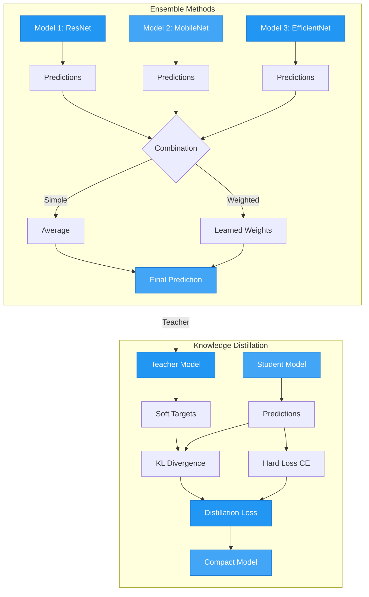

# Model Ensemble & Knowledge Distillation

Combine multiple models and distill knowledge into compact students for production deployment.

## Ensemble & Distillation Architecture



## Overview

Learn how to create model ensembles for improved accuracy and use knowledge distillation to compress large models into efficient students while retaining performance.

## What This Example Covers

- **Simple averaging ensemble** - Quick accuracy boost
- **Weighted ensemble** - Learned combination weights
- **Knowledge distillation** - Teacher-student training
- **Multi-objective trade-offs** - Accuracy vs speed
- **Production deployment** - Choosing the right approach

## Ensemble Methods

### Simple Averaging

```python
from autotimm import ImageClassifier

# Create diverse models
models = [
    ImageClassifier(backbone="hf-hub:timm/resnet18.a1_in1k", num_classes=10),
    ImageClassifier(backbone="hf-hub:timm/mobilenetv3_small_100.lamb_in1k", num_classes=10),
    ImageClassifier(backbone="hf-hub:timm/efficientnet_b0.ra_in1k", num_classes=10),
]

# Average predictions
outputs = [model(image) for model in models]
ensemble_output = torch.stack(outputs).mean(dim=0)
```

**Benefits**:
- 2-3% accuracy improvement
- No training required
- Works best with diverse architectures

### Weighted Ensemble

```python
class WeightedEnsemble(nn.Module):
    def __init__(self, models, num_classes):
        super().__init__()
        self.models = nn.ModuleList(models)
        self.weights = nn.Parameter(torch.ones(len(models)) / len(models))

    def forward(self, x):
        predictions = [model(x) for model in self.models]
        normalized_weights = F.softmax(self.weights, dim=0)
        return sum(w * pred for w, pred in zip(normalized_weights, predictions))
```

**Benefits**:
- 2.5-4% accuracy improvement
- Learns optimal combination
- Minimal training (weights only)

## Knowledge Distillation

### Basic Distillation

```python
class DistillationLoss(nn.Module):
    def __init__(self, alpha=0.5, temperature=3.0):
        super().__init__()
        self.alpha = alpha
        self.temperature = temperature

    def forward(self, student_logits, teacher_logits, labels):
        # Hard target loss
        hard_loss = F.cross_entropy(student_logits, labels)

        # Soft target loss
        student_soft = F.log_softmax(student_logits / self.temperature, dim=1)
        teacher_soft = F.softmax(teacher_logits / self.temperature, dim=1)
        soft_loss = F.kl_div(student_soft, teacher_soft, reduction='batchmean')
        soft_loss *= (self.temperature ** 2)

        return self.alpha * soft_loss + (1 - self.alpha) * hard_loss

# Training
teacher = ImageClassifier(backbone="hf-hub:timm/resnet50.a1_in1k", num_classes=10)
student = ImageClassifier(backbone="hf-hub:timm/mobilenetv3_small_100.lamb_in1k", num_classes=10)

distill_loss = DistillationLoss(alpha=0.7, temperature=3.0)

for images, labels in train_loader:
    with torch.no_grad():
        teacher_logits = teacher(images)

    student_logits = student(images)
    loss = distill_loss(student_logits, teacher_logits, labels)
```

## Run the Example

```bash
python examples/huggingface/hf_ensemble.py
```

## Comparison Table

| Method | Accuracy Gain | Inference Time | Memory | Training Cost |
|--------|---------------|----------------|---------|---------------|
| Simple Ensemble | +2-3% | N × single | N × single | Low |
| Weighted Ensemble | +2.5-4% | N × single | N × single | Low |
| Knowledge Distillation | +1-2% | 1 × student | 1 × student | High |

## Decision Guide

### Use Simple Ensemble When:
- Inference time is not critical
- You have multiple trained models
- Want quick accuracy boost
- Offline/batch processing

### Use Weighted Ensemble When:
- Have validation set to optimize weights
- Models have varying quality
- Can afford weight optimization
- Need better than simple averaging

### Use Knowledge Distillation When:
- Need fast inference (production/edge)
- Have limited memory budget
- Can afford training time
- Have strong teacher model

### Hybrid Approach:
1. Train ensemble as teacher
2. Distill into single student
3. Best of both worlds!

## Hyperparameters

### Temperature (T)
- **T=1**: No distillation (hard targets only)
- **T=3-5**: Typical range for vision
- **T=10+**: Very soft, more regularization
- Higher T for larger teacher-student gap

### Alpha (α)
- **α=0.5**: Equal weight to hard and soft
- **α=0.7-0.9**: Emphasize soft targets (typical)
- **α=0.1-0.3**: Emphasize hard targets
- Higher α when teacher is very strong

### Student Size
- **0.1-0.3x teacher**: Typical compression
- Too small → Limited capacity
- Too large → Defeats purpose

## Typical Results

```
Teacher (ResNet-50):        91% accuracy
Student from scratch:       85% accuracy
Student with distillation:  88% accuracy  (+3%)
Compression ratio:          10x smaller, 10x faster
```

## Best Practices

1. **Ensemble diversity**: Use different architectures (ResNet + EfficientNet + ViT)
2. **Temperature tuning**: Start with T=3, adjust based on results
3. **Student capacity**: 10-30% of teacher size works well
4. **Training duration**: Train student 2-3x longer than normal
5. **Monitor metrics**: Track both accuracy and inference speed

## Related Examples

- [HuggingFace Hub Models](huggingface-hub.md)
- [Model Deployment](hf_deployment.md)
- [Hyperparameter Tuning](../utilities/hf_hyperparameter_tuning.md)
