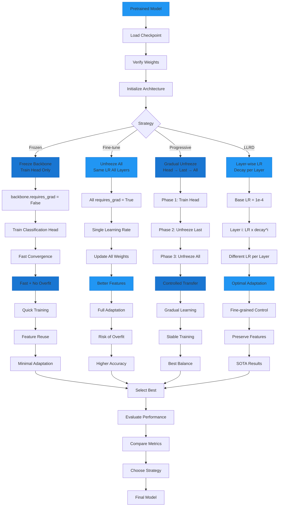

# Advanced Transfer Learning with HuggingFace Hub Models

Master transfer learning strategies for optimal performance with pretrained models from HuggingFace Hub.

## Transfer Learning Strategies



## Overview

This example demonstrates sophisticated transfer learning techniques including progressive unfreezing, layer-wise learning rate decay (LLRD), and discriminative fine-tuning for achieving state-of-the-art results.

## What This Example Covers

- **Pretraining dataset comparison** - IN1k vs IN21k vs IN22k
- **Progressive unfreezing** - Gradually unfreeze layers
- **Layer-wise LR decay (LLRD)** - Different learning rates per layer
- **Discriminative fine-tuning** - Optimization strategies
- **Two-phase training** - Frozen → unfrozen backbone

## Key Concepts

### Pretraining Datasets

- **ImageNet-1k (IN1k)** - 1.28M images, 1k classes - fast baseline
- **ImageNet-21k (IN21k)** - 14M images, 21k classes - better transfer
- **ImageNet-22k (IN22k)** - 14M images, 22k classes - fine-grained features
- **Semi-supervised** - 940M images - robust features

### Transfer Learning Strategies

1. **Frozen backbone** - Only train head (fast, prevents overfitting)
2. **Standard fine-tuning** - Unfreeze all, same LR everywhere
3. **Progressive unfreezing** - Gradually unfreeze layers
4. **LLRD** - Earlier layers get smaller learning rates

## Example Code

### Basic Two-Phase Training

```python
from autotimm import ImageClassifier, ImageDataModule, AutoTrainer

# Phase 1: Train head with frozen backbone
model = ImageClassifier(
    backbone="hf-hub:timm/resnet50.a1_in1k",
    num_classes=10,
    freeze_backbone=True,
)

trainer = AutoTrainer(max_epochs=5)
trainer.fit(model, datamodule=data)

# Phase 2: Unfreeze and fine-tune
model.unfreeze_backbone()
trainer = AutoTrainer(max_epochs=10)
trainer.fit(model, datamodule=data)
```

### Layer-wise Learning Rate Decay

```python
def get_layer_wise_lr_groups(model, base_lr=1e-3, decay_factor=0.8):
    """Create parameter groups with decaying learning rates."""
    layer_groups = [
        (["head"], 1.0),                    # Head gets base_lr
        (["backbone.layer4"], decay_factor),
        (["backbone.layer3"], decay_factor**2),
        (["backbone.layer2"], decay_factor**3),
        (["backbone.layer1"], decay_factor**4),
    ]

    param_groups = []
    for layer_names, lr_mult in layer_groups:
        params = [p for n, p in model.named_parameters()
                  if any(l in n for l in layer_names)]
        param_groups.append({"params": params, "lr": base_lr * lr_mult})

    return param_groups

# Use with optimizer
param_groups = get_layer_wise_lr_groups(model, base_lr=1e-3, decay_factor=0.8)
optimizer = torch.optim.AdamW(param_groups, weight_decay=0.01)
```

### Progressive Unfreezing

```python
# Stage 1: Head only (5 epochs)
model = ImageClassifier(backbone="hf-hub:timm/resnet50.a1_in1k", num_classes=10, freeze_backbone=True)
trainer.fit(model, max_epochs=5)

# Stage 2: Unfreeze layer4 (3 epochs)
for name, param in model.named_parameters():
    if "layer4" in name or "head" in name:
        param.requires_grad = True
trainer.fit(model, max_epochs=3)

# Stage 3: Unfreeze layer3 (3 epochs)
for name, param in model.named_parameters():
    if "layer3" in name or "layer4" in name or "head" in name:
        param.requires_grad = True
trainer.fit(model, max_epochs=3)

# Stage 4: Unfreeze all (5 epochs)
model.unfreeze_backbone()
trainer.fit(model, max_epochs=5)
```

## Run the Example

```bash
python examples/huggingface/hf_transfer_learning.py
```

## Decision Guide

### By Dataset Size

- **Small (<10k images)**: Frozen backbone or LLRD
- **Medium (10k-100k)**: LLRD or progressive unfreezing
- **Large (>100k)**: Standard fine-tuning works well

### By Domain Shift

- **Similar domain** (IN1k → CIFAR): Standard fine-tuning
- **Moderate shift** (Natural → Indoor): LLRD
- **Large shift** (Natural → Medical): Progressive unfreezing + LLRD

### By Pretraining Dataset

- **Need fast training**: Use IN1k models
- **Need best transfer**: Use IN21k/22k models
- **Limited labeled data**: Use semi-supervised models

## Best Practices

1. **Always start with frozen backbone**:

   - Establishes baseline
   - Fast sanity check
   - Prevents catastrophic forgetting

2. **Use LLRD for 1-3% improvement**:

   - Typical decay factor: 0.8
   - Base LR for head: 1e-3
   - Effective LR for layer1: ~3e-4

3. **Progressive unfreezing for small datasets**:

   - Prevents overfitting
   - Allows gradual adaptation
   - More stable than sudden unfreezing

4. **Monitor per-layer gradients**:

   - Ensure all layers are learning
   - Avoid vanishing gradients
   - Adjust learning rates accordingly

## Common Pitfalls

- **Too high learning rate**: Destroys pretrained features
- **Same LR for all layers**: Suboptimal for transfer learning
- **Unfreezing too early**: Can cause catastrophic forgetting
- **Not using warmup for ViTs**: ViTs need gradual LR warmup

## Related Examples

- [HuggingFace Hub Models](huggingface-hub.md)
- [Hyperparameter Tuning](../utilities/hf_hyperparameter_tuning.md)
- [Custom Data](../utilities/hf_custom_data.md)
