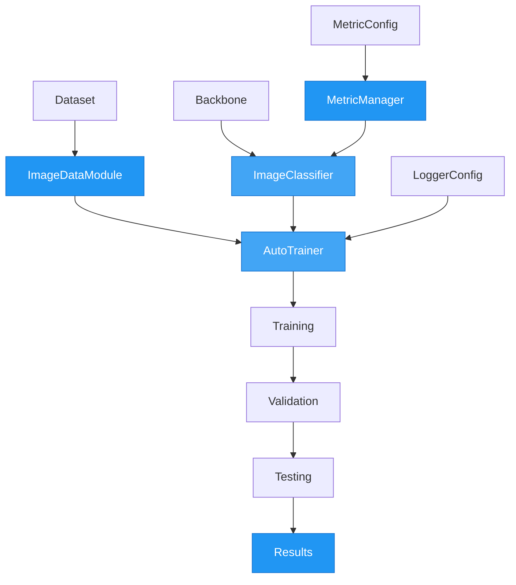

# Classification Examples

This page demonstrates image classification tasks using AutoTimm.

## Classification Workflow



## CIFAR-10 Classification

Basic training with ResNet-18 on CIFAR-10 using MetricManager.

```python
from autotimm import (
    AutoTrainer,
    ImageClassifier,
    ImageDataModule,
    LoggerConfig,
    MetricConfig,
    MetricManager,
)


def main():
    # Data
    data = ImageDataModule(
        data_dir="./data",
        dataset_name="CIFAR10",
        image_size=224,
        batch_size=64,
    )

    # Metrics
    metric_configs = [
        MetricConfig(
            name="accuracy",
            backend="torchmetrics",
            metric_class="Accuracy",
            params={"task": "multiclass"},
            stages=["train", "val", "test"],
            prog_bar=True,
        ),
    ]

    # Create MetricManager
    metric_manager = MetricManager(configs=metric_configs, num_classes=10)

    # Model
    model = ImageClassifier(
        backbone="resnet18",
        num_classes=10,
        metrics=metric_manager,
        lr=1e-3,
    )

    # Train
    trainer = AutoTrainer(
        max_epochs=10,
        logger=[LoggerConfig(backend="tensorboard", params={"save_dir": "logs"})],
        checkpoint_monitor="val/accuracy",
    )

    trainer.fit(model, datamodule=data)
    trainer.test(model, datamodule=data)


if __name__ == "__main__":
    main()
```

---

## Custom Folder Dataset

Training on your own images organized in folders.

```python
from autotimm import (
    AutoTrainer,
    ImageClassifier,
    ImageDataModule,
    LoggerConfig,
    MetricConfig,
    MetricManager,
)


def main():
    # Your data structure:
    # dataset/
    #   train/
    #     class_a/...
    #     class_b/...
    #   val/
    #     class_a/...
    #     class_b/...

    data = ImageDataModule(
        data_dir="./dataset",
        image_size=384,
        batch_size=16,
    )
    data.setup("fit")

    metric_configs = [
        MetricConfig(
            name="accuracy",
            backend="torchmetrics",
            metric_class="Accuracy",
            params={"task": "multiclass"},
            stages=["train", "val", "test"],
            prog_bar=True,
        ),
    ]

    metric_manager = MetricManager(configs=metric_configs, num_classes=data.num_classes)

    model = ImageClassifier(
        backbone="efficientnet_b3",
        num_classes=data.num_classes,
        metrics=metric_manager,
    )

    trainer = AutoTrainer(
        max_epochs=20,
        logger=[LoggerConfig(backend="wandb", params={"project": "my-project"})],
        checkpoint_monitor="val/accuracy",
    )

    trainer.fit(model, datamodule=data)


if __name__ == "__main__":
    main()
```

---

## ViT Fine-Tuning

Two-phase fine-tuning for Vision Transformers with MetricManager.

```python
from autotimm import AutoTrainer, ImageClassifier, MetricConfig, MetricManager


def main():
    metric_configs = [
        MetricConfig(
            name="accuracy",
            backend="torchmetrics",
            metric_class="Accuracy",
            params={"task": "multiclass"},
            stages=["train", "val", "test"],
        ),
    ]

    metric_manager = MetricManager(configs=metric_configs, num_classes=data.num_classes)

    # Phase 1: Linear probe (frozen backbone)
    model = ImageClassifier(
        backbone="vit_base_patch16_224",
        num_classes=data.num_classes,
        metrics=metric_manager,
        freeze_backbone=True,
        lr=1e-2,
    )

    trainer = AutoTrainer(max_epochs=5)
    trainer.fit(model, datamodule=data)

    # Phase 2: Full fine-tune
    for param in model.backbone.parameters():
        param.requires_grad = True

    model._lr = 1e-4
    trainer = AutoTrainer(max_epochs=20, gradient_clip_val=1.0)
    trainer.fit(model, datamodule=data)


if __name__ == "__main__":
    main()
```

---

## Multi-Label Classification

Multi-label classification where each image can belong to multiple classes simultaneously.
Uses `MultiLabelImageDataModule` for CSV-based data and `ImageClassifier` with `multi_label=True`.

```python
from autotimm import (
    AutoTrainer,
    ImageClassifier,
    MetricConfig,
    MultiLabelImageDataModule,
)


def main():
    # Data - CSV with columns: image_path, cat, dog, outdoor, indoor
    data = MultiLabelImageDataModule(
        train_csv="train.csv",
        val_csv="val.csv",
        image_dir="./images",
        image_size=224,
        batch_size=32,
    )
    data.setup("fit")

    num_labels = data.num_labels  # auto-detected from CSV

    # Multilabel metrics
    metrics = [
        MetricConfig(
            name="accuracy",
            backend="torchmetrics",
            metric_class="MultilabelAccuracy",
            params={"num_labels": num_labels},
            stages=["train", "val"],
            prog_bar=True,
        ),
        MetricConfig(
            name="f1",
            backend="torchmetrics",
            metric_class="MultilabelF1Score",
            params={"num_labels": num_labels, "average": "macro"},
            stages=["val"],
        ),
    ]

    # Model - multi_label=True switches to BCEWithLogitsLoss + sigmoid
    model = ImageClassifier(
        backbone="resnet50",
        num_classes=num_labels,
        multi_label=True,
        threshold=0.5,
        metrics=metrics,
        lr=1e-3,
    )

    # Train
    trainer = AutoTrainer(max_epochs=10)
    trainer.fit(model, datamodule=data)


if __name__ == "__main__":
    main()
```

**Key differences from single-label:**

- Data: CSV with multi-hot label columns instead of ImageFolder directories
- Model: `multi_label=True` uses `BCEWithLogitsLoss` and sigmoid predictions
- Metrics: Use `Multilabel*` metrics (e.g., `MultilabelAccuracy`, `MultilabelF1Score`)
- `predict_step` returns per-label sigmoid probabilities (each in [0, 1], don't sum to 1)

---

## Running Classification Examples

```bash
git clone https://github.com/theja-vanka/AutoTimm.git
cd AutoTimm
pip install -e ".[all]"

# Run examples
python examples/getting_started/classify_cifar10.py
python examples/getting_started/classify_custom_folder.py
python examples/getting_started/vit_finetuning.py
python examples/data_training/multilabel_classification.py
```

## See Also

- [Image Classifier Guide](../../user-guide/models/image-classifier.md)
- [Multi-Label Data Loading](../../user-guide/data-loading/image-classification-data.md#multi-label-classification-data)
- [Classification Inference](../../user-guide/inference/classification-inference.md)
- [API Reference](../../api/classifier.md)
