# Object Detection Examples

This page demonstrates object detection tasks using AutoTimm.

## Object Detection on COCO

FCOS-style anchor-free object detection with timm backbones and Feature Pyramid Networks.

### FCOS Architecture

```mermaid
graph TD
    F1[Backbone + FPN] --> F1a[Extract Features]
    F1a --> F1b[Feature Pyramid]
    F1b --> F2[Classification Head]
    F2 --> F2a[Conv Layers]
    F2a --> F2b[Class Scores]
    F1b --> F3[Regression Head]
    F3 --> F3a[Conv Layers]
    F3a --> F3b[Box Offsets]
    F1b --> F4[Centerness Head]
    F4 --> F4a[Conv Layers]
    F4a --> F4b[Centerness Scores]
    F2b --> F5[Focal Loss]
    F3b --> F6[GIoU Loss]
    F4b --> F7[BCE Loss]
    F5 --> F8[Combined Loss]
    F6 --> F8
    F7 --> F8
    
    style F1 fill:#2196F3,stroke:#1976D2
    style F5 fill:#1976D2,stroke:#1565C0
    style F8 fill:#2196F3,stroke:#1976D2
```



### Implementation

```python
from autotimm import (
    AutoTrainer,
    DetectionDataModule,
    LoggerConfig,
    MetricConfig,
    ObjectDetector,
)


def main():
    # Data - COCO format detection dataset
    data = DetectionDataModule(
        data_dir="./coco",
        image_size=640,
        batch_size=16,
        num_workers=4,
        augmentation_preset="default",  # or "strong" for more augmentation
    )

    # Metrics - MeanAveragePrecision for object detection
    metric_configs = [
        MetricConfig(
            name="mAP",
            backend="torchmetrics",
            metric_class="MeanAveragePrecision",
            params={"box_format": "xyxy", "iou_type": "bbox"},
            stages=["val", "test"],
            prog_bar=True,
        ),
    ]

    # Model - FCOS-style detector with timm backbone
    model = ObjectDetector(
        backbone="resnet50",  # Any timm backbone works
        num_classes=80,  # COCO has 80 classes
        metrics=metric_configs,
        fpn_channels=256,
        head_num_convs=4,
        lr=1e-4,
        scheduler="multistep",
        scheduler_kwargs={"milestones": [8, 11], "gamma": 0.1},
    )

    # Train
    trainer = AutoTrainer(
        max_epochs=12,
        logger=[LoggerConfig(backend="tensorboard", params={"save_dir": "logs"})],
        checkpoint_monitor="val/map",
        checkpoint_mode="max",
        gradient_clip_val=1.0,
    )

    trainer.fit(model, datamodule=data)
    trainer.test(model, datamodule=data)


if __name__ == "__main__":
    main()
```

**Key Features:**

- **FCOS architecture**: Anchor-free detection with Feature Pyramid Network (P3-P7)
- **Any timm backbone**: ResNet, EfficientNet, ConvNeXt, etc.
- **Focal Loss + GIoU Loss**: State-of-the-art detection losses
- **COCO-compatible**: Supports standard COCO JSON format
- **Flexible augmentation**: Built-in presets or custom albumentations pipelines

---

## YOLOX Object Detection

YOLOX is a high-performance anchor-free detector that achieves state-of-the-art results with excellent speed-accuracy trade-offs.

### YOLOX Architecture


### Implementation

```python
from autotimm import AutoTrainer, DetectionDataModule, LoggerConfig, MetricConfig
from autotimm.detection import YOLOXDetector


def main():
    # Data - COCO format detection dataset
    data = DetectionDataModule(
        data_dir="./coco",
        image_size=640,
        batch_size=8,
        num_workers=4,
        augmentation_preset="yolox",  # YOLOX-specific augmentation
    )

    # Metrics
    metric_configs = [
        MetricConfig(
            name="mAP",
            backend="torchmetrics",
            metric_class="MeanAveragePrecision",
            params={"box_format": "xyxy", "iou_type": "bbox"},
            stages=["val", "test"],
            prog_bar=True,
        ),
    ]

    # Model - YOLOX detector
    model = YOLOXDetector(
        model_size="s",  # Options: 'nano', 'tiny', 's', 'm', 'l', 'x'
        num_classes=80,
        metrics=metric_configs,
        lr=0.01,
        warmup_epochs=5,
    )

    # Train
    trainer = AutoTrainer(
        max_epochs=300,
        logger=[LoggerConfig(backend="tensorboard", params={"save_dir": "logs/yolox"})],
        checkpoint_monitor="val/map",
        checkpoint_mode="max",
    )

    trainer.fit(model, datamodule=data)
    trainer.test(model, datamodule=data)


if __name__ == "__main__":
    main()
```

**YOLOX Model Sizes:**

| Model | Params | FLOPs | Speed (V100) | COCO mAP |
|-------|--------|-------|-------------|----------|
| YOLOX-Nano | 0.91M | 1.08G | ~2000 FPS | 25.8% |
| YOLOX-Tiny | 5.06M | 6.45G | ~1000 FPS | 32.8% |
| YOLOX-S | 9.0M | 26.8G | ~340 FPS | 40.5% |
| YOLOX-M | 25.3M | 73.8G | ~175 FPS | 46.9% |
| YOLOX-L | 54.2M | 155.6G | ~90 FPS | 49.7% |
| YOLOX-X | 99.1M | 281.9G | ~55 FPS | 51.5% |

**Key Features:**

- **Anchor-free design**: Simplified architecture without anchor boxes
- **Strong augmentation**: Mosaic and MixUp for improved generalization
- **SimOTA assignment**: Advanced label assignment strategy
- **Decoupled head**: Separate classification and localization heads
- **Multiple model sizes**: From Nano (edge devices) to X (maximum accuracy)

---

## Explore YOLOX Models

Compare and visualize different YOLOX model architectures.

```python
from autotimm.detection import YOLOXDetector
import torch


def main():
    # Compare model sizes
    sizes = ["nano", "tiny", "s", "m", "l", "x"]
    
    for size in sizes:
        model = YOLOXDetector(model_size=size, num_classes=80)
        
        # Count parameters
        params = sum(p.numel() for p in model.parameters())
        print(f"YOLOX-{size.upper()}: {params/1e6:.2f}M parameters")
        
        # Test inference
        dummy_input = torch.randn(1, 3, 640, 640)
        with torch.inference_mode():
            output = model(dummy_input)
        print(f"  Output shape: {output.shape}")


if __name__ == "__main__":
    main()
```

---

## YOLOX Official

Use the official YOLOX implementation with AutoTimm's data pipeline.

```python
from autotimm import AutoTrainer, DetectionDataModule
from autotimm.detection import YOLOXDetector


def main():
    # Use official YOLOX training recipe
    data = DetectionDataModule(
        data_dir="./coco",
        image_size=640,
        batch_size=8,
        num_workers=8,
        augmentation_preset="yolox",
    )

    model = YOLOXDetector(
        model_size="s",
        num_classes=80,
        lr=0.01,
        warmup_epochs=5,
        no_aug_epochs=15,  # Last epochs without augmentation
    )

    trainer = AutoTrainer(
        max_epochs=300,
        precision="fp16-mixed",  # Use mixed precision for speed
        gradient_clip_val=1.0,
    )

    trainer.fit(model, datamodule=data)


if __name__ == "__main__":
    main()
```

**Official Training Recipe:**

- **Total epochs**: 300
- **Warmup**: 5 epochs
- **No augmentation**: Last 15 epochs
- **Optimizer**: SGD with momentum
- **Learning rate schedule**: Cosine annealing
- **Augmentation**: Mosaic + MixUp

---

## Transformer-Based Object Detection

Use Vision Transformers (ViT, Swin, DeiT) as backbones for object detection.

```python
from autotimm import AutoTrainer, DetectionDataModule, LoggerConfig, MetricConfig, ObjectDetector


def main():
    # Data
    data = DetectionDataModule(
        data_dir="./coco",
        image_size=640,
        batch_size=8,  # Smaller batch for transformers
        num_workers=4,
        augmentation_preset="default",
    )

    # Metrics
    metric_configs = [
        MetricConfig(
            name="mAP",
            backend="torchmetrics",
            metric_class="MeanAveragePrecision",
            params={"box_format": "xyxy", "iou_type": "bbox"},
            stages=["val", "test"],
            prog_bar=True,
        ),
    ]

    # Option 1: Swin Transformer (recommended for detection)
    model_swin = ObjectDetector(
        backbone="swin_tiny_patch4_window7_224",
        num_classes=80,
        metrics=metric_configs,
        fpn_channels=256,
        head_num_convs=4,
        lr=1e-4,
        scheduler="multistep",
        scheduler_kwargs={"milestones": [8, 11], "gamma": 0.1},
    )

    # Option 2: Vision Transformer (highest accuracy)
    model_vit = ObjectDetector(
        backbone="vit_base_patch16_224",
        num_classes=80,
        metrics=metric_configs,
        fpn_channels=256,
        head_num_convs=4,
        lr=1e-4,
        scheduler="cosine",
    )

    # Option 3: Two-phase training (recommended)
    model = ObjectDetector(
        backbone="swin_base_patch4_window7_224",
        num_classes=80,
        metrics=metric_configs,
        fpn_channels=256,
        freeze_backbone=True,  # Phase 1: freeze backbone
        lr=1e-3,
    )

    # Phase 1: Train detection head
    trainer_phase1 = AutoTrainer(
        max_epochs=5,
        logger=[LoggerConfig(backend="tensorboard", params={"save_dir": "logs/phase1"})],
        gradient_clip_val=1.0,
    )
    trainer_phase1.fit(model, datamodule=data)

    # Phase 2: Fine-tune entire model
    for param in model.backbone.parameters():
        param.requires_grad = True
    model._lr = 1e-5  # Lower LR for fine-tuning

    trainer_phase2 = AutoTrainer(
        max_epochs=15,
        logger=[LoggerConfig(backend="tensorboard", params={"save_dir": "logs/phase2"})],
        gradient_clip_val=1.0,
    )
    trainer_phase2.fit(model, datamodule=data)
    trainer_phase2.test(model, datamodule=data)


if __name__ == "__main__":
    main()
```

**Transformer Backbone Comparison:**

| Backbone | Speed | Accuracy | Memory | Best For |
|----------|-------|----------|--------|----------|
| `vit_tiny_patch16_224` | Medium | Good | Low | Quick experiments |
| `vit_base_patch16_224` | Slow | Best | High | Maximum accuracy |
| `swin_tiny_patch4_window7_224` | Fast | Good | Medium | Balanced performance |
| `swin_base_patch4_window7_224` | Medium | Better | Medium-High | Production use |
| `deit_base_patch16_224` | Slow | Best | High | Limited data |

**Tips:**

- Use smaller batch sizes (8-16) - transformers need more memory
- Two-phase training works very well with transformers
- Gradient clipping (1.0) is important for stability
- Lower learning rates (1e-4 to 1e-5) than CNNs
- Swin Transformers are best for detection (hierarchical features)

---

## RT-DETR (Real-Time Detection Transformer)

End-to-end transformer-based object detection with no NMS required.

### RT-DETR Architecture


### Implementation

```python
import torch
from transformers import RTDetrForObjectDetection, RTDetrImageProcessor

from autotimm import AutoTrainer, DetectionDataModule, LoggerConfig


class RTDetrModule(torch.nn.Module):
    """Wrapper for RT-DETR model."""

    def __init__(self, model_name="PekingU/rtdetr_r50vd", num_classes=80, lr=1e-4):
        super().__init__()
        self.model = RTDetrForObjectDetection.from_pretrained(
            model_name, num_labels=num_classes, ignore_mismatched_sizes=True
        )
        self.processor = RTDetrImageProcessor.from_pretrained(model_name)
        self.lr = lr

    def forward(self, pixel_values, labels=None):
        return self.model(pixel_values=pixel_values, labels=labels)

    def training_step(self, batch, batch_idx):
        images, targets = batch
        labels = self._convert_targets(targets, images.shape[0])
        outputs = self(pixel_values=images, labels=labels)
        return outputs.loss

    def configure_optimizers(self):
        return torch.optim.AdamW(self.parameters(), lr=self.lr)


def main():
    # Data - Use AutoTimm's DetectionDataModule
    data = DetectionDataModule(
        data_dir="./coco",
        image_size=640,
        batch_size=4,
        num_workers=4,
        augmentation_preset="default",
    )

    # Model - RT-DETR with ResNet-50 backbone
    model = RTDetrModule(
        model_name="PekingU/rtdetr_r50vd",
        num_classes=80,
        lr=1e-4,
    )

    # Train
    trainer = AutoTrainer(
        max_epochs=12,
        logger=[LoggerConfig(backend="tensorboard", params={"save_dir": "logs/rtdetr"})],
        gradient_clip_val=0.1,
        precision="bf16-mixed",
    )

    trainer.fit(model, datamodule=data)
    trainer.test(model, datamodule=data)


if __name__ == "__main__":
    main()
```

**RT-DETR vs FCOS:**

| Feature | RT-DETR | FCOS (AutoTimm) |
|---------|---------|-----------------|
| Architecture | Transformer-based | CNN-based |
| Detection | Query-based | Anchor-free points |
| NMS required | No ✨ | Yes |
| Inference speed | Real-time | Real-time |
| Memory usage | Higher | Lower |
| Small objects | Good | Excellent |
| Large objects | Excellent | Good |

**Available RT-DETR Models:**

| Model | Parameters | Speed | Best For |
|-------|------------|-------|----------|
| `PekingU/rtdetr_r18vd` | 20M | Fastest | Quick experiments |
| `PekingU/rtdetr_r34vd` | 31M | Fast | Balanced |
| `PekingU/rtdetr_r50vd` | 42M | Medium | Recommended ⭐ |
| `PekingU/rtdetr_r101vd` | 76M | Slower | Maximum accuracy |

**When to use RT-DETR:**

- Need end-to-end differentiable pipeline
- Want to avoid NMS post-processing
- Detecting large objects or scenes
- Have sufficient GPU memory

**When to use FCOS:**

- Need maximum efficiency
- Detecting small objects
- Limited GPU memory
- Need multi-scale detection (P3-P7)

**Requirements:**
```bash
pip install transformers
```

---

## Inference

The [`detection_inference.py`](https://github.com/theja-vanka/AutoTimm/blob/main/examples/logging_inference/detection_inference.py) script provides a comprehensive toolkit for object detection inference.

### Features

- **Model Loading**: Load trained models from checkpoints
- **Preprocessing**: Automatic image preprocessing using model's data config
- **Single & Batch Prediction**: Run inference on individual or multiple images
- **Visualization**: Draw bounding boxes with class labels and confidence scores
- **Export Options**:
  - JSON format with detection coordinates and metadata
  - CSV format for spreadsheet analysis
- **COCO Integration**: Pre-configured with COCO class names

### Basic Usage

```python
from examples.detection_inference import (
    load_model,
    predict_single_image,
    visualize_detections,
    export_to_json,
    COCO_CLASSES,
)

# Load trained model
model = load_model(
    checkpoint_path="best-detector.ckpt",
    backbone="resnet50",
    num_classes=80,
    score_thresh=0.3,
)
model = model.cuda()

# Single image inference
detections = predict_single_image(
    model,
    "image.jpg",
    class_names=COCO_CLASSES,
)

# Print results
for det in detections:
    print(f"{det['class']}: {det['confidence']:.2%} at {det['bbox']}")

# Visualize
visualize_detections(
    "image.jpg",
    detections,
    "output.jpg",
    threshold=0.3,
)
```

### Batch Processing

```python
from examples.detection_inference import predict_batch, export_to_json

# Process multiple images
image_paths = ["img1.jpg", "img2.jpg", "img3.jpg"]
results = predict_batch(
    model,
    image_paths,
    class_names=COCO_CLASSES,
    batch_size=4,
)

# Export all results to JSON
export_to_json(
    results,
    "detections.json",
    image_paths=image_paths,
)
```

### Export to JSON/CSV

```python
from examples.detection_inference import export_to_json, export_to_csv

export_to_json(results, "detections.json", image_paths=image_paths)
export_to_csv(results, "detections.csv", image_paths=image_paths)
```

For a complete inference workflow, see the [Detection Inference Guide](../../user-guide/inference/object-detection-inference.md).

### Running the Demo

```bash
python examples/logging_inference/detection_inference.py
```

Clone the repository and run examples:

```bash
git clone https://github.com/theja-vanka/AutoTimm.git
cd AutoTimm
pip install -e ".[all]"

# Run object detection examples
python examples/computer_vision/object_detection_coco.py
python examples/computer_vision/object_detection_yolox.py
python examples/computer_vision/object_detection_transformers.py
python examples/computer_vision/object_detection_rtdetr.py

# Explore YOLOX models
python examples/computer_vision/explore_yolox_models.py
python examples/computer_vision/yolox_official.py

# Run inference
python examples/logging_inference/detection_inference.py
```

## See Also

- [ObjectDetector Guide](../../user-guide/models/object-detector.md)
- [Detection Inference](../../user-guide/inference/object-detection-inference.md)
- [Detection Data Loading](../../user-guide/data-loading/object-detection-data.md)
- [API Reference](../../api/detection.md)
