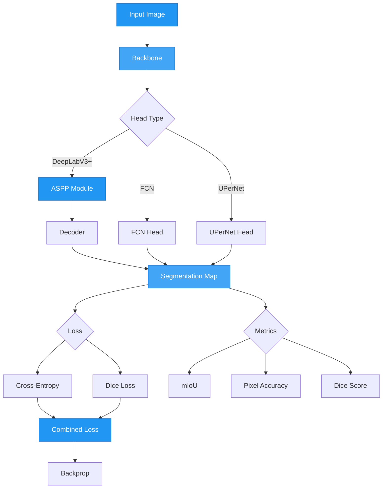

# Semantic Segmentation Examples

Complete examples for training semantic segmentation models with AutoTimm.

## Semantic Segmentation Architecture



## Basic Example: Cityscapes

Train DeepLabV3+ on Cityscapes dataset for urban scene segmentation.

```python
from autotimm import (
    AutoTrainer,
    SemanticSegmentor,
    SegmentationDataModule,
    MetricConfig,
    LoggerConfig,
    LoggingConfig,
)


def main():
    # Data - Cityscapes with 19 classes
    data = SegmentationDataModule(
        data_dir="./cityscapes",
        format="cityscapes",
        image_size=512,
        batch_size=8,
        num_workers=4,
        augmentation_preset="default",
    )

    # Metrics
    metrics = [
        MetricConfig(
            name="mIoU",
            backend="torchmetrics",
            metric_class="JaccardIndex",
            params={
                "task": "multiclass",
                "num_classes": 19,
                "average": "macro",
                "ignore_index": 255,
            },
            stages=["val", "test"],
            prog_bar=True,
        ),
        MetricConfig(
            name="pixel_acc",
            backend="torchmetrics",
            metric_class="Accuracy",
            params={
                "task": "multiclass",
                "num_classes": 19,
                "ignore_index": 255,
            },
            stages=["val", "test"],
        ),
    ]

    # Model - DeepLabV3+ with ResNet-50
    model = SemanticSegmentor(
        backbone="resnet50",
        num_classes=19,
        head_type="deeplabv3plus",
        loss_type="combined",  # CE + Dice
        ce_weight=1.0,
        dice_weight=1.0,
        ignore_index=255,
        metrics=metrics,
        logging_config=LoggingConfig(
            log_learning_rate=True,
            log_gradient_norm=True,
        ),
        lr=1e-4,
        weight_decay=1e-4,
        optimizer="adamw",
        scheduler="cosine",
    )

    # Trainer
    trainer = AutoTrainer(
        max_epochs=200,
        accelerator="auto",
        devices=1,
        precision="16-mixed",
        logger=[LoggerConfig(backend="tensorboard", params={"save_dir": "logs/cityscapes"})],
        checkpoint_monitor="val/mIoU",
        checkpoint_mode="max",
    )

    # Train
    trainer.fit(model, datamodule=data)

    # Test
    results = trainer.test(model, datamodule=data)
    print(f"Test mIoU: {results[0]['test/mIoU']:.4f}")


if __name__ == "__main__":
    main()
```

## Pascal VOC Example

Train on Pascal VOC 2012 with 21 classes (20 objects + background).

```python
from autotimm import SemanticSegmentor, SegmentationDataModule, MetricConfig, AutoTrainer, LoggerConfig


def main():
    # Data
    data = SegmentationDataModule(
        data_dir="./VOC2012",
        format="voc",
        image_size=512,
        batch_size=16,
        num_workers=4,
        augmentation_preset="strong",
    )

    # Metrics
    metrics = [
        MetricConfig(
            name="iou",
            backend="torchmetrics",
            metric_class="JaccardIndex",
            params={
                "task": "multiclass",
                "num_classes": 21,
                "average": "macro",
                "ignore_index": 255,
            },
            stages=["val", "test"],
            prog_bar=True,
        ),
    ]

    # Model - FCN baseline
    model = SemanticSegmentor(
        backbone="resnet50",
        num_classes=21,
        head_type="fcn",  # Simpler architecture
        loss_type="combined",
        metrics=metrics,
        lr=1e-3,
        optimizer="adamw",
        scheduler="cosine",
    )

    # Trainer
    trainer = AutoTrainer(
        max_epochs=100,
        logger=[LoggerConfig(backend="tensorboard")],
    )

    # Train
    trainer.fit(model, datamodule=data)
    trainer.test(model, datamodule=data)


if __name__ == "__main__":
    main()
```

## Custom Dataset Example

Train on a custom dataset with PNG masks.

```python
from autotimm import SemanticSegmentor, SegmentationDataModule, MetricConfig, AutoTrainer


def main():
    # Custom dataset with 5 classes (0-4) + ignore (255)
    data = SegmentationDataModule(
        data_dir="./custom_dataset",
        format="png",  # Uses images/ and masks/ folders
        image_size=512,
        batch_size=8,
        augmentation_preset="default",
    )

    # Metrics
    metrics = [
        MetricConfig(
            name="iou",
            backend="torchmetrics",
            metric_class="JaccardIndex",
            params={
                "task": "multiclass",
                "num_classes": 5,
                "average": "macro",
                "ignore_index": 255,
            },
            stages=["val"],
            prog_bar=True,
        ),
    ]

    # Model
    model = SemanticSegmentor(
        backbone="resnet18",  # Lighter backbone for small dataset
        num_classes=5,
        head_type="deeplabv3plus",
        loss_type="dice",  # Dice only for class imbalance
        metrics=metrics,
    )

    # Trainer
    trainer = AutoTrainer(max_epochs=50)

    trainer.fit(model, datamodule=data)


if __name__ == "__main__":
    main()
```

## Custom Transforms Example

Use albumentations for advanced augmentation.

```python
import albumentations as A
from albumentations.pytorch import ToTensorV2
from autotimm import SemanticSegmentor, SegmentationDataModule, MetricConfig, AutoTrainer


def get_train_transforms():
    return A.Compose([
        A.RandomScale(scale_limit=0.5, p=1.0),
        A.RandomCrop(height=512, width=512, p=1.0),
        A.HorizontalFlip(p=0.5),
        A.VerticalFlip(p=0.2),
        A.Rotate(limit=15, p=0.5),
        A.ColorJitter(brightness=0.4, contrast=0.4, saturation=0.4, hue=0.1, p=0.8),
        A.GaussianBlur(blur_limit=(3, 7), p=0.3),
        A.Normalize(mean=(0.485, 0.456, 0.406), std=(0.229, 0.224, 0.225)),
        ToTensorV2(),
    ])


def get_val_transforms():
    return A.Compose([
        A.Resize(512, 512),
        A.Normalize(mean=(0.485, 0.456, 0.406), std=(0.229, 0.224, 0.225)),
        ToTensorV2(),
    ])


def main():
    # Data with custom transforms
    data = SegmentationDataModule(
        data_dir="./data",
        format="png",
        custom_train_transforms=get_train_transforms(),
        custom_val_transforms=get_val_transforms(),
        batch_size=8,
    )

    # Metrics
    metrics = [
        MetricConfig(
            name="iou",
            backend="torchmetrics",
            metric_class="JaccardIndex",
            params={"task": "multiclass", "num_classes": 10, "average": "macro"},
            stages=["val"],
            prog_bar=True,
        ),
    ]

    # Model
    model = SemanticSegmentor(
        backbone="efficientnet_b3",
        num_classes=10,
        head_type="deeplabv3plus",
        loss_type="combined",
        metrics=metrics,
    )

    # Trainer
    trainer = AutoTrainer(max_epochs=100)
    trainer.fit(model, datamodule=data)


if __name__ == "__main__":
    main()
```

## Inference

The [`segmentation_inference.py`](https://github.com/theja-vanka/AutoTimm/blob/main/examples/logging_inference/segmentation_inference.py) script provides a comprehensive toolkit for semantic segmentation inference.

### Features

- **Model Loading**: Load trained models from checkpoints
- **Preprocessing**: Automatic image preprocessing using model's data config
- **Single & Batch Prediction**: Run inference on individual or multiple images
- **Visualization**: Overlay segmentation masks on original images with customizable transparency
- **Export Options**:
  - Save colored segmentation masks as PNG
  - Export per-class pixel statistics to JSON
  - Create class legends for visualization
- **Pre-configured Palettes**: Cityscapes and Pascal VOC color schemes

### Basic Usage

```python
from examples.segmentation_inference import (
    load_model,
    predict_single_image,
    visualize_segmentation,
    export_mask_to_png,
    CITYSCAPES_CLASSES,
    CITYSCAPES_COLORS,
)

# Load trained model
model = load_model(
    checkpoint_path="best-segmentor.ckpt",
    backbone="resnet50",
    num_classes=19,
    image_size=512,
)
model = model.cuda()

# Single image inference
result = predict_single_image(model, "street_scene.jpg")

# Visualize with overlay (50% transparency)
visualize_segmentation(
    "street_scene.jpg",
    result["mask"],
    "output.jpg",
    color_palette=CITYSCAPES_COLORS,
    alpha=0.5,
)

# Export colored mask
export_mask_to_png(
    result["mask"],
    "mask.png",
    color_palette=CITYSCAPES_COLORS,
)
```

### Batch Processing

```python
from examples.segmentation_inference import predict_batch, export_to_json

# Process multiple images
image_paths = ["img1.jpg", "img2.jpg", "img3.jpg"]
results = predict_batch(model, image_paths, batch_size=4)

# Export statistics for all images
masks = [r["mask"] for r in results]
export_to_json(
    masks,
    "batch_statistics.json",
    image_paths=image_paths,
    class_names=CITYSCAPES_CLASSES,
)
```

### Creating Class Legends

```python
from examples.segmentation_inference import create_legend

# Generate legend image
create_legend(
    CITYSCAPES_CLASSES,
    CITYSCAPES_COLORS,
    "legend.png",
)
```

### Custom Color Palettes

```python
# Define custom colors for your dataset
CUSTOM_CLASSES = ["background", "building", "road", "vegetation", "vehicle"]
CUSTOM_COLORS = [
    (0, 0, 0),      # black - background
    (128, 0, 0),    # maroon - building
    (128, 128, 128), # gray - road
    (0, 128, 0),    # green - vegetation
    (0, 0, 255),    # blue - vehicle
]

# Use with inference
visualize_segmentation(
    "image.jpg",
    result["mask"],
    "output.jpg",
    color_palette=CUSTOM_COLORS,
    alpha=0.6,
)
```

### Running the Demo

```bash
python examples/logging_inference/segmentation_inference.py
```

For a complete inference workflow, see the [Segmentation Inference Guide](../../user-guide/inference/semantic-segmentation-inference.md).

## Using Swin Transformer

Use Vision Transformer backbone for better accuracy.

```python
from autotimm import SemanticSegmentor, SegmentationDataModule, MetricConfig, AutoTrainer


def main():
    # Data
    data = SegmentationDataModule(
        data_dir="./cityscapes",
        format="cityscapes",
        image_size=512,
        batch_size=4,  # Smaller batch for transformer
        num_workers=4,
    )

    # Metrics
    metrics = [
        MetricConfig(
            name="mIoU",
            backend="torchmetrics",
            metric_class="JaccardIndex",
            params={
                "task": "multiclass",
                "num_classes": 19,
                "average": "macro",
                "ignore_index": 255,
            },
            stages=["val"],
            prog_bar=True,
        ),
    ]

    # Model - Swin Transformer
    model = SemanticSegmentor(
        backbone="swin_tiny_patch4_window7_224",
        num_classes=19,
        head_type="deeplabv3plus",
        loss_type="combined",
        metrics=metrics,
        lr=1e-4,
    )

    # Trainer with mixed precision
    trainer = AutoTrainer(
        max_epochs=200,
        precision="16-mixed",
        gradient_clip_val=1.0,
    )

    trainer.fit(model, datamodule=data)


if __name__ == "__main__":
    main()
```

## Comparing Losses

Compare different loss functions.

```python
from autotimm import SemanticSegmentor, SegmentationDataModule, MetricConfig, AutoTrainer, LoggerConfig


def train_with_loss(loss_type, run_name):
    """Train model with specific loss type."""
    data = SegmentationDataModule(
        data_dir="./data",
        format="png",
        image_size=512,
        batch_size=8,
    )

    metrics = [
        MetricConfig(
            name="iou",
            backend="torchmetrics",
            metric_class="JaccardIndex",
            params={"task": "multiclass", "num_classes": 10, "average": "macro"},
            stages=["val"],
            prog_bar=True,
        ),
    ]

    model = SemanticSegmentor(
        backbone="resnet50",
        num_classes=10,
        head_type="deeplabv3plus",
        loss_type=loss_type,  # "ce", "dice", "focal", or "combined"
        metrics=metrics,
    )

    trainer = AutoTrainer(
        max_epochs=50,
        logger=[LoggerConfig(backend="tensorboard", params={"save_dir": f"logs/{run_name}"})],
    )

    trainer.fit(model, datamodule=data)
    
    # Only run test if test set exists
    try:
        results = trainer.test(model, datamodule=data)
        return results[0]['test/iou']
    except:
        # Return validation IoU if test set doesn't exist
        return trainer.callback_metrics.get('val/iou', 0.0).item()


def main():
    # Compare losses
    results = {}

    results['ce'] = train_with_loss("ce", "ce_loss")
    results['dice'] = train_with_loss("dice", "dice_loss")
    results['focal'] = train_with_loss("focal", "focal_loss")
    results['combined'] = train_with_loss("combined", "combined_loss")

    print("\nResults:")
    for loss_type, iou in results.items():
        print(f"{loss_type}: {iou:.4f}")


if __name__ == "__main__":
    main()
```

## Using Import Aliases

Cleaner imports with submodule aliases:

```python
from autotimm.task import SemanticSegmentor
from autotimm.loss import DiceLoss, CombinedSegmentationLoss
from autotimm.head import DeepLabV3PlusHead
from autotimm.metric import MetricConfig


def main():
    # Can also directly instantiate losses
    dice_loss = DiceLoss(num_classes=19, ignore_index=255)

    # Model using alias imports
    model = SemanticSegmentor(
        backbone="resnet50",
        num_classes=19,
        head_type="deeplabv3plus",
        loss_type="combined",
        metrics=[
            MetricConfig(
                name="iou",
                backend="torchmetrics",
                metric_class="JaccardIndex",
                params={"task": "multiclass", "num_classes": 19, "average": "macro"},
                stages=["val"],
                prog_bar=True,
            ),
        ],
    )


if __name__ == "__main__":
    main()
```

## See Also

- [Semantic Segmentation Guide](../../user-guide/models/semantic-segmentation.md)
- [Data Loading Guide](../../user-guide/data-loading/segmentation-data.md)
- [API Reference](../../api/segmentation.md)
