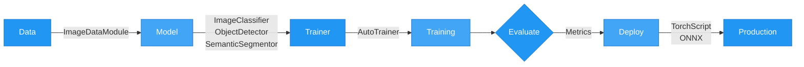

# AutoTimm
{ width="500" }

Automated deep learning image tasks powered by [timm](https://github.com/huggingface/pytorch-image-models) and [PyTorch Lightning](https://github.com/Lightning-AI/pytorch-lightning).

AutoTimm lets you train image classifiers, object detectors, and segmentation models with any of timm's 1000+ backbones in a few lines of Python.

## AutoTimm Workflow



## Features

- **4 vision tasks** - Image classification, object detection, semantic segmentation, and instance segmentation
- **1000+ backbones** - Any timm model works: CNNs (ResNet, EfficientNet, ConvNeXt) and Transformers (ViT, Swin, DeiT)
- **Flexible architectures** - Built-in FCOS detector, DeepLabV3+ segmentation, Mask R-CNN style instance segmentation
- **Advanced losses** - Focal, Dice, Tversky, Combined CE+Dice, GIoU for bbox regression
- **Configurable metrics** - Use torchmetrics or custom metrics
- **Multiple logger backends** - TensorBoard, MLflow, W&B, CSV simultaneously
- **Auto-tuning** - Automatic learning rate and batch size finding
- **Enhanced logging** - Learning rate, gradient norms, confusion matrices
- **Flexible transforms** - Torchvision (PIL) or albumentations (OpenCV) with bbox and mask support (both included by default)

## Quick Example

```python
from autotimm import (
    AutoTrainer, ImageClassifier, ImageDataModule,
    LoggerConfig, MetricConfig,
)

# Data
data = ImageDataModule(
    data_dir="./data",
    dataset_name="CIFAR10",
    image_size=224,
    batch_size=64,
)

# Metrics (explicit configuration required)
metrics = [
    MetricConfig(
        name="accuracy",
        backend="torchmetrics",
        metric_class="Accuracy",
        params={"task": "multiclass"},
        stages=["train", "val", "test"],
        prog_bar=True,
    ),
]

# Model
model = ImageClassifier(
    backbone="resnet18",
    num_classes=10,
    metrics=metrics,
    lr=1e-3,
)

# Trainer with logging
trainer = AutoTrainer(
    max_epochs=10,
    logger=[LoggerConfig(backend="tensorboard", params={"save_dir": "logs"})],
    checkpoint_monitor="val/accuracy",
)

trainer.fit(model, datamodule=data)
trainer.test(model, datamodule=data)
```

## Why AutoTimm?

| Feature | AutoTimm | Raw PyTorch | Lightning |
|---------|----------|-------------|-----------|
| 1000+ backbones | Yes | Manual | Manual |
| Configurable metrics | Yes | Manual | Manual |
| Multi-logger support | Yes | Manual | Partial |
| Auto LR/batch finding | Yes | No | Yes |
| Lines of code | ~20 | ~200+ | ~100 |

## Next Steps

- [Installation](getting-started/installation.md) - Get AutoTimm installed
- [Quick Start](getting-started/quickstart.md) - Train your first model
- [User Guide](user-guide/data-loading/index.md) - Deep dive into features
- [API Reference](api/index.md) - Full API documentation
- [Examples](examples/index.md) - Runnable example scripts
