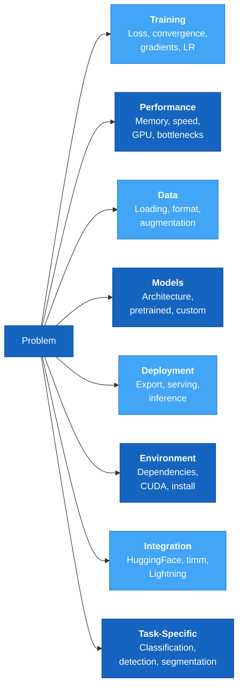

# Troubleshooting

Comprehensive troubleshooting guide for common issues when using AutoTimm.

## Quick Navigation



## Browse by Category

### 🔥 Training Issues
Problems during model training and optimization.

- **[NaN Losses](training/nan-losses.md)** - Numerical instability and NaN loss values
- **[Convergence Problems](training/convergence.md)** - Overfitting, underfitting, oscillating loss
- **[Gradient Issues](training/gradient-issues.md)** - Gradient explosion and vanishing gradients
- **[LR Tuning Failures](training/lr-tuning.md)** - Learning rate finder issues

### ⚡ Performance Issues
Memory, speed, and resource optimization.

- **[OOM Errors](performance/oom-errors.md)** - Out of memory errors and solutions
- **[Slow Training](performance/slow-training.md)** - Training speed bottlenecks
- **[Performance Profiling](performance/profiling.md)** - Identifying and fixing bottlenecks

### 📊 Data Issues
Data loading and augmentation problems.

- **[Data Loading](data/data-loading.md)** - Dataset loading and format issues
- **[Augmentation](data/augmentation.md)** - Transform and augmentation errors

### 🤖 Model Issues
Model loading, checkpoints, and metrics.

- **[Model Loading](models/model-loading.md)** - Checkpoint and pretrained model issues
- **[Metrics](models/metrics.md)** - Metric calculation problems

### 🚀 Deployment Issues
Export, inference, and production deployment.

- **[Export & Inference](deployment/export-inference.md)** - ONNX, TorchScript, and inference issues
- **[Production Deployment](deployment/production.md)** - C++, iOS, Android, and edge deployment

### 🖥️ Environment Issues
Hardware, devices, and distributed training.

- **[Device Errors](environment/device-errors.md)** - CUDA, MPS, and multi-GPU issues
- **[Installation](environment/installation.md)** - Dependencies and version issues
- **[Distributed Training](environment/distributed.md)** - Multi-GPU and multi-node problems

### 🔗 Integration Issues
External tools and platform integration.

- **[Loggers](integration/loggers.md)** - WandB, TensorBoard, MLflow issues
- **[HuggingFace](integration/huggingface.md)** - HuggingFace Hub integration
- **[Reproducibility](integration/reproducibility.md)** - Seeding and deterministic training

### 🎯 Task-Specific Issues
Issues specific to computer vision tasks.

- **[YOLOX](task-specific/yolox.md)** - YOLOX-specific training and inference
- **[Interpretation](task-specific/interpretation.md)** - Model interpretation and visualization

### 📖 Quick Reference
Fast lookup tables and common patterns.

- **[Error Reference](reference/error-reference.md)** - Common error messages and solutions
- **[Warnings](reference/warnings.md)** - Common warning messages

## Common Workflows

### "My training loss is NaN"
1. Check [NaN Losses](training/nan-losses.md)
2. Enable gradient clipping
3. Reduce learning rate
4. Try auto-tuning: [LR Tuning](training/lr-tuning.md)

### "CUDA out of memory"
1. See [OOM Errors](performance/oom-errors.md)
2. Reduce batch size
3. Enable gradient accumulation
4. Use mixed precision training

### "Training is too slow"
1. Check [Slow Training](performance/slow-training.md)
2. Profile with [Performance Profiling](performance/profiling.md)
3. Increase `num_workers`
4. Enable mixed precision

### "Model won't converge"
1. Review [Convergence Problems](training/convergence.md)
2. Check for overfitting/underfitting
3. Adjust learning rate
4. Review data quality

### "Export fails"
1. See [Export & Inference](deployment/export-inference.md)
2. Use `method="trace"` for TorchScript
3. Try lower ONNX opset version
4. Simplify model architecture

## Getting Help

If you encounter an issue not covered here:

1. **Search the docs**: Use the search feature to find relevant information
2. **Check error reference**: See [Error Reference](reference/error-reference.md) for common errors
3. **Enable debug logging**: Get more detailed error information
4. **Create minimal reproduction**: Isolate the issue to simplify debugging
5. **Report issues**: Open an issue at [GitHub Issues](https://github.com/theja-vanka/AutoTimm/issues)

## Debug Mode

Enable detailed logging for troubleshooting:

```python
from autotimm import LoggingConfig, ImageClassifier

logging_config = LoggingConfig(
    verbosity=2,  # Verbose logging
    log_gradient_norm=True,
    log_learning_rate=True,
)

model = ImageClassifier(
    backbone="resnet50",
    num_classes=10,
    logging_config=logging_config,
)
```

## Related Resources

- [Training Guide](../user-guide/training/training.md) - Complete training documentation
- [Data Loading Guide](../user-guide/data-loading/index.md) - Data loading best practices
- [Deployment Guide](../user-guide/deployment/deployment.md) - Production deployment guide
- [API Reference](../api/index.md) - Complete API documentation
