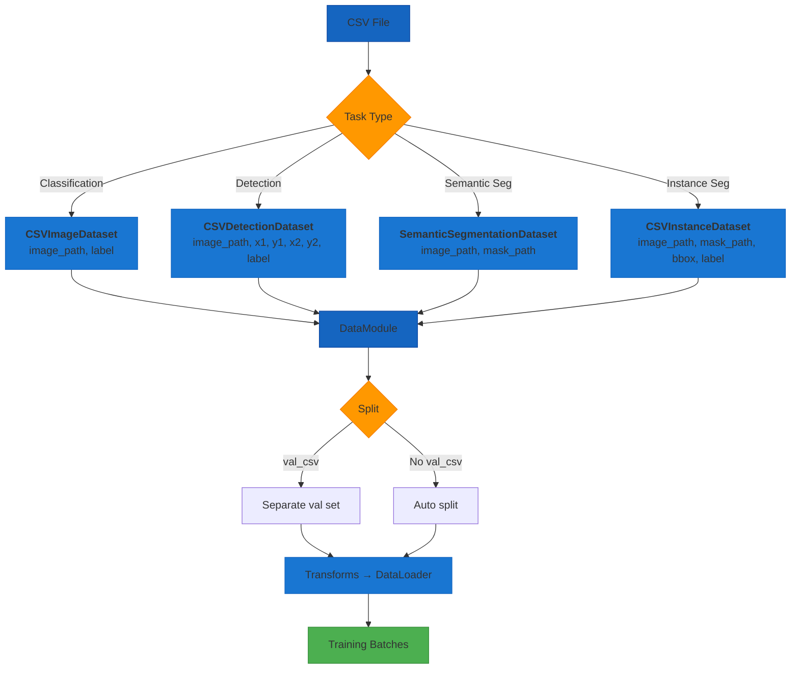

# CSV Data Loading

AutoTimm supports CSV-based data loading for all task types, making it easy to work with datasets from Kaggle, custom annotations, and other tabular formats without converting to folder-based or COCO JSON structures.

## CSV Data Pipeline



---

## CSV Formats by Task

### Image Classification

```
image_path,label
train/img001.jpg,cat
train/img002.jpg,dog
train/img003.jpg,bird
```

- **image_path**: Relative path to the image (resolved against `image_dir`)
- **label**: Class name (string). Classes are auto-detected and sorted alphabetically.

### Object Detection

```
image_path,x_min,y_min,x_max,y_max,label
img001.jpg,10,20,100,200,cat
img001.jpg,50,60,150,250,dog
img002.jpg,30,40,120,220,cat
```

- Multiple rows per image (one per bounding box)
- Bounding boxes in `(x_min, y_min, x_max, y_max)` pixel format
- Rows are automatically grouped by image

### Semantic Segmentation

```
image_path,mask_path
images/img001.jpg,masks/mask001.png
images/img002.jpg,masks/mask002.png
```

- **mask_path**: Path to single-channel PNG mask with pixel values = class indices
- Paths are resolved relative to `data_dir`

### Instance Segmentation

```
image_path,x_min,y_min,x_max,y_max,label,mask_path
img001.jpg,10,20,100,200,cat,masks/img001_0.png
img001.jpg,50,60,150,250,dog,masks/img001_1.png
```

- Multiple rows per image (one per instance)
- Each `mask_path` is a binary mask PNG for that instance
- Does **not** require pycocotools

---

## Classification

### Basic Usage

```python
from autotimm import ImageDataModule

data = ImageDataModule(
    train_csv="train.csv",
    image_dir="./images",
    val_csv="val.csv",
    image_size=224,
    batch_size=32,
)
```

### Auto Validation Split

If no `val_csv` is provided, a fraction of training data is held out:

```python
data = ImageDataModule(
    train_csv="train.csv",
    image_dir="./images",
    val_split=0.2,
)
```

### Balanced Sampling

Works with CSV mode for imbalanced datasets:

```python
data = ImageDataModule(
    train_csv="train.csv",
    image_dir="./images",
    balanced_sampling=True,
)
```

### Explicit Column Names

```python
data = ImageDataModule(
    train_csv="train.csv",
    image_dir="./images",
    image_column="filepath",
    label_column="category",
)
```

### Full Parameter Reference

```python
ImageDataModule(
    train_csv="train.csv",          # Path to training CSV
    val_csv=None,                   # Optional validation CSV
    test_csv=None,                  # Optional test CSV
    image_dir="./images",           # Root directory for image paths
    image_column=None,              # Image column name (default: first column)
    label_column=None,              # Label column name (default: second column)
    image_size=224,                 # Target image size
    batch_size=32,                  # Batch size
    num_workers=4,                  # Data loading workers
    val_split=0.1,                  # Val split (when no val_csv)
    transform_backend="torchvision",  # "torchvision" or "albumentations"
    augmentation_preset=None,       # Preset name
    balanced_sampling=False,        # Weighted sampling for imbalanced data
)
```

---

## Object Detection

### Basic Usage

```python
from autotimm import DetectionDataModule

data = DetectionDataModule(
    train_csv="train_annotations.csv",
    val_csv="val_annotations.csv",
    image_dir="./images",
    image_size=640,
    batch_size=16,
)
```

### Custom Column Names

```python
data = DetectionDataModule(
    train_csv="annotations.csv",
    image_dir="./images",
    image_column="file",
    bbox_columns=["left", "top", "right", "bottom"],
    label_column="class",
)
```

### Filter Small Boxes

```python
data = DetectionDataModule(
    train_csv="annotations.csv",
    image_dir="./images",
    min_bbox_area=32.0,
)
```

### Full Parameter Reference

```python
DetectionDataModule(
    train_csv="train.csv",          # Path to training CSV
    val_csv=None,                   # Optional validation CSV
    test_csv=None,                  # Optional test CSV
    image_dir="./images",           # Root directory for images
    image_column="image_path",      # Image column name
    bbox_columns=None,              # Bbox columns (default: x_min,y_min,x_max,y_max)
    label_column="label",           # Label column name
    image_size=640,                 # Target image size
    batch_size=16,                  # Batch size
    num_workers=4,                  # Data loading workers
    augmentation_preset="default",  # "default" or "strong"
    min_bbox_area=0.0,              # Minimum bbox area filter
)
```

---

## Semantic Segmentation

### Basic Usage

```python
from autotimm import SegmentationDataModule

data = SegmentationDataModule(
    data_dir="./data",
    format="csv",
    train_csv="train_seg.csv",
    val_csv="val_seg.csv",
    image_size=512,
    batch_size=8,
)
```

### Full Parameter Reference

```python
SegmentationDataModule(
    data_dir="./data",              # Root for resolving CSV paths
    format="csv",                   # Must be "csv" for CSV mode
    train_csv="train.csv",         # Path to training CSV
    val_csv=None,                   # Optional validation CSV
    test_csv=None,                  # Optional test CSV
    image_size=512,                 # Target image size
    batch_size=8,                   # Batch size
    num_workers=4,                  # Data loading workers
    augmentation_preset="default",  # "default", "strong", or "light"
    ignore_index=255,               # Ignore label for unlabeled pixels
)
```

---

## Instance Segmentation

### Basic Usage

```python
from autotimm import InstanceSegmentationDataModule

data = InstanceSegmentationDataModule(
    train_csv="train_instances.csv",
    val_csv="val_instances.csv",
    image_dir="./data",
    image_size=640,
    batch_size=4,
)
```

### Custom Column Names

```python
data = InstanceSegmentationDataModule(
    train_csv="instances.csv",
    image_dir="./data",
    image_column="file",
    bbox_columns=["left", "top", "right", "bottom"],
    label_column="class",
    mask_column="segmentation_mask",
)
```

### Full Parameter Reference

```python
InstanceSegmentationDataModule(
    train_csv="train.csv",          # Path to training CSV
    val_csv=None,                   # Optional validation CSV
    test_csv=None,                  # Optional test CSV
    image_dir="./data",             # Root directory for images and masks
    image_column="image_path",      # Image column name
    bbox_columns=None,              # Bbox columns (default: x_min,y_min,x_max,y_max)
    label_column="label",           # Label column name
    mask_column="mask_path",        # Mask column name
    image_size=640,                 # Target image size
    batch_size=4,                   # Batch size
    num_workers=4,                  # Data loading workers
    augmentation_preset="default",  # "default", "strong", or "light"
)
```

---

## Complete Training Examples

### Classification from CSV

```python
from autotimm import (
    AutoTrainer,
    ImageClassifier,
    ImageDataModule,
    MetricConfig,
)

# Data
data = ImageDataModule(
    train_csv="train.csv",
    val_csv="val.csv",
    image_dir="./images",
    image_size=224,
    batch_size=32,
    num_workers=4,
)
data.setup("fit")

# Model
model = ImageClassifier(
    backbone="resnet50",
    num_classes=data.num_classes,
    metrics=[
        MetricConfig(
            name="accuracy",
            backend="torchmetrics",
            metric_class="Accuracy",
            params={"task": "multiclass"},
            stages=["train", "val"],
            prog_bar=True,
        ),
    ],
    lr=1e-3,
)

# Train
trainer = AutoTrainer(max_epochs=10)
trainer.fit(model, datamodule=data)
```

### Detection from CSV

```python
from autotimm import (
    AutoTrainer,
    DetectionDataModule,
    MetricConfig,
    ObjectDetector,
)

# Data
data = DetectionDataModule(
    train_csv="train_annotations.csv",
    val_csv="val_annotations.csv",
    image_dir="./images",
    image_size=640,
    batch_size=16,
)
data.setup("fit")

# Model
model = ObjectDetector(
    backbone="resnet50",
    num_classes=data.num_classes,
    metrics=[
        MetricConfig(
            name="mAP",
            backend="torchmetrics",
            metric_class="MeanAveragePrecision",
            params={"box_format": "xyxy"},
            stages=["val"],
        ),
    ],
)

# Train
trainer = AutoTrainer(max_epochs=12, gradient_clip_val=1.0)
trainer.fit(model, datamodule=data)
```

### Segmentation from CSV

```python
from autotimm import (
    AutoTrainer,
    MetricConfig,
    SemanticSegmentor,
    SegmentationDataModule,
)

# Data
data = SegmentationDataModule(
    data_dir="./data",
    format="csv",
    train_csv="train_seg.csv",
    val_csv="val_seg.csv",
    image_size=512,
    batch_size=8,
)

# Model
model = SemanticSegmentor(
    backbone="resnet50",
    num_classes=21,
    head_type="deeplabv3plus",
    loss_type="combined",
    metrics=[
        MetricConfig(
            name="mIoU",
            backend="torchmetrics",
            metric_class="JaccardIndex",
            params={"task": "multiclass", "num_classes": 21},
            stages=["val"],
            prog_bar=True,
        ),
    ],
)

# Train
trainer = AutoTrainer(max_epochs=50)
trainer.fit(model, datamodule=data)
```

---

## Tips

### Path Resolution

- **Classification**: `image_dir` defaults to the parent directory of `train_csv`
- **Detection**: `image_dir` defaults to the parent directory of `train_csv`
- **Segmentation**: Paths in CSV are resolved relative to `data_dir`
- **Instance Segmentation**: `image_dir` defaults to the parent directory of `train_csv`

### Creating CSVs from Existing Data

```python
import csv
from pathlib import Path

# Convert folder-based dataset to CSV
data_dir = Path("./my_dataset/train")
with open("train.csv", "w", newline="") as f:
    writer = csv.writer(f)
    writer.writerow(["image_path", "label"])
    for class_dir in sorted(data_dir.iterdir()):
        if class_dir.is_dir():
            for img in sorted(class_dir.glob("*.jpg")):
                writer.writerow([f"{class_dir.name}/{img.name}", class_dir.name])
```

### When to Use CSV vs Other Formats

| Scenario | Recommended Format |
|----------|-------------------|
| Kaggle competition data | CSV |
| Custom annotations spreadsheet | CSV |
| Large-scale object detection | COCO JSON |
| Standard benchmarks (VOC, Cityscapes) | Native format |
| Quick prototyping | CSV or folder-based |

---

## See Also

- [Image Classification Data](image-classification-data.md) - Folder-based and built-in datasets
- [Multi-Label Classification Data](multilabel-classification-data.md) - Multi-label CSV format
- [Object Detection Data](object-detection-data.md) - COCO JSON format
- [Segmentation Data](segmentation-data.md) - PNG, VOC, Cityscapes, COCO formats
- [Data Handling Examples](../../examples/utilities/data-handling.md) - More data loading examples
