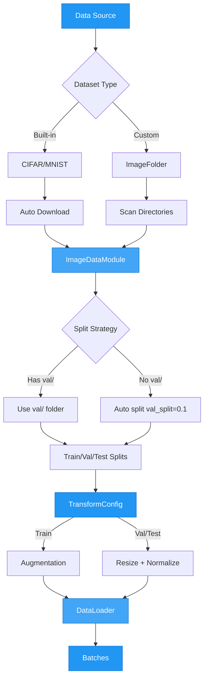

# Image Classification Data

The `ImageDataModule` handles image classification datasets including built-in datasets (CIFAR, MNIST) and custom folder-structured datasets.

## Data Loading Flow



## Built-in Datasets

Load standard datasets automatically:

```python
from autotimm import ImageDataModule

data = ImageDataModule(
    data_dir="./data",          # Download location
    dataset_name="CIFAR10",     # Dataset name
    image_size=224,
    batch_size=64,
)
```

Supported datasets:

| Dataset | Classes | Size |
|---------|---------|------|
| `CIFAR10` | 10 | 32x32 |
| `CIFAR100` | 100 | 32x32 |
| `MNIST` | 10 | 28x28 |
| `FashionMNIST` | 10 | 28x28 |

---

## Custom Folder Datasets

Organize images in ImageFolder format:

```
dataset/
  train/
    class_a/
      img1.jpg
      img2.jpg
    class_b/
      img3.jpg
  val/
    class_a/
      img4.jpg
    class_b/
      img5.jpg
  test/           # Optional
    class_a/
      img6.jpg
```

Load with:

```python
data = ImageDataModule(
    data_dir="./dataset",
    image_size=384,
    batch_size=16,
)
data.setup("fit")
print(f"Classes: {data.num_classes}")
print(f"Class names: {data.class_names}")
```

---

## Auto Validation Split

If no `val/` directory exists, a fraction of training data is held out:

```python
data = ImageDataModule(
    data_dir="./dataset",
    val_split=0.1,   # 10% for validation (default)
)
```

---

## Transform Backends

### Torchvision (Default)

PIL-based transforms using torchvision:

```python
data = ImageDataModule(
    data_dir="./data",
    dataset_name="CIFAR10",
    transform_backend="torchvision",  # Default
    augmentation_preset="default",
)
```

Available presets:

| Preset | Description |
|--------|-------------|
| `default` | RandomResizedCrop, HorizontalFlip, ColorJitter |
| `autoaugment` | AutoAugment (ImageNet policy) |
| `randaugment` | RandAugment (2 ops, magnitude 9) |
| `trivialaugment` | TrivialAugmentWide |

```python
# Using RandAugment
data = ImageDataModule(
    data_dir="./data",
    dataset_name="CIFAR10",
    augmentation_preset="randaugment",
)
```

### Albumentations

OpenCV-based transforms (faster for some operations, included by default):

```python
data = ImageDataModule(
    data_dir="./data",
    dataset_name="CIFAR10",
    transform_backend="albumentations",
    augmentation_preset="default",
)
```

Available presets:

| Preset | Description |
|--------|-------------|
| `default` | RandomResizedCrop, HorizontalFlip, ColorJitter |
| `strong` | Affine, blur/noise, ColorJitter, CoarseDropout |

```python
# Strong augmentation for better generalization
data = ImageDataModule(
    data_dir="./data",
    dataset_name="CIFAR10",
    transform_backend="albumentations",
    augmentation_preset="strong",
)
```

---

## Custom Transforms

### Torchvision Custom

```python
from torchvision import transforms

custom_train = transforms.Compose([
    transforms.RandomResizedCrop(224),
    transforms.RandomHorizontalFlip(),
    transforms.RandAugment(num_ops=2, magnitude=9),
    transforms.ToTensor(),
    transforms.Normalize(mean=[0.485, 0.456, 0.406], std=[0.229, 0.224, 0.225]),
])

custom_eval = transforms.Compose([
    transforms.Resize(256),
    transforms.CenterCrop(224),
    transforms.ToTensor(),
    transforms.Normalize(mean=[0.485, 0.456, 0.406], std=[0.229, 0.224, 0.225]),
])

data = ImageDataModule(
    data_dir="./dataset",
    train_transforms=custom_train,
    eval_transforms=custom_eval,
)
```

### Albumentations Custom

```python
import albumentations as A
from albumentations.pytorch import ToTensorV2

custom_train = A.Compose([
    A.RandomResizedCrop(height=224, width=224),
    A.HorizontalFlip(p=0.5),
    A.ColorJitter(brightness=0.3, contrast=0.3, saturation=0.3, p=0.8),
    A.GaussianBlur(blur_limit=(3, 7), p=0.3),
    A.Normalize(mean=[0.485, 0.456, 0.406], std=[0.229, 0.224, 0.225]),
    ToTensorV2(),
])

custom_eval = A.Compose([
    A.Resize(height=256, width=256),
    A.CenterCrop(height=224, width=224),
    A.Normalize(mean=[0.485, 0.456, 0.406], std=[0.229, 0.224, 0.225]),
    ToTensorV2(),
])

data = ImageDataModule(
    data_dir="./dataset",
    transform_backend="albumentations",
    train_transforms=custom_train,
    eval_transforms=custom_eval,
)
```

---

## Balanced Sampling

For imbalanced datasets, use weighted sampling:

```python
data = ImageDataModule(
    data_dir="./imbalanced_dataset",
    balanced_sampling=True,  # Oversamples minority classes
)
```

This uses `WeightedRandomSampler` to ensure each class is sampled equally during training.

---

## DataLoader Options

Fine-tune data loading performance:

```python
data = ImageDataModule(
    data_dir="./dataset",
    batch_size=64,
    num_workers=8,            # Parallel data loading
    pin_memory=True,          # Faster GPU transfer
    persistent_workers=True,  # Keep workers alive
    prefetch_factor=4,        # Batches to prefetch per worker
)
```

**Performance Tips:**

- **num_workers**: Start with `4 * num_gpus`, adjust based on CPU cores
- **pin_memory**: Set `True` when using GPU
- **persistent_workers**: Set `True` to avoid worker restart overhead
- **prefetch_factor**: Increase to `4-8` if CPU can keep up with GPU

---

## Dataset Summary

Get a summary of your data:

```python
data = ImageDataModule(data_dir="./dataset", dataset_name="CIFAR10")
data.setup("fit")
print(data.summary())
```

Output (Rich table):

```
┌─────────────────────┬──────────┐
│ Field               │ Value    │
├─────────────────────┼──────────┤
│ Data dir            │ ./data   │
│ Dataset             │ CIFAR10  │
│ Image size          │ 224      │
│ Batch size          │ 32       │
│ Num classes         │ 10       │
│ Train samples       │ 45000    │
│ Val samples         │ 5000     │
│ Test samples        │ 10000    │
└─────────────────────┴──────────┘
```

---

## Full Parameter Reference

```python
ImageDataModule(
    data_dir="./data",           # Root directory
    dataset_name=None,           # Built-in dataset name (CIFAR10, etc.)
    image_size=224,              # Target image size
    batch_size=32,               # Batch size
    num_workers=4,               # Data loading workers
    val_split=0.1,               # Validation split fraction
    train_transforms=None,       # Custom train transforms
    eval_transforms=None,        # Custom eval transforms
    augmentation_preset=None,    # "default", "autoaugment", etc.
    transform_backend="torchvision",  # "torchvision" or "albumentations"
    pin_memory=True,             # Pin memory for GPU
    persistent_workers=False,    # Keep workers alive
    prefetch_factor=None,        # Prefetch batches per worker
    balanced_sampling=False,     # Weighted sampling for imbalanced data
)
```

---

## Complete Example

```python
from autotimm import (
    AutoTrainer,
    ImageClassifier,
    ImageDataModule,
    MetricConfig,
    MetricManager,
)

# Data
data = ImageDataModule(
    data_dir="./data",
    dataset_name="CIFAR10",
    image_size=224,
    batch_size=64,
    num_workers=4,
    augmentation_preset="randaugment",
)

# Metrics
metric_configs = [
    MetricConfig(
        name="accuracy",
        backend="torchmetrics",
        metric_class="Accuracy",
        params={"task": "multiclass"},
        stages=["train", "val", "test"],
        prog_bar=True,
    ),
]
metric_manager = MetricManager(configs=metric_configs, num_classes=10)

# Model
model = ImageClassifier(
    backbone="resnet50",
    num_classes=10,
    metrics=metric_manager,
    lr=1e-3,
)

# Train
trainer = AutoTrainer(max_epochs=10)
trainer.fit(model, datamodule=data)
trainer.test(model, datamodule=data)
```

---

## Multi-Label Classification Data

For multi-label tasks (where each image can have multiple labels), use `MultiLabelImageDataModule` with CSV files.

### CSV Format

```
image_path,cat,dog,outdoor,indoor
img1.jpg,1,0,1,0
img2.jpg,0,1,0,1
img3.jpg,1,1,1,0
```

The first column is the image path (relative to `image_dir`), and the remaining columns are binary label indicators.

### Basic Usage

```python
from autotimm import MultiLabelImageDataModule

data = MultiLabelImageDataModule(
    train_csv="train.csv",
    image_dir="./images",
    val_csv="val.csv",          # Optional: auto-splits from train if omitted
    image_size=224,
    batch_size=32,
    num_workers=4,
)
data.setup("fit")
print(f"Labels: {data.num_labels}")       # 4
print(f"Label names: {data.label_names}")  # ['cat', 'dog', 'outdoor', 'indoor']
```

### Auto Validation Split

If no `val_csv` is provided, a fraction of training data is held out:

```python
data = MultiLabelImageDataModule(
    train_csv="train.csv",
    image_dir="./images",
    val_split=0.2,   # 20% for validation
)
```

### Explicit Label Columns

By default, all columns except the first are used as labels. To select specific columns:

```python
data = MultiLabelImageDataModule(
    train_csv="train.csv",
    image_dir="./images",
    label_columns=["cat", "dog"],  # Only use these labels
    image_column="image_path",     # Explicit image column name
)
```

### With Albumentations

```python
data = MultiLabelImageDataModule(
    train_csv="train.csv",
    image_dir="./images",
    transform_backend="albumentations",
    augmentation_preset="strong",
)
```

### Complete Multi-Label Training

```python
from autotimm import (
    AutoTrainer,
    ImageClassifier,
    MetricConfig,
    MultiLabelImageDataModule,
)

data = MultiLabelImageDataModule(
    train_csv="train.csv",
    image_dir="./images",
    val_csv="val.csv",
    image_size=224,
    batch_size=32,
)
data.setup("fit")

model = ImageClassifier(
    backbone="resnet50",
    num_classes=data.num_labels,
    multi_label=True,
    metrics=[
        MetricConfig(
            name="accuracy",
            backend="torchmetrics",
            metric_class="MultilabelAccuracy",
            params={"num_labels": data.num_labels},
            stages=["train", "val"],
            prog_bar=True,
        ),
    ],
)

trainer = AutoTrainer(max_epochs=10)
trainer.fit(model, datamodule=data)
```

### Full Parameter Reference

```python
MultiLabelImageDataModule(
    train_csv="train.csv",          # Path to training CSV
    image_dir="./images",           # Root directory for image paths
    val_csv=None,                   # Optional validation CSV
    test_csv=None,                  # Optional test CSV
    label_columns=None,             # Label column names (auto-detected if None)
    image_column=None,              # Image column name (first column if None)
    image_size=224,                 # Target image size
    batch_size=32,                  # Batch size
    num_workers=4,                  # Data loading workers
    val_split=0.1,                  # Validation split (when val_csv is None)
    train_transforms=None,          # Custom train transforms
    eval_transforms=None,           # Custom eval transforms
    augmentation_preset=None,       # Preset name
    transform_backend="torchvision",  # "torchvision" or "albumentations"
    pin_memory=True,                # Pin memory for GPU
    persistent_workers=False,       # Keep workers alive
    prefetch_factor=None,           # Prefetch batches per worker
)
```

---

## See Also

- [Object Detection Data](object-detection-data.md) - For COCO format object detection datasets
- [Data Handling Examples](../../examples/utilities/data-handling.md) - More examples and use cases
- [Training Guide](../training/training.md) - How to train models with your data
- [Multi-Label Classification Example](../../examples/tasks/classification.md#multi-label-classification) - Complete multi-label example
