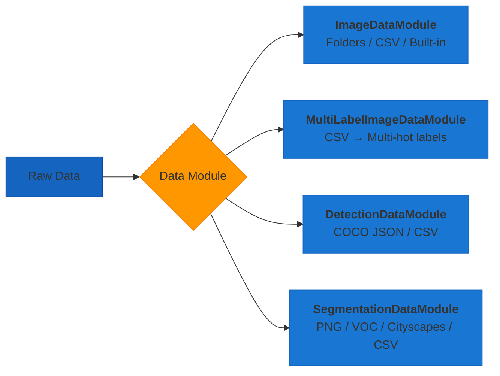

# Data Loading

AutoTimm provides specialized data modules for different computer vision tasks:

- **[ImageDataModule](image-classification-data.md)**: Image classification datasets (CIFAR, MNIST, custom folders, CSV)
- **[MultiLabelImageDataModule](multilabel-classification-data.md)**: Multi-label classification from CSV files
- **[DetectionDataModule](object-detection-data.md)**: Object detection datasets (COCO format or CSV)
- **[SegmentationDataModule](segmentation-data.md)**: Semantic segmentation datasets (PNG, VOC, Cityscapes, COCO, CSV)
- **[InstanceSegmentationDataModule](segmentation-data.md#instance-segmentation-data)**: Instance segmentation datasets (COCO format or CSV)
- **[CSV Data Loading](csv-data.md)**: CSV-based data loading for all task types
- **[Transforms](transforms.md)**: Image transforms and augmentation system

## Data Loading Pipeline

### Data Modules



### Transform & Batch


## Quick Start

### Image Classification

```python
from autotimm import ImageDataModule

# Built-in dataset
data = ImageDataModule(
    data_dir="./data",
    dataset_name="CIFAR10",
    image_size=224,
    batch_size=64,
)

# Custom folder dataset
data = ImageDataModule(
    data_dir="./my_dataset",  # Contains train/, val/ folders
    image_size=224,
    batch_size=32,
)
```

**[Full Image Classification Data Guide](image-classification-data.md)**

### Multi-Label Classification

```python
from autotimm import MultiLabelImageDataModule

# CSV with columns: image_path, cat, dog, outdoor, indoor
data = MultiLabelImageDataModule(
    train_csv="train.csv",
    image_dir="./images",
    val_csv="val.csv",
    image_size=224,
    batch_size=32,
)
```

**[Full Multi-Label Classification Data Guide](multilabel-classification-data.md)**

### Object Detection

```python
from autotimm import DetectionDataModule

# COCO format dataset
data = DetectionDataModule(
    data_dir="./coco",
    image_size=640,
    batch_size=16,
    augmentation_preset="default",
)
```

:material-arrow-right: **[Full Object Detection Data Guide](object-detection-data.md)**

---

## Choosing the Right Data Module

| Task | Data Module | Input Format | Output |
|------|-------------|--------------|---------|
| Image Classification | `ImageDataModule` | Images in class folders | Class labels |
| Multi-Label Classification | `MultiLabelImageDataModule` | CSV + images | Multi-hot labels |
| Object Detection | `DetectionDataModule` | COCO JSON + images | Bounding boxes + labels |

---

## Common Features

Both data modules share these features:

### Model-Specific Normalization with TransformConfig

Use `TransformConfig` with a backbone to get model-specific normalization (mean/std):

```python
from autotimm import ImageDataModule, TransformConfig

# Create shared config for data and model
config = TransformConfig(
    preset="randaugment",
    image_size=384,
    use_timm_config=True,  # Use model's pretrained normalization
)

data = ImageDataModule(
    data_dir="./data",
    dataset_name="CIFAR10",
    transform_config=config,
    backbone="efficientnet_b4",  # Required for model-specific normalization
)
```

See [TransformConfig API](../../api/transforms.md) for full details.

### DataLoader Configuration

```python
data = ImageDataModule(  # or DetectionDataModule
    batch_size=32,
    num_workers=4,            # Parallel data loading
    pin_memory=True,          # Faster GPU transfer
    persistent_workers=True,  # Keep workers alive
    prefetch_factor=4,        # Batches to prefetch
)
```

### Augmentation Support

Both modules support:
- **Preset augmentations**: `"default"`, `"strong"`, etc.
- **Custom transforms**: Torchvision or Albumentations
- **Backend selection**: Choose between `"torchvision"` or `"albumentations"`

---

## Detailed Guides

### Image Classification
Learn about:
- Built-in datasets (CIFAR10, MNIST, etc.)
- Custom folder structure
- Transform backends and presets
- Balanced sampling for imbalanced data
- Custom augmentations

**[Read the Image Classification Data Guide →](image-classification-data.md)**

### Multi-Label Classification
Learn about:
- CSV-based multi-label data format
- Auto-detected and explicit label columns
- Auto validation split
- Transform backends and augmentation presets
- Integration with `ImageClassifier(multi_label=True)`

**[Read the Multi-Label Classification Data Guide →](multilabel-classification-data.md)**

### Object Detection
Learn about:
- COCO dataset format
- Detection-specific augmentations
- Class filtering
- Small box filtering
- Custom COCO datasets

**[Read the Object Detection Data Guide →](object-detection-data.md)**

### Transforms
Learn about:
- TransformConfig for unified configuration
- Augmentation presets (torchvision and albumentations)
- Model-specific normalization with timm
- Custom transform pipelines
- Backend comparison

**[Read the Transforms Guide →](transforms.md)**

---

## Performance Tips

### Optimize DataLoader Settings

1. **Start conservative**: `num_workers=4`, `batch_size=32`
2. **Monitor CPU usage**: Increase `num_workers` if CPU is underutilized
3. **Monitor GPU usage**: Increase `batch_size` if GPU memory allows
4. **Use persistent workers**: Set `persistent_workers=True` for faster epoch starts
5. **Enable prefetching**: Set `prefetch_factor=4-8` if CPU can keep up

### Memory Optimization

- **Reduce batch size** if hitting OOM errors
- **Enable pin_memory** when using GPU
- **Use mixed precision** training (`trainer.precision="bf16-mixed"`)
- **Adjust image size** to reduce memory footprint

### Speed Optimization

- **Increase num_workers** up to CPU core count
- **Use SSD storage** for faster image loading
- **Cache small datasets** in RAM if possible
- **Use persistent_workers** to avoid worker restart overhead

---

## Examples

### Classification Example

```python
from autotimm import (
    AutoTrainer,
    ImageClassifier,
    ImageDataModule,
    MetricConfig,
    MetricManager,
)

data = ImageDataModule(
    data_dir="./data",
    dataset_name="CIFAR10",
    batch_size=64,
)

metric_manager = MetricManager(
    configs=[
        MetricConfig(
            name="accuracy",
            backend="torchmetrics",
            metric_class="Accuracy",
            params={"task": "multiclass"},
            stages=["train", "val", "test"],
        )
    ],
    num_classes=10,
)

model = ImageClassifier(
    backbone="resnet50",
    num_classes=10,
    metrics=metric_manager,
)

trainer = AutoTrainer(max_epochs=10)
trainer.fit(model, datamodule=data)
```

### Detection Example

```python
from autotimm import (
    AutoTrainer,
    DetectionDataModule,
    MetricConfig,
    ObjectDetector,
)

data = DetectionDataModule(
    data_dir="./coco",
    image_size=640,
    batch_size=16,
)

model = ObjectDetector(
    backbone="resnet50",
    num_classes=80,
    metrics=[
        MetricConfig(
            name="mAP",
            backend="torchmetrics",
            metric_class="MeanAveragePrecision",
            params={"box_format": "xyxy"},
            stages=["val", "test"],
        )
    ],
)

trainer = AutoTrainer(max_epochs=12, gradient_clip_val=1.0)
trainer.fit(model, datamodule=data)
```

---

## See Also

- [Image Classification Data Guide](image-classification-data.md)
- [Multi-Label Classification Data Guide](multilabel-classification-data.md)
- [Object Detection Data Guide](object-detection-data.md)
- [Data Handling Examples](../../examples/utilities/data-handling.md)
- [Training Guide](../training/training.md)
