# Multi-Label Classification Data

The `MultiLabelImageDataModule` handles multi-label image classification datasets from CSV files, where each image can belong to multiple classes simultaneously.

## Data Loading Flow

```mermaid
graph TD
    A[CSV File] --> A1[Read CSV]
    A1 --> A2[Parse Headers]
    A2 --> A3[Load Paths & Labels]
    A3 --> B[MultiLabelImageDataset]
    
    C[Image Dir] --> C1[Verify Directory]
    C1 --> C2[List Image Files]
    C2 --> B

    B --> B1[Create Dataset]
    B1 --> B2[Validate Labels]
    B2 --> B3[Multi-hot Encoding]
    B3 --> D[MultiLabelImageDataModule]

    D --> D1[Initialize Module]
    D1 --> D2[Configure Params]
    D2 --> E{Split Strategy}

    E -->|val_csv provided| F1[Separate val set]
    F1 --> F1a[Load val CSV]
    F1a --> F1b[Create Val Dataset]
    
    E -->|No val_csv| F2[Auto split val_split]
    F2 --> F2a[Random Split]
    F2a --> F2b[Create Val Subset]

    F1b --> G[Train / Val / Test Splits]
    F2b --> G
    
    G --> G1[Assign Indices]
    G1 --> G2[Verify Splits]
    G2 --> H[Transforms]

    H -->|Train| I1[Augmentation]
    I1 --> I1a[RandomResizedCrop]
    I1a --> I1b[RandomHorizontalFlip]
    I1b --> I1c[ColorJitter]
    I1c --> I1d[Normalize]
    
    H -->|Val / Test| I2[Resize + Normalize]
    I2 --> I2a[Resize]
    I2a --> I2b[CenterCrop]
    I2b --> I2c[Normalize]

    I1d --> J[DataLoader]
    I2c --> J
    
    J --> J1[Create Loaders]
    J1 --> J2[Set Batch Size]
    J2 --> J3[Configure Workers]
    J3 --> K[Batches: image, multi-hot labels]
    
    K --> K1[Stack Images]
    K1 --> K2[Stack Labels]
    K2 --> K3[Ready for Model]

    style A fill:#2196F3,stroke:#1976D2,color:#fff
    style B fill:#42A5F5,stroke:#1976D2,color:#fff
    style D fill:#2196F3,stroke:#1976D2,color:#fff
    style H fill:#42A5F5,stroke:#1976D2,color:#fff
    style J fill:#2196F3,stroke:#1976D2,color:#fff
    style K fill:#42A5F5,stroke:#1976D2,color:#fff
    style K3 fill:#2196F3,stroke:#1976D2,color:#fff
```



## CSV Format

Each row contains an image path and binary label columns:

```
image_path,cat,dog,outdoor,indoor
img1.jpg,1,0,1,0
img2.jpg,0,1,0,1
img3.jpg,1,1,1,0
```

- **First column**: relative image path (resolved against `image_dir`)
- **Remaining columns**: binary label indicators (0 or 1)

---

## Basic Usage

```python
from autotimm import MultiLabelImageDataModule

data = MultiLabelImageDataModule(
    train_csv="train.csv",
    image_dir="./images",
    val_csv="val.csv",
    image_size=224,
    batch_size=32,
)
data.setup("fit")
print(f"Num labels: {data.num_labels}")       # 4
print(f"Label names: {data.label_names}")      # ['cat', 'dog', 'outdoor', 'indoor']
print(f"Train samples: {len(data.train_dataset)}")
```

---

## Auto Validation Split

If no `val_csv` is provided, a fraction of training data is held out:

```python
data = MultiLabelImageDataModule(
    train_csv="train.csv",
    image_dir="./images",
    val_split=0.2,   # 20% for validation
)
```

---

## Explicit Label Columns

By default, all columns except the first are used as labels. To select specific columns:

```python
data = MultiLabelImageDataModule(
    train_csv="train.csv",
    image_dir="./images",
    label_columns=["cat", "dog"],   # Only use these 2 labels
    image_column="filepath",        # Explicit image column name
)
```

---

## Transform Backends

### Torchvision (Default)

```python
data = MultiLabelImageDataModule(
    train_csv="train.csv",
    image_dir="./images",
    transform_backend="torchvision",
    augmentation_preset="randaugment",
)
```

### Albumentations

```python
data = MultiLabelImageDataModule(
    train_csv="train.csv",
    image_dir="./images",
    transform_backend="albumentations",
    augmentation_preset="strong",
)
```

---

## Custom Transforms

```python
from torchvision import transforms

custom_train = transforms.Compose([
    transforms.RandomResizedCrop(224),
    transforms.RandomHorizontalFlip(),
    transforms.ToTensor(),
    transforms.Normalize([0.485, 0.456, 0.406], [0.229, 0.224, 0.225]),
])

data = MultiLabelImageDataModule(
    train_csv="train.csv",
    image_dir="./images",
    train_transforms=custom_train,
)
```

---

## DataLoader Options

```python
data = MultiLabelImageDataModule(
    train_csv="train.csv",
    image_dir="./images",
    batch_size=64,
    num_workers=8,
    pin_memory=True,
    persistent_workers=True,
    prefetch_factor=4,
)
```

---

## Full Parameter Reference

```python
MultiLabelImageDataModule(
    train_csv="train.csv",          # Path to training CSV
    image_dir="./images",           # Root directory for image paths
    val_csv=None,                   # Optional validation CSV
    test_csv=None,                  # Optional test CSV
    label_columns=None,             # Label column names (auto-detected)
    image_column=None,              # Image column name (first column)
    image_size=224,                 # Target image size
    batch_size=32,                  # Batch size
    num_workers=4,                  # Data loading workers
    val_split=0.1,                  # Validation split fraction
    train_transforms=None,          # Custom train transforms
    eval_transforms=None,           # Custom eval transforms
    augmentation_preset=None,       # Preset name
    transform_backend="torchvision",  # "torchvision" or "albumentations"
    transform_config=None,          # TransformConfig for model normalization
    backbone=None,                  # Backbone for model-specific normalization
    pin_memory=True,                # Pin memory for GPU
    persistent_workers=False,       # Keep workers alive
    prefetch_factor=None,           # Prefetch batches per worker
)
```

---

## Complete Example

```python
from autotimm import (
    AutoTrainer,
    ImageClassifier,
    MetricConfig,
    MultiLabelImageDataModule,
)

# Data
data = MultiLabelImageDataModule(
    train_csv="train.csv",
    image_dir="./images",
    val_csv="val.csv",
    image_size=224,
    batch_size=32,
    num_workers=4,
)
data.setup("fit")

# Model
model = ImageClassifier(
    backbone="resnet50",
    num_classes=data.num_labels,
    multi_label=True,
    threshold=0.5,
    metrics=[
        MetricConfig(
            name="accuracy",
            backend="torchmetrics",
            metric_class="MultilabelAccuracy",
            params={"num_labels": data.num_labels},
            stages=["train", "val"],
            prog_bar=True,
        ),
        MetricConfig(
            name="f1",
            backend="torchmetrics",
            metric_class="MultilabelF1Score",
            params={"num_labels": data.num_labels, "average": "macro"},
            stages=["val"],
        ),
    ],
    lr=1e-3,
)

# Train
trainer = AutoTrainer(max_epochs=10)
trainer.fit(model, datamodule=data)
```

---

## See Also

- [Image Classification Data](image-classification-data.md) - Single-label classification data loading
- [Image Classifier Guide](../models/image-classifier.md#multi-label-classification) - Multi-label model configuration
- [Multi-Label Example](../../examples/tasks/classification.md#multi-label-classification) - Runnable example
- [API Reference](../../api/data.md#multilabelimagedatamodule) - Full API docs
