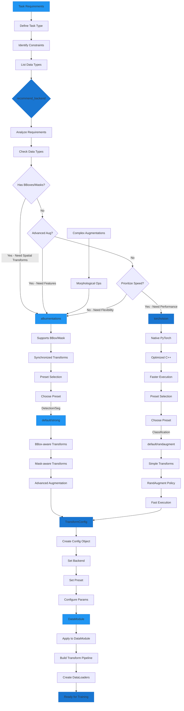

# Preset Manager

The Preset Manager is an intelligent system that helps you choose the best transform backend (torchvision vs albumentations) based on your specific task and requirements.

## Backend Selection Workflow



## Quick Start

```python
from autotimm import recommend_backend

# Get a recommendation for your task
rec = recommend_backend(task="detection")
print(rec)
```

Output:
```
Recommended Backend: albumentations
Recommended Preset: default

Reasoning: Object Detection requires bbox/mask-aware transforms. 
Albumentations provides built-in support for synchronized transforms.

Available presets for albumentations:
  - default
  - strong
  - light
```

## Core Functions

### `recommend_backend()`

Get an intelligent recommendation for the best transform backend.

```python
from autotimm import recommend_backend

recommendation = recommend_backend(
    task="classification",  # or "detection", "segmentation", "instance_segmentation"
    needs_advanced_augmentation=False,
    needs_spatial_transforms=False,
    prioritize_speed=False,
    has_bbox_or_masks=False,
)
```

**Parameters:**

- `task` (optional): Type of vision task
  - `"classification"`: Image classification
  - `"detection"`: Object detection  
  - `"segmentation"`: Semantic segmentation
  - `"instance_segmentation"`: Instance segmentation

- `needs_advanced_augmentation`: Whether you need advanced augmentations like geometric transforms, blur, noise, etc.

- `needs_spatial_transforms`: Whether you need spatial transforms like rotation, affine, elastic transforms

- `prioritize_speed`: Whether to prioritize transform speed over flexibility

- `has_bbox_or_masks`: Whether your data includes bounding boxes or masks that need to be transformed together with images

**Returns:** `BackendRecommendation` object with:
- `backend`: Recommended backend ("torchvision" or "albumentations")
- `preset`: Recommended preset for that backend
- `reasoning`: Explanation for the recommendation
- `available_presets`: List of all available presets
- `alternative`: Alternative option with reasoning (if applicable)

### `compare_backends()`

Compare torchvision and albumentations backends side-by-side.

```python
from autotimm import compare_backends

# Print detailed comparison table
comparison = compare_backends(verbose=True)

# Or get data programmatically
comparison = compare_backends(verbose=False)
print(comparison['torchvision']['presets'])
print(comparison['albumentations']['best_for'])
```

## Usage Examples

### Example 1: Simple Classification

```python
from autotimm import recommend_backend, ImageClassifier, MetricConfig

# Get recommendation
rec = recommend_backend(task="classification")

# Convert to config
config = rec.to_config(image_size=224)

# Use in model
metrics = [
    MetricConfig(
        name="accuracy",
        backend="torchmetrics",
        metric_class="Accuracy",
        params={"task": "multiclass", "num_classes": 10},
        stages=["train", "val"],
        prog_bar=True,
    ),
]

model = ImageClassifier(
    backbone="resnet18",
    num_classes=10,
    transform_config=config,
    metrics=metrics,
)
```

### Example 2: Object Detection

```python
from autotimm import recommend_backend, ObjectDetector

# Detection automatically recommends albumentations
rec = recommend_backend(task="detection")
print(f"Using {rec.backend} with preset '{rec.preset}'")

# Create config with detection-specific settings
config = rec.to_config(
    image_size=640,
    min_bbox_area=10,
    min_visibility=0.3,
)

model = ObjectDetector(
    backbone="resnet50",
    num_classes=80,
)
```

### Example 3: Advanced Classification

```python
from autotimm import recommend_backend

# Need strong augmentation for small dataset
rec = recommend_backend(
    task="classification",
    needs_advanced_augmentation=True,
    needs_spatial_transforms=True,
)

# This will recommend albumentations with 'strong' preset
config = rec.to_config(image_size=384)
print(f"Backend: {config.backend}, Preset: {config.preset}")
# Output: Backend: albumentations, Preset: strong
```

### Example 4: Speed-Optimized Pipeline

```python
from autotimm import recommend_backend

# Prioritize speed for inference
rec = recommend_backend(prioritize_speed=True)

# This recommends torchvision with 'light' preset
config = rec.to_config(image_size=224)
```

### Example 5: Comparing Backends

```python
from autotimm import compare_backends

# View full comparison
comparison = compare_backends(verbose=True)

# Access specific information
tv_pros = comparison['torchvision']['pros']
albu_pros = comparison['albumentations']['pros']

print("Torchvision advantages:")
for pro in tv_pros:
    print(f"  + {pro}")
```

## Decision Matrix

The Preset Manager uses the following logic to make recommendations:

| Task | Requirements | Recommended Backend | Recommended Preset |
|------|-------------|--------------------|--------------------|
| Classification | Default | Torchvision | randaugment |
| Classification | Advanced augmentation | Albumentations | strong |
| Detection | Any | Albumentations | default |
| Segmentation | Any | Albumentations | default |
| Instance Segmentation | Any | Albumentations | default |
| Any | Spatial transforms needed | Albumentations | strong |
| Any | BBox/masks present | Albumentations | default |
| Any | Speed priority (no bbox/masks) | Torchvision | light |

## Backend Comparison

### Torchvision

**Best for:**

- Image classification
- Quick prototyping
- Simple augmentation pipelines
- When speed is critical (for basic transforms)

**Pros:**

- Built into PyTorch ecosystem
- Fast for basic transforms
- Well-documented
- No extra dependencies (included in AutoTimm)

**Cons:**

- Limited spatial transforms
- No built-in bbox/mask handling
- Fewer augmentation options

**Available Presets:**

- `default`: RandomResizedCrop, HorizontalFlip, ColorJitter
- `autoaugment`: AutoAugment (ImageNet policy)
- `randaugment`: RandAugment with configurable ops/magnitude
- `trivialaugment`: TrivialAugmentWide
- `light`: RandomResizedCrop, HorizontalFlip only

### Albumentations

**Best for:**

- Object detection
- Semantic/instance segmentation
- Advanced augmentation pipelines
- Spatial transforms (rotation, affine, elastic)

**Pros:**

- Rich augmentation library (80+ transforms)
- Built-in bbox/mask support
- Spatial transforms (affine, elastic, etc.)
- Highly optimized (included in AutoTimm)

**Cons:**

- Slightly more complex API
- OpenCV-based (different from PIL)

**Available Presets:**

- `default`: RandomResizedCrop, HorizontalFlip, ColorJitter
- `strong`: Affine, blur/noise, ColorJitter, CoarseDropout
- `light`: RandomResizedCrop, HorizontalFlip only

## API Reference

### BackendRecommendation

```python
@dataclass
class BackendRecommendation:
    backend: Literal["torchvision", "albumentations"]
    preset: str
    reasoning: str
    available_presets: list[str]
    alternative: str | None = None
    
    def to_config(self, **kwargs) -> TransformConfig:
        """Convert to TransformConfig with optional overrides."""
        ...
```

### recommend_backend()

```python
def recommend_backend(
    task: Literal["classification", "detection", "segmentation", "instance_segmentation"] | None = None,
    needs_advanced_augmentation: bool = False,
    needs_spatial_transforms: bool = False,
    prioritize_speed: bool = False,
    has_bbox_or_masks: bool = False,
) -> BackendRecommendation:
    """Recommend the best transform backend based on requirements."""
    ...
```

### compare_backends()

```python
def compare_backends(verbose: bool = True) -> dict[str, dict]:
    """Compare torchvision and albumentations backends."""
    ...
```

## See Also

- [TransformConfig](transforms.md) - Unified transform configuration
- [Data Loading](index.md) - Overview of data loading in AutoTimm
- [Transforms Guide](transforms.md) - Detailed guide to transforms
