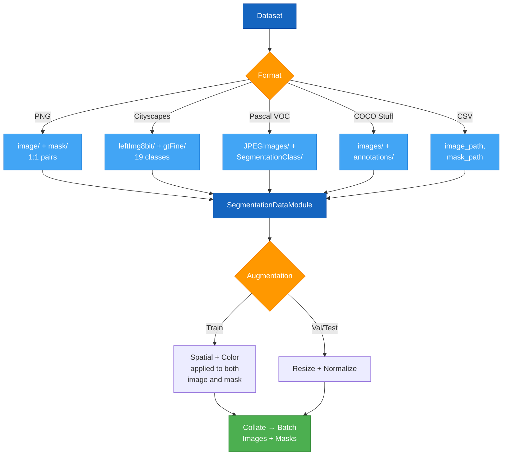

# Segmentation Data Loading

This guide covers data loading for semantic and instance segmentation tasks. For CSV-based data loading, see [CSV Data Loading](csv-data.md#semantic-segmentation).

## Segmentation Data Pipeline



## Semantic Segmentation Data

### Supported Formats

AutoTimm supports multiple segmentation dataset formats:

| Format | Description | Use Case |
|--------|-------------|----------|
| PNG | Simple image + mask pairs | Custom datasets, quick prototyping |
| Cityscapes | Urban scene segmentation | Autonomous driving |
| Pascal VOC | 20-class segmentation | General object segmentation |
| COCO Stuff | 171 stuff categories | Scene understanding |

### PNG Format

The simplest format for custom datasets.

**Directory Structure:**

```
data/
  train/
    images/
      img001.jpg
      img002.jpg
      img003.png
    masks/
      img001.png
      img002.png
      img003.png
  val/
    images/
    masks/
  test/
    images/
    masks/
```

**Requirements:**

- Images and masks must have matching filenames
- Masks must be single-channel PNG with pixel values = class indices
- Use 255 for unlabeled/ignored pixels

**Example:**

```python
from autotimm import SegmentationDataModule

data = SegmentationDataModule(
    data_dir="./data",
    format="png",
    image_size=512,
    batch_size=8,
)
```

### Cityscapes Format

Urban scene segmentation with 19 classes.

**Directory Structure:**

```
cityscapes/
  leftImg8bit/
    train/
      aachen/
        aachen_000000_000019_leftImg8bit.png
      ...
    val/
  gtFine/
    train/
      aachen/
        aachen_000000_000019_gtFine_labelIds.png
      ...
    val/
```

**Example:**

```python
data = SegmentationDataModule(
    data_dir="./cityscapes",
    format="cityscapes",
    image_size=512,
    batch_size=8,
)
```

**Class Mapping:**

Cityscapes has 34 original classes mapped to 19 training classes. AutoTimm handles this automatically.

### Pascal VOC Format

20 object classes + background.

**Directory Structure:**

```
VOC2012/
  JPEGImages/
    2007_000027.jpg
    2007_000032.jpg
  SegmentationClass/
    2007_000027.png
    2007_000032.png
  ImageSets/
    Segmentation/
      train.txt
      val.txt
```

**Example:**

```python
data = SegmentationDataModule(
    data_dir="./VOC2012",
    format="voc",
    image_size=512,
    batch_size=8,
)
```

### COCO Stuff Format

171 stuff categories for scene understanding.

**Directory Structure:**

```
coco/
  train2017/
  val2017/
  annotations/
    stuff_train2017.json
    stuff_val2017.json
```

**Example:**

```python
data = SegmentationDataModule(
    data_dir="./coco",
    format="coco",
    image_size=512,
    batch_size=8,
)
```

## Instance Segmentation Data

### COCO Instance Format

AutoTimm uses COCO JSON format with segmentation annotations.

**Directory Structure:**

```
coco/
  train2017/
    000000000001.jpg
    000000000002.jpg
  val2017/
  annotations/
    instances_train2017.json
    instances_val2017.json
```

**Example:**

```python
from autotimm import InstanceSegmentationDataModule

data = InstanceSegmentationDataModule(
    data_dir="./coco",
    image_size=640,
    batch_size=4,
)
```

**Annotation Format:**

The JSON contains:
- `images`: List of image info (id, file_name, width, height)
- `annotations`: List of instance annotations
  - `bbox`: [x, y, width, height] in COCO format
  - `segmentation`: RLE or polygon mask
  - `category_id`: Object class
  - `area`: Mask area
  - `iscrowd`: Whether instance is crowd

**Mask Formats:**

COCO supports two mask representations:
1. **Polygon**: `[[x1, y1, x2, y2, ...]]` - List of polygon vertices
2. **RLE**: Compressed binary mask (for crowd annotations)

AutoTimm automatically decodes both using pycocotools.

## Data Augmentation

### Semantic Segmentation

#### Presets

```python
# Light augmentation
data = SegmentationDataModule(
    data_dir="./data",
    format="png",
    augmentation_preset="light",
)

# Default augmentation
data = SegmentationDataModule(
    data_dir="./data",
    augmentation_preset="default",
)

# Strong augmentation
data = SegmentationDataModule(
    data_dir="./data",
    augmentation_preset="strong",
)
```

**Preset Details:**

| Transform | Light | Default | Strong |
|-----------|-------|---------|--------|
| RandomScale | ±10% | ±20% | ±50% |
| RandomCrop | Yes | Yes | Yes |
| HorizontalFlip | 0.5 | 0.5 | 0.5 |
| ColorJitter | Mild | Medium | Strong |
| GaussianBlur | No | No | Yes |
| Rotate | No | ±10° | ±15° |

#### Custom Transforms

```python
import albumentations as A
from albumentations.pytorch import ToTensorV2

train_transforms = A.Compose([
    A.RandomScale(scale_limit=0.5),
    A.RandomCrop(height=512, width=512),
    A.HorizontalFlip(p=0.5),
    A.ColorJitter(brightness=0.4, contrast=0.4, saturation=0.4, hue=0.1),
    A.GaussianBlur(p=0.3),
    A.Normalize(mean=(0.485, 0.456, 0.406), std=(0.229, 0.224, 0.225)),
    ToTensorV2(),
])

val_transforms = A.Compose([
    A.Resize(512, 512),
    A.Normalize(mean=(0.485, 0.456, 0.406), std=(0.229, 0.224, 0.225)),
    ToTensorV2(),
])

data = SegmentationDataModule(
    data_dir="./data",
    format="png",
    custom_train_transforms=train_transforms,
    custom_val_transforms=val_transforms,
)
```

**Important Notes:**

- Masks are automatically transformed with nearest-neighbor interpolation
- No need to specify additional_targets for masks
- Albumentations handles spatial consistency automatically

### Instance Segmentation

```python
import albumentations as A
from albumentations.pytorch import ToTensorV2

transforms = A.Compose([
    A.RandomScale(scale_limit=0.1),
    A.HorizontalFlip(p=0.5),
    A.ColorJitter(brightness=0.2, contrast=0.2),
    A.Normalize(mean=(0.485, 0.456, 0.406), std=(0.229, 0.224, 0.225)),
    ToTensorV2(),
], bbox_params=A.BboxParams(format='coco', label_fields=['labels']))

data = InstanceSegmentationDataModule(
    data_dir="./coco",
    custom_train_transforms=transforms,
)
```

**Important Notes:**

- Must specify `bbox_params` for detection + segmentation
- Masks are automatically transformed alongside boxes
- Format='coco' means [x, y, width, height]

## Class Mapping

### Handle Sparse Class IDs

Some datasets have non-contiguous class IDs. Use class_mapping to convert to contiguous indices:

```python
# Dataset has classes: 0 (bg), 7 (car), 11 (person), 255 (ignore)
# Map to: 0 (bg), 1 (car), 2 (person), 255 (ignore)

class_mapping = {
    0: 0,    # background
    7: 1,    # car
    11: 2,   # person
    255: 255 # ignore
}

data = SegmentationDataModule(
    data_dir="./data",
    format="png",
    class_mapping=class_mapping,
    ignore_index=255,
)
```

## DataModule Parameters

### SegmentationDataModule

```python
data = SegmentationDataModule(
    data_dir="./data",              # Root directory
    format="png",                   # Dataset format
    image_size=512,                 # Target size (square)
    batch_size=8,                   # Batch size
    num_workers=4,                  # Dataloader workers
    augmentation_preset="default",  # Augmentation preset
    custom_train_transforms=None,   # Custom train transforms
    custom_val_transforms=None,     # Custom val transforms
    class_mapping=None,             # Class ID mapping
    ignore_index=255,               # Ignore label
)
```

### InstanceSegmentationDataModule

```python
data = InstanceSegmentationDataModule(
    data_dir="./coco",              # Root directory
    image_size=640,                 # Target size (square)
    batch_size=4,                   # Batch size
    num_workers=4,                  # Dataloader workers
    augmentation_preset="default",  # Augmentation preset
    custom_train_transforms=None,   # Custom train transforms
    custom_val_transforms=None,     # Custom val transforms
)
```

## Creating Custom Datasets

### For Semantic Segmentation

Create a custom dataset by organizing images and masks:

```python
from pathlib import Path
from PIL import Image
import numpy as np

def create_png_dataset(image_dir, output_dir, num_classes):
    """Convert custom data to PNG format."""
    output_dir = Path(output_dir)
    (output_dir / "train" / "images").mkdir(parents=True, exist_ok=True)
    (output_dir / "train" / "masks").mkdir(parents=True, exist_ok=True)

    for image_path in Path(image_dir).glob("*.jpg"):
        # Copy image
        image = Image.open(image_path)
        image.save(output_dir / "train" / "images" / image_path.name)

        # Create/convert mask
        # Your custom logic to generate mask
        mask = np.zeros((image.height, image.width), dtype=np.uint8)
        # ... populate mask with class indices (0 to num_classes-1)
        # Use 255 for ignored pixels

        mask_image = Image.fromarray(mask)
        mask_name = image_path.stem + ".png"
        mask_image.save(output_dir / "train" / "masks" / mask_name)
```

### For Instance Segmentation

Convert to COCO format:

```python
import json
from pycocotools import mask as mask_utils

def create_coco_json(images_dir, annotations, output_path):
    """Create COCO JSON from custom annotations."""
    coco_format = {
        "images": [],
        "annotations": [],
        "categories": []
    }

    # Add categories
    for cat_id, cat_name in enumerate(["person", "car", "dog"], start=1):
        coco_format["categories"].append({
            "id": cat_id,
            "name": cat_name,
            "supercategory": "object"
        })

    # Add images and annotations
    ann_id = 1
    for img_id, (image_path, anns) in enumerate(annotations.items(), start=1):
        image = Image.open(image_path)

        coco_format["images"].append({
            "id": img_id,
            "file_name": Path(image_path).name,
            "width": image.width,
            "height": image.height,
        })

        # Add annotations for this image
        for ann in anns:
            # Convert binary mask to RLE
            rle = mask_utils.encode(np.asfortranarray(ann['mask']))
            rle['counts'] = rle['counts'].decode('utf-8')

            coco_format["annotations"].append({
                "id": ann_id,
                "image_id": img_id,
                "category_id": ann['category_id'],
                "bbox": ann['bbox'],  # [x, y, w, h]
                "area": float(mask_utils.area(rle)),
                "segmentation": rle,
                "iscrowd": 0,
            })
            ann_id += 1

    # Save JSON
    with open(output_path, 'w') as f:
        json.dump(coco_format, f)
```

## Best Practices

### 1. Image Size

Choose based on your task:
- **512x512**: Good balance for most tasks
- **768x768**: Higher quality, more memory
- **1024x1024**: Best quality, requires lots of memory

### 2. Batch Size

Segmentation requires more memory than classification:
- Start with batch_size=4 and increase if possible
- Use gradient accumulation for larger effective batch sizes

### 3. Workers

Set num_workers based on CPU cores:
```python
import os
data = SegmentationDataModule(
    data_dir="./data",
    num_workers=min(os.cpu_count(), 8),
)
```

### 4. Augmentation

- Use strong augmentation for small datasets
- Use light augmentation for large datasets
- Always normalize with ImageNet stats for pretrained backbones

### 5. Ignore Index

Always set ignore_index=255 for unlabeled pixels:
```python
data = SegmentationDataModule(
    data_dir="./data",
    ignore_index=255,
)
```

## Troubleshooting

For common segmentation data loading issues, see the [Troubleshooting - Data Loading](../../troubleshooting/data/data-loading.md), which includes:

- Masks not loading (format, pixel values, filename issues)
- Slow data loading (workers, image size, storage)
- Transform errors (albumentations, backend mixing)
- Out of memory errors

## Examples

See:
- [Semantic Segmentation Example](../../examples/tasks/semantic-segmentation.md)
- [Instance Segmentation Example](../../examples/tasks/instance-segmentation.md)
- [CSV Data Loading](csv-data.md) - Load segmentation data from CSV files
