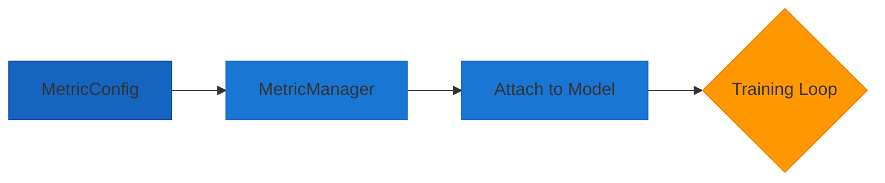
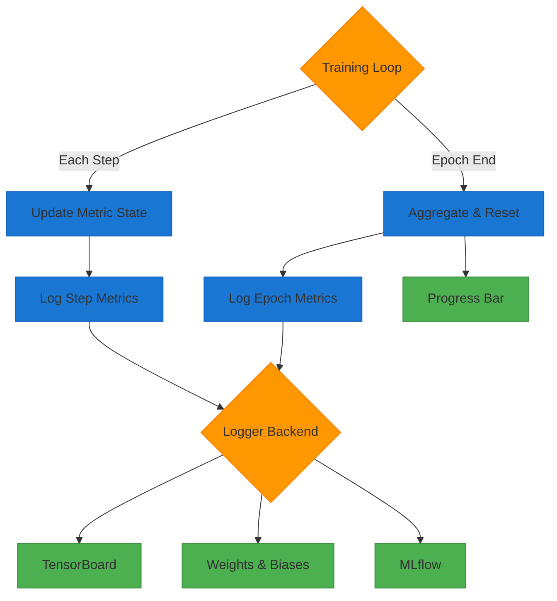

# Metrics

AutoTimm uses explicit metric configuration through `MetricConfig` and `MetricManager`. No default metrics are provided - you must specify exactly what you want to track.

## Metric Lifecycle

### Configure & Attach



### Compute & Log



## MetricConfig

### Basic Configuration

```python
from autotimm import MetricConfig

accuracy = MetricConfig(
    name="accuracy",                    # Unique identifier
    backend="torchmetrics",             # "torchmetrics" or "custom"
    metric_class="Accuracy",            # Class name in torchmetrics
    params={"task": "multiclass"},      # Constructor parameters
    stages=["train", "val", "test"],    # Where to compute
    prog_bar=True,                      # Show in progress bar
)
```

### MetricConfig Parameters

| Parameter | Required | Description |
|-----------|----------|-------------|
| `name` | Yes | Unique identifier for logging |
| `backend` | Yes | `"torchmetrics"` or `"custom"` |
| `metric_class` | Yes | Class name or full path |
| `params` | Yes | Constructor parameters |
| `stages` | Yes | List: `"train"`, `"val"`, `"test"` |
| `log_on_step` | No | Log each step (default: `False`) |
| `log_on_epoch` | No | Log each epoch (default: `True`) |
| `prog_bar` | No | Show in progress bar (default: `False`) |

## Torchmetrics Backend

### Common Metrics

```python
from autotimm import MetricConfig

metrics = [
    # Accuracy
    MetricConfig(
        name="accuracy",
        backend="torchmetrics",
        metric_class="Accuracy",
        params={"task": "multiclass"},
        stages=["train", "val", "test"],
        prog_bar=True,
    ),
    # F1 Score
    MetricConfig(
        name="f1",
        backend="torchmetrics",
        metric_class="F1Score",
        params={"task": "multiclass", "average": "macro"},
        stages=["val", "test"],
    ),
    # Precision
    MetricConfig(
        name="precision",
        backend="torchmetrics",
        metric_class="Precision",
        params={"task": "multiclass", "average": "macro"},
        stages=["val", "test"],
    ),
    # Recall
    MetricConfig(
        name="recall",
        backend="torchmetrics",
        metric_class="Recall",
        params={"task": "multiclass", "average": "macro"},
        stages=["val", "test"],
    ),
]
```

### Top-K Accuracy

```python
MetricConfig(
    name="top5_accuracy",
    backend="torchmetrics",
    metric_class="Accuracy",
    params={"task": "multiclass", "top_k": 5},
    stages=["val", "test"],
)
```

### Per-Class Metrics

```python
MetricConfig(
    name="f1_per_class",
    backend="torchmetrics",
    metric_class="F1Score",
    params={"task": "multiclass", "average": "none"},
    stages=["test"],
)
```

### Binary Classification

```python
metrics = [
    MetricConfig(
        name="accuracy",
        backend="torchmetrics",
        metric_class="Accuracy",
        params={"task": "binary"},
        stages=["train", "val", "test"],
    ),
    MetricConfig(
        name="auroc",
        backend="torchmetrics",
        metric_class="AUROC",
        params={"task": "binary"},
        stages=["val", "test"],
    ),
]
```

## Custom Metrics

Create custom metrics by subclassing `torchmetrics.Metric`:

```python
# mypackage/metrics.py
import torch
import torchmetrics

class CustomAccuracy(torchmetrics.Metric):
    def __init__(self, threshold=0.5):
        super().__init__()
        self.threshold = threshold
        self.add_state("correct", default=torch.tensor(0), dist_reduce_fx="sum")
        self.add_state("total", default=torch.tensor(0), dist_reduce_fx="sum")

    def update(self, preds, target):
        self.correct += (preds == target).sum()
        self.total += target.numel()

    def compute(self):
        return self.correct.float() / self.total
```

Use in AutoTimm:

```python
MetricConfig(
    name="custom_accuracy",
    backend="custom",
    metric_class="mypackage.metrics.CustomAccuracy",
    params={"threshold": 0.5},
    stages=["val"],
)
```

## MetricManager

`MetricManager` provides programmatic access to metrics across training stages.

### Direct Usage

```python
from autotimm import MetricConfig, MetricManager


def main():
    metric_configs = [
        MetricConfig(
            name="accuracy",
            backend="torchmetrics",
            metric_class="Accuracy",
            params={"task": "multiclass"},
            stages=["train", "val", "test"],
        ),
        MetricConfig(
            name="f1",
            backend="torchmetrics",
            metric_class="F1Score",
            params={"task": "multiclass", "average": "macro"},
            stages=["val"],
        ),
    ]

    manager = MetricManager(configs=metric_configs, num_classes=10)

    # Access metrics by stage
    train_metrics = manager.get_train_metrics()  # ModuleDict
    val_metrics = manager.get_val_metrics()
    test_metrics = manager.get_test_metrics()

    # Access metrics by name
    accuracy = manager.get_metric_by_name("accuracy")
    accuracy_val = manager.get_metric_by_name("accuracy", stage="val")

    # Access config by name
    config = manager.get_config_by_name("accuracy")
    print(config.stages)  # ["train", "val", "test"]

    # Iterate over configs
    for config in manager:
        print(f"{config.name}: {config.stages}")

    # Access by index
    first_config = manager[0]
    print(f"Number of metrics: {len(manager)}")


if __name__ == "__main__":
    main()
```

### In ImageClassifier

Pass either a list of configs or a MetricManager:

```python
from autotimm import ImageClassifier, MetricConfig, MetricManager


def main():
    metric_configs = [
        MetricConfig(
            name="accuracy",
            backend="torchmetrics",
            metric_class="Accuracy",
            params={"task": "multiclass"},
            stages=["train", "val", "test"],
        ),
    ]

    # Option 1: List of configs (auto-creates MetricManager)
    model = ImageClassifier(
        backbone="resnet50",
        num_classes=10,
        metrics=metric_configs,
    )

    # Option 2: Pre-built MetricManager (recommended)
    manager = MetricManager(configs=metric_configs, num_classes=10)
    model = ImageClassifier(
        backbone="resnet50",
        num_classes=10,
        metrics=manager,
    )


if __name__ == "__main__":
    main()
```

## LoggingConfig

Control enhanced logging behavior:

```python
from autotimm import LoggingConfig

logging_config = LoggingConfig(
    log_learning_rate=True,       # Log LR each step
    log_gradient_norm=True,       # Log gradient norms
    log_weight_norm=False,        # Log weight norms
    log_confusion_matrix=True,    # Log confusion matrix each epoch
    log_predictions=False,        # Log sample predictions
    predictions_per_epoch=8,      # Number of predictions to log
    verbosity=1,                  # 0=minimal, 1=normal, 2=verbose
)

model = ImageClassifier(
    backbone="resnet50",
    num_classes=10,
    metrics=metrics,
    logging_config=logging_config,
)
```

### LoggingConfig Parameters

| Parameter | Default | Description |
|-----------|---------|-------------|
| `log_learning_rate` | Required | Log current learning rate |
| `log_gradient_norm` | Required | Log gradient norms |
| `log_weight_norm` | `False` | Log weight norms |
| `log_confusion_matrix` | `False` | Log confusion matrix at epoch end |
| `log_predictions` | `False` | Log sample predictions |
| `predictions_per_epoch` | `8` | Number of predictions to log |
| `verbosity` | `1` | Logging verbosity (0, 1, 2) |

## Full Example

```python
from autotimm import (
    AutoTrainer,
    ImageClassifier,
    ImageDataModule,
    LoggerConfig,
    LoggingConfig,
    MetricConfig,
    MetricManager,
)


def main():
    # Comprehensive metrics
    metric_configs = [
        MetricConfig(
            name="accuracy",
            backend="torchmetrics",
            metric_class="Accuracy",
            params={"task": "multiclass"},
            stages=["train", "val", "test"],
            prog_bar=True,
        ),
        MetricConfig(
            name="top5_accuracy",
            backend="torchmetrics",
            metric_class="Accuracy",
            params={"task": "multiclass", "top_k": 5},
            stages=["val", "test"],
        ),
        MetricConfig(
            name="f1",
            backend="torchmetrics",
            metric_class="F1Score",
            params={"task": "multiclass", "average": "macro"},
            stages=["val", "test"],
            prog_bar=True,
        ),
        MetricConfig(
            name="precision",
            backend="torchmetrics",
            metric_class="Precision",
            params={"task": "multiclass", "average": "macro"},
            stages=["test"],
        ),
        MetricConfig(
            name="recall",
            backend="torchmetrics",
            metric_class="Recall",
            params={"task": "multiclass", "average": "macro"},
            stages=["test"],
        ),
    ]

    # Create MetricManager
    metric_manager = MetricManager(configs=metric_configs, num_classes=10)

    # Enhanced logging
    logging_config = LoggingConfig(
        log_learning_rate=True,
        log_gradient_norm=True,
        log_confusion_matrix=True,
    )

    # Data
    data = ImageDataModule(
        data_dir="./data",
        dataset_name="CIFAR10",
        image_size=224,
        batch_size=64,
    )

    # Model
    model = ImageClassifier(
        backbone="resnet50",
        num_classes=10,
        metrics=metric_manager,
        logging_config=logging_config,
    )

    # Trainer with TensorBoard
    trainer = AutoTrainer(
        max_epochs=10,
        logger=[LoggerConfig(backend="tensorboard", params={"save_dir": "logs"})],
    )

    trainer.fit(model, datamodule=data)
    trainer.test(model, datamodule=data)


if __name__ == "__main__":
    main()
```

The logged metrics will appear as:

- `train/accuracy`
- `train/loss`
- `val/accuracy`
- `val/f1`
- `val/loss`
- `test/accuracy`
- `test/f1`
- `test/precision`
- `test/recall`
- `train/lr` (if log_learning_rate=True)
- `train/grad_norm` (if log_gradient_norm=True)
- `val/confusion_matrix` (image, if log_confusion_matrix=True)
