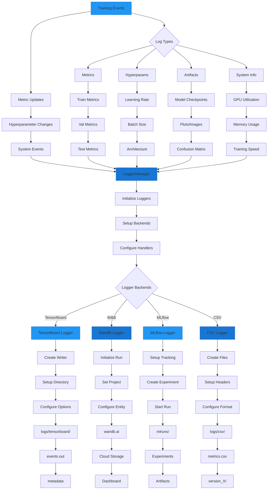

# Logging

AutoTimm supports multiple logging backends through `LoggerConfig` and `LoggerManager`. Log to TensorBoard, MLflow, Weights & Biases, and CSV simultaneously.

## Logging System Architecture



## LoggerConfig

### Basic Configuration

```python
from autotimm import LoggerConfig

tensorboard = LoggerConfig(
    backend="tensorboard",
    params={"save_dir": "logs", "name": "experiment_1"},
)
```

### Supported Backends

| Backend | Required Params | Install |
|---------|-----------------|---------|
| `tensorboard` | `save_dir` | `pip install autotimm[tensorboard]` |
| `csv` | `save_dir` | Built-in |
| `wandb` | `project` | `pip install autotimm[wandb]` |
| `mlflow` | `experiment_name` | `pip install autotimm[mlflow]` |

## Single Logger

### TensorBoard

```python
from autotimm import AutoTrainer, LoggerConfig

trainer = AutoTrainer(
    max_epochs=10,
    logger=[LoggerConfig(
        backend="tensorboard",
        params={"save_dir": "logs", "name": "my_run"},
    )],
)
```

View logs:

```bash
tensorboard --logdir logs
```

### Weights & Biases

```bash
pip install autotimm[wandb]
```

```python
trainer = AutoTrainer(
    max_epochs=10,
    logger=[LoggerConfig(
        backend="wandb",
        params={
            "project": "my-project",
            "name": "experiment-1",
            "tags": ["resnet", "cifar10"],
        },
    )],
)
```

### MLflow

```bash
pip install autotimm[mlflow]
```

```python
trainer = AutoTrainer(
    max_epochs=10,
    logger=[LoggerConfig(
        backend="mlflow",
        params={
            "experiment_name": "cifar10-classification",
            "tracking_uri": "http://localhost:5000",  # Optional
        },
    )],
)
```

### CSV Logger

Simple file-based logging:

```python
trainer = AutoTrainer(
    max_epochs=10,
    logger=[LoggerConfig(
        backend="csv",
        params={"save_dir": "logs/csv", "name": "metrics"},
    )],
)
```

## Multiple Loggers

Log to multiple backends simultaneously:

```python
from autotimm import AutoTrainer, LoggerConfig

trainer = AutoTrainer(
    max_epochs=10,
    logger=[
        LoggerConfig(backend="tensorboard", params={"save_dir": "logs/tb"}),
        LoggerConfig(backend="csv", params={"save_dir": "logs/csv"}),
        LoggerConfig(backend="wandb", params={"project": "my-project"}),
    ],
)
```

## LoggerManager

For programmatic logger management:

```python
from autotimm import AutoTrainer, LoggerConfig, LoggerManager

manager = LoggerManager(configs=[
    LoggerConfig(backend="tensorboard", params={"save_dir": "logs/tb"}),
    LoggerConfig(backend="mlflow", params={"experiment_name": "exp1"}),
])

trainer = AutoTrainer(max_epochs=10, logger=manager)

# Access specific loggers
tb_logger = manager.get_logger_by_backend("tensorboard")
mlflow_logger = manager.get_logger_by_backend("mlflow")

# Iterate over loggers
for logger in manager:
    print(logger)
```

### LoggerManager Methods

| Method | Description |
|--------|-------------|
| `loggers` | List of instantiated loggers |
| `configs` | List of LoggerConfig objects |
| `get_logger_by_backend(name)` | Get logger by backend type |
| `len(manager)` | Number of loggers |

## Enhanced Logging

### LoggingConfig

Control what gets logged during training:

```python
from autotimm import LoggingConfig, ImageClassifier

model = ImageClassifier(
    backbone="resnet50",
    num_classes=10,
    metrics=metrics,
    logging_config=LoggingConfig(
        log_learning_rate=True,      # Log LR each step
        log_gradient_norm=True,      # Log gradient norms
        log_weight_norm=False,       # Log weight norms
        log_confusion_matrix=True,   # Log confusion matrix
    ),
)
```

### What Gets Logged

| Log | Key | Condition |
|-----|-----|-----------|
| Training loss | `train/loss` | Always |
| Validation loss | `val/loss` | Always |
| Test loss | `test/loss` | Always |
| Metrics | `{stage}/{name}` | Per MetricConfig |
| Learning rate | `train/lr` | `log_learning_rate=True` |
| Gradient norm | `train/grad_norm` | `log_gradient_norm=True` |
| Weight norm | `train/weight_norm` | `log_weight_norm=True` |
| Confusion matrix | `val/confusion_matrix` | `log_confusion_matrix=True` |

### Confusion Matrix

When `log_confusion_matrix=True`, a confusion matrix image is logged at the end of each validation epoch:

```python
model = ImageClassifier(
    backbone="resnet50",
    num_classes=10,
    metrics=metrics,
    logging_config=LoggingConfig(
        log_learning_rate=False,
        log_gradient_norm=False,
        log_confusion_matrix=True,
    ),
)
```

The confusion matrix shows:

- Counts per cell
- Percentages (normalized by true class)
- Overall accuracy
- Color-coded by intensity

## Backend-Specific Parameters

### TensorBoard

```python
LoggerConfig(
    backend="tensorboard",
    params={
        "save_dir": "logs",           # Required
        "name": "experiment",         # Subdirectory name
        "version": "v1",              # Version string
        "log_graph": True,            # Log model graph
        "default_hp_metric": False,   # HP metric logging
    },
)
```

### Weights & Biases

```python
LoggerConfig(
    backend="wandb",
    params={
        "project": "my-project",      # Required
        "name": "run-1",              # Run name
        "tags": ["tag1", "tag2"],     # Tags
        "notes": "Experiment notes",  # Description
        "group": "experiment-group",  # Group runs
        "job_type": "training",       # Job type
        "save_dir": "wandb_logs",     # Local save directory
        "offline": False,             # Offline mode
    },
)
```

### MLflow

```python
LoggerConfig(
    backend="mlflow",
    params={
        "experiment_name": "exp",     # Required
        "tracking_uri": "http://localhost:5000",  # MLflow server
        "run_name": "run-1",          # Run name
        "tags": {"env": "dev"},       # Tags
        "save_dir": "mlruns",         # Local artifacts
    },
)
```

### CSV

```python
LoggerConfig(
    backend="csv",
    params={
        "save_dir": "logs",           # Required
        "name": "metrics",            # Subdirectory name
        "version": None,              # Auto-increment
        "flush_logs_every_n_steps": 100,
    },
)
```

## Full Example

```python
from autotimm import (
    AutoTrainer,
    ImageClassifier,
    ImageDataModule,
    LoggerConfig,
    LoggerManager,
    LoggingConfig,
    MetricConfig,
)

# Data
data = ImageDataModule(
    data_dir="./data",
    dataset_name="CIFAR10",
    image_size=224,
    batch_size=64,
)

# Metrics
metrics = [
    MetricConfig(
        name="accuracy",
        backend="torchmetrics",
        metric_class="Accuracy",
        params={"task": "multiclass"},
        stages=["train", "val", "test"],
        prog_bar=True,
    ),
]

# Enhanced logging
logging_config = LoggingConfig(
    log_learning_rate=True,
    log_gradient_norm=True,
    log_confusion_matrix=True,
)

# Model
model = ImageClassifier(
    backbone="resnet50",
    num_classes=10,
    metrics=metrics,
    logging_config=logging_config,
)

# Multiple loggers
loggers = LoggerManager(configs=[
    LoggerConfig(backend="tensorboard", params={"save_dir": "logs/tb"}),
    LoggerConfig(backend="csv", params={"save_dir": "logs/csv"}),
])

# Train
trainer = AutoTrainer(
    max_epochs=10,
    logger=loggers,
    checkpoint_monitor="val/accuracy",
)

trainer.fit(model, datamodule=data)
```
