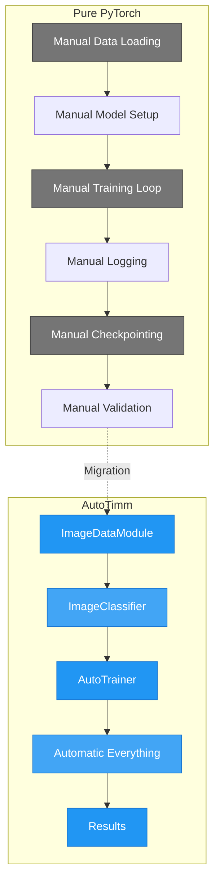

# Migration Guide

This guide helps you migrate existing deep learning projects to AutoTimm from other frameworks and libraries.

## Migration Workflow Comparison



## From Pure PyTorch

### Before: Pure PyTorch

```python
import torch
import torch.nn as nn
import torch.optim as optim
from torch.utils.data import DataLoader
from torchvision import datasets, transforms, models


def train_pure_pytorch():
    # Setup
    device = torch.device("cuda" if torch.cuda.is_available() else "cpu")

    # Data
    transform = transforms.Compose([
        transforms.Resize(256),
        transforms.CenterCrop(224),
        transforms.ToTensor(),
        transforms.Normalize([0.485, 0.456, 0.406], [0.229, 0.224, 0.225]),
    ])

    train_dataset = datasets.CIFAR10("./data", train=True, download=True, transform=transform)
    val_dataset = datasets.CIFAR10("./data", train=False, transform=transform)

    train_loader = DataLoader(train_dataset, batch_size=64, shuffle=True, num_workers=4)
    val_loader = DataLoader(val_dataset, batch_size=64, shuffle=False, num_workers=4)

    # Model
    model = models.resnet50(pretrained=True)
    model.fc = nn.Linear(model.fc.in_features, 10)
    model = model.to(device)

    # Optimizer and loss
    criterion = nn.CrossEntropyLoss()
    optimizer = optim.AdamW(model.parameters(), lr=1e-4, weight_decay=1e-4)
    scheduler = optim.lr_scheduler.CosineAnnealingLR(optimizer, T_max=50)

    # Training loop
    for epoch in range(50):
        model.train()
        train_loss = 0.0
        correct = 0
        total = 0

        for images, labels in train_loader:
            images, labels = images.to(device), labels.to(device)

            optimizer.zero_grad()
            outputs = model(images)
            loss = criterion(outputs, labels)
            loss.backward()
            optimizer.step()

            train_loss += loss.item()
            _, predicted = outputs.max(1)
            total += labels.size(0)
            correct += predicted.eq(labels).sum().item()

        train_acc = 100.0 * correct / total

        # Validation
        model.eval()
        val_correct = 0
        val_total = 0

        with torch.no_grad():
            for images, labels in val_loader:
                images, labels = images.to(device), labels.to(device)
                outputs = model(images)
                _, predicted = outputs.max(1)
                val_total += labels.size(0)
                val_correct += predicted.eq(labels).sum().item()

        val_acc = 100.0 * val_correct / val_total

        print(f"Epoch {epoch}: Train Acc: {train_acc:.2f}%, Val Acc: {val_acc:.2f}%")

        scheduler.step()

        # Manual checkpointing
        if val_acc > best_acc:
            best_acc = val_acc
            torch.save(model.state_dict(), "best_model.pth")


if __name__ == "__main__":
    train_pure_pytorch()
```

### After: AutoTimm

```python
from autotimm import AutoTrainer, ImageClassifier, ImageDataModule, MetricConfig


def train_autotimm():
    # Data (handles transforms, loaders, etc.)
    data = ImageDataModule(
        data_dir="./data",
        dataset_name="CIFAR10",
        image_size=224,
        batch_size=64,
        num_workers=4,
    )

    # Metrics
    metrics = [
        MetricConfig(
            name="accuracy",
            backend="torchmetrics",
            metric_class="Accuracy",
            params={"task": "multiclass"},
            stages=["train", "val", "test"],
            prog_bar=True,
        ),
    ]

    # Model (backbone + head + loss + optimizer)
    model = ImageClassifier(
        backbone="resnet50",
        num_classes=10,
        metrics=metrics,
        lr=1e-4,
        weight_decay=1e-4,
        scheduler="cosineannealinglr",
        scheduler_kwargs={"T_max": 50},
    )

    # Trainer (handles training loop, checkpointing, GPU, etc.)
    trainer = AutoTrainer(
        max_epochs=50,
        accelerator="auto",
        checkpoint_monitor="val/accuracy",
        checkpoint_mode="max",
    )

    trainer.fit(model, datamodule=data)


if __name__ == "__main__":
    train_autotimm()
```

### Key Differences

| Aspect | Pure PyTorch | AutoTimm |
|--------|--------------|----------|
| Lines of code | ~80 | ~35 |
| Device handling | Manual | Automatic |
| Training loop | Manual | Built-in |
| Validation | Manual | Built-in |
| Checkpointing | Manual | Automatic |
| Mixed precision | Complex | One parameter |
| Multi-GPU | Complex | One parameter |
| Logging | Manual | Configurable |

---

## From PyTorch Lightning

If you're already using PyTorch Lightning, migration is straightforward since AutoTimm builds on top of it.

### Before: PyTorch Lightning

```python
import pytorch_lightning as pl
import timm
import torch
import torch.nn as nn
from torch.utils.data import DataLoader
from torchvision import datasets, transforms
from torchmetrics import Accuracy


class LitClassifier(pl.LightningModule):
    def __init__(self, backbone="resnet50", num_classes=10, lr=1e-4):
        super().__init__()
        self.save_hyperparameters()

        # Create backbone
        self.backbone = timm.create_model(backbone, pretrained=True, num_classes=0)
        self.head = nn.Linear(self.backbone.num_features, num_classes)
        self.criterion = nn.CrossEntropyLoss()

        # Metrics
        self.train_acc = Accuracy(task="multiclass", num_classes=num_classes)
        self.val_acc = Accuracy(task="multiclass", num_classes=num_classes)

    def forward(self, x):
        features = self.backbone(x)
        return self.head(features)

    def training_step(self, batch, batch_idx):
        images, labels = batch
        logits = self(images)
        loss = self.criterion(logits, labels)

        self.train_acc(logits, labels)
        self.log("train/loss", loss, prog_bar=True)
        self.log("train/accuracy", self.train_acc, prog_bar=True)
        return loss

    def validation_step(self, batch, batch_idx):
        images, labels = batch
        logits = self(images)
        loss = self.criterion(logits, labels)

        self.val_acc(logits, labels)
        self.log("val/loss", loss)
        self.log("val/accuracy", self.val_acc, prog_bar=True)

    def configure_optimizers(self):
        optimizer = torch.optim.AdamW(self.parameters(), lr=self.hparams.lr)
        scheduler = torch.optim.lr_scheduler.CosineAnnealingLR(optimizer, T_max=50)
        return {"optimizer": optimizer, "lr_scheduler": scheduler}


class CIFAR10DataModule(pl.LightningDataModule):
    def __init__(self, data_dir="./data", batch_size=64, num_workers=4):
        super().__init__()
        self.data_dir = data_dir
        self.batch_size = batch_size
        self.num_workers = num_workers

        self.transform = transforms.Compose([
            transforms.Resize(256),
            transforms.CenterCrop(224),
            transforms.ToTensor(),
            transforms.Normalize([0.485, 0.456, 0.406], [0.229, 0.224, 0.225]),
        ])

    def setup(self, stage=None):
        self.train_dataset = datasets.CIFAR10(
            self.data_dir, train=True, download=True, transform=self.transform
        )
        self.val_dataset = datasets.CIFAR10(
            self.data_dir, train=False, transform=self.transform
        )

    def train_dataloader(self):
        return DataLoader(
            self.train_dataset, batch_size=self.batch_size, shuffle=True, num_workers=self.num_workers
        )

    def val_dataloader(self):
        return DataLoader(
            self.val_dataset, batch_size=self.batch_size, shuffle=False, num_workers=self.num_workers
        )


def train_lightning():
    model = LitClassifier(backbone="resnet50", num_classes=10, lr=1e-4)
    data = CIFAR10DataModule(batch_size=64)

    trainer = pl.Trainer(
        max_epochs=50,
        accelerator="auto",
        callbacks=[
            pl.callbacks.ModelCheckpoint(monitor="val/accuracy", mode="max"),
        ],
    )

    trainer.fit(model, data)


if __name__ == "__main__":
    train_lightning()
```

### After: AutoTimm

```python
from autotimm import AutoTrainer, ImageClassifier, ImageDataModule, MetricConfig


def train_autotimm():
    # Data module with same functionality, less code
    data = ImageDataModule(
        data_dir="./data",
        dataset_name="CIFAR10",
        image_size=224,
        batch_size=64,
        num_workers=4,
    )

    # Metrics configuration
    metrics = [
        MetricConfig(
            name="accuracy",
            backend="torchmetrics",
            metric_class="Accuracy",
            params={"task": "multiclass"},
            stages=["train", "val"],
            prog_bar=True,
        ),
    ]

    # Pre-built task module
    model = ImageClassifier(
        backbone="resnet50",
        num_classes=10,
        metrics=metrics,
        lr=1e-4,
        scheduler="cosineannealinglr",
        scheduler_kwargs={"T_max": 50},
    )

    # Trainer with built-in checkpointing
    trainer = AutoTrainer(
        max_epochs=50,
        checkpoint_monitor="val/accuracy",
        checkpoint_mode="max",
    )

    trainer.fit(model, datamodule=data)


if __name__ == "__main__":
    train_autotimm()
```

### Gradual Migration

You can use AutoTimm components incrementally:

```python
import pytorch_lightning as pl
from autotimm import ImageDataModule, MetricConfig, MetricManager

# Use AutoTimm data module with your existing model
data = ImageDataModule(
    data_dir="./data",
    dataset_name="CIFAR10",
    image_size=224,
    batch_size=64,
)

# Your existing Lightning module
model = LitClassifier(...)

# Standard Lightning trainer
trainer = pl.Trainer(max_epochs=50)
trainer.fit(model, data)
```

---

## From timm Standalone

### Before: timm Direct Usage

```python
import timm
import torch
import torch.nn as nn
from torch.utils.data import DataLoader
from torchvision import datasets, transforms


def train_timm():
    device = torch.device("cuda" if torch.cuda.is_available() else "cpu")

    # Create model with timm
    model = timm.create_model("resnet50", pretrained=True, num_classes=10)
    model = model.to(device)

    # Get timm transforms
    data_config = timm.data.resolve_model_data_config(model)
    transform = timm.data.create_transform(**data_config, is_training=True)
    val_transform = timm.data.create_transform(**data_config, is_training=False)

    # Data
    train_dataset = datasets.CIFAR10("./data", train=True, download=True, transform=transform)
    val_dataset = datasets.CIFAR10("./data", train=False, transform=val_transform)

    train_loader = DataLoader(train_dataset, batch_size=64, shuffle=True)
    val_loader = DataLoader(val_dataset, batch_size=64)

    # Training setup
    criterion = nn.CrossEntropyLoss()
    optimizer = timm.optim.create_optimizer_v2(model, opt="adamw", lr=1e-4, weight_decay=1e-4)
    scheduler = timm.scheduler.create_scheduler_v2(
        optimizer, sched="cosine", num_epochs=50, warmup_epochs=5
    )[0]

    # Training loop (manual)
    for epoch in range(50):
        model.train()
        for images, labels in train_loader:
            images, labels = images.to(device), labels.to(device)

            optimizer.zero_grad()
            outputs = model(images)
            loss = criterion(outputs, labels)
            loss.backward()
            optimizer.step()

        scheduler.step(epoch)

        # Validation (manual)
        model.eval()
        correct = 0
        total = 0
        with torch.no_grad():
            for images, labels in val_loader:
                images, labels = images.to(device), labels.to(device)
                outputs = model(images)
                _, predicted = outputs.max(1)
                total += labels.size(0)
                correct += predicted.eq(labels).sum().item()

        print(f"Epoch {epoch}: Val Acc: {100.*correct/total:.2f}%")


if __name__ == "__main__":
    train_timm()
```

### After: AutoTimm

```python
from autotimm import AutoTrainer, ImageClassifier, ImageDataModule, MetricConfig


def train_autotimm():
    # AutoTimm handles timm integration internally
    data = ImageDataModule(
        data_dir="./data",
        dataset_name="CIFAR10",
        image_size=224,
        batch_size=64,
    )

    metrics = [
        MetricConfig(
            name="accuracy",
            backend="torchmetrics",
            metric_class="Accuracy",
            params={"task": "multiclass"},
            stages=["train", "val"],
            prog_bar=True,
        ),
    ]

    # Uses timm backbone internally
    model = ImageClassifier(
        backbone="resnet50",  # Any timm model works
        num_classes=10,
        metrics=metrics,
        lr=1e-4,
        weight_decay=1e-4,
        optimizer="adamw",  # Can use timm optimizers
        scheduler="cosineannealinglr",
        scheduler_kwargs={"T_max": 50},
    )

    trainer = AutoTrainer(max_epochs=50)
    trainer.fit(model, datamodule=data)


if __name__ == "__main__":
    train_autotimm()
```

### Using Any timm Backbone

AutoTimm supports all timm backbones:

```python
import autotimm

# List available backbones
backbones = autotimm.list_backbones()
print(f"Available backbones: {len(backbones)}")

# Use any timm model
model = autotimm.ImageClassifier(
    backbone="convnext_base",  # ConvNeXt
    num_classes=10,
    metrics=metrics,
)

model = autotimm.ImageClassifier(
    backbone="vit_base_patch16_224",  # Vision Transformer
    num_classes=10,
    metrics=metrics,
)

model = autotimm.ImageClassifier(
    backbone="swin_base_patch4_window7_224",  # Swin Transformer
    num_classes=10,
    metrics=metrics,
)
```

---

## From Detectron2

### Config Translation

Detectron2 uses YAML/Python configs. Here's how to translate:

#### Detectron2 Config

```python
# detectron2_config.py
from detectron2.config import get_cfg
from detectron2 import model_zoo

cfg = get_cfg()
cfg.merge_from_file(model_zoo.get_config_file("COCO-Detection/faster_rcnn_R_50_FPN_3x.yaml"))

cfg.DATASETS.TRAIN = ("coco_2017_train",)
cfg.DATASETS.TEST = ("coco_2017_val",)
cfg.DATALOADER.NUM_WORKERS = 4

cfg.MODEL.WEIGHTS = model_zoo.get_checkpoint_url("COCO-Detection/faster_rcnn_R_50_FPN_3x.yaml")
cfg.MODEL.ROI_HEADS.NUM_CLASSES = 80
cfg.MODEL.ROI_HEADS.BATCH_SIZE_PER_IMAGE = 512

cfg.SOLVER.IMS_PER_BATCH = 16
cfg.SOLVER.BASE_LR = 0.0001
cfg.SOLVER.MAX_ITER = 90000
cfg.SOLVER.STEPS = (60000, 80000)
cfg.SOLVER.GAMMA = 0.1
cfg.SOLVER.CHECKPOINT_PERIOD = 5000

cfg.INPUT.MIN_SIZE_TRAIN = (640, 672, 704, 736, 768, 800)
cfg.INPUT.MAX_SIZE_TRAIN = 1333
```

#### AutoTimm Equivalent

```python
from autotimm import AutoTrainer, DetectionDataModule, MetricConfig, ObjectDetector


def train_detection():
    # Data
    data = DetectionDataModule(
        data_dir="./coco",
        image_size=640,  # Or use multi-scale
        batch_size=16,  # IMS_PER_BATCH
        num_workers=4,
    )

    # Metrics
    metrics = [
        MetricConfig(
            name="mAP",
            backend="torchmetrics",
            metric_class="MeanAveragePrecision",
            params={"box_format": "xyxy"},
            stages=["val"],
            prog_bar=True,
        ),
    ]

    # Model (FCOS-style, not Faster R-CNN)
    model = ObjectDetector(
        backbone="resnet50",  # R_50 equivalent
        num_classes=80,
        metrics=metrics,
        fpn_channels=256,
        lr=1e-4,  # BASE_LR
        scheduler="multistep",
        scheduler_kwargs={
            "milestones": [8, 11],  # Converted from iterations to epochs
            "gamma": 0.1,
        },
    )

    # Trainer
    trainer = AutoTrainer(
        max_epochs=12,  # ~90000 iters with batch 16 on COCO
        gradient_clip_val=1.0,
        checkpoint_monitor="val/map",
        checkpoint_mode="max",
    )

    trainer.fit(model, datamodule=data)


if __name__ == "__main__":
    train_detection()
```

### Key Differences from Detectron2

| Aspect | Detectron2 | AutoTimm |
|--------|-----------|----------|
| Architecture | Faster R-CNN (anchor-based) | FCOS (anchor-free) |
| Config format | YAML + Python | Python only |
| Framework | Custom training loop | PyTorch Lightning |
| Multi-GPU | Custom distributed | Lightning DDP |
| Logging | Custom | TensorBoard/WandB/etc. |

### Data Format Compatibility

Both use COCO format, so your data can be used directly:

```python
# Same COCO data directory structure
data = DetectionDataModule(
    data_dir="./coco",  # Same as Detectron2
    image_size=640,
    batch_size=16,
)
```

---

## Code Pattern Comparisons

### Model Creation

```python
# Pure PyTorch
model = models.resnet50(pretrained=True)
model.fc = nn.Linear(model.fc.in_features, num_classes)

# timm
model = timm.create_model("resnet50", pretrained=True, num_classes=num_classes)

# AutoTimm
model = ImageClassifier(backbone="resnet50", num_classes=num_classes, metrics=metrics)
```

### Optimizer Setup

```python
# Pure PyTorch
optimizer = torch.optim.AdamW(model.parameters(), lr=1e-4)
scheduler = torch.optim.lr_scheduler.CosineAnnealingLR(optimizer, T_max=50)

# AutoTimm (configured in model)
model = ImageClassifier(
    backbone="resnet50",
    num_classes=10,
    metrics=metrics,
    lr=1e-4,
    optimizer="adamw",
    scheduler="cosineannealinglr",
    scheduler_kwargs={"T_max": 50},
)
```

### Training Loop

```python
# Pure PyTorch
for epoch in range(num_epochs):
    model.train()
    for batch in train_loader:
        optimizer.zero_grad()
        loss = criterion(model(batch[0]), batch[1])
        loss.backward()
        optimizer.step()
    scheduler.step()

# AutoTimm
trainer = AutoTrainer(max_epochs=num_epochs)
trainer.fit(model, datamodule=data)
```

### Inference

```python
# Pure PyTorch
model.eval()
with torch.no_grad():
    output = model(image)
    prediction = output.argmax(dim=1)

# AutoTimm
model.eval()
predictions = model.predict(image)  # Returns processed predictions
```

---

## Gradual Migration Strategy

### Step 1: Use AutoTimm Data Modules

Start by replacing your data loading:

```python
# Replace custom data loaders with AutoTimm
from autotimm import ImageDataModule

data = ImageDataModule(
    data_dir="./data",
    image_size=224,
    batch_size=64,
)

# Use with your existing model
trainer = pl.Trainer(...)
trainer.fit(your_existing_model, data)
```

### Step 2: Use AutoTimm Metrics

Add configurable metrics:

```python
from autotimm import MetricConfig, MetricManager

metrics = [
    MetricConfig(
        name="accuracy",
        backend="torchmetrics",
        metric_class="Accuracy",
        params={"task": "multiclass"},
        stages=["train", "val"],
    ),
]

manager = MetricManager(configs=metrics, num_classes=10)
```

### Step 3: Use AutoTimm Task Modules

Replace your model with AutoTimm task classes:

```python
from autotimm import ImageClassifier

model = ImageClassifier(
    backbone="resnet50",
    num_classes=10,
    metrics=metrics,
)
```

### Step 4: Use AutoTrainer

Finally, use AutoTrainer for the complete solution:

```python
from autotimm import AutoTrainer

trainer = AutoTrainer(
    max_epochs=50,
    checkpoint_monitor="val/accuracy",
)

trainer.fit(model, datamodule=data)
```

---

## Common Migration Issues

### Issue: Custom Loss Function

**Problem:** Your project uses a custom loss function.

**Solution:** Pass custom loss to the model or extend the task class:

```python
from autotimm import ImageClassifier


class CustomLossClassifier(ImageClassifier):
    def __init__(self, *args, **kwargs):
        super().__init__(*args, **kwargs)
        self.criterion = YourCustomLoss()
```

### Issue: Custom Data Augmentation

**Problem:** You have specific augmentation requirements.

**Solution:** Use custom transforms:

```python
import albumentations as A
from autotimm import ImageDataModule

custom_transform = A.Compose([...])

data = ImageDataModule(
    data_dir="./data",
    image_size=224,
    train_transforms=custom_transform,
)
```

### Issue: Custom Training Logic

**Problem:** You need custom training step logic.

**Solution:** Extend the task class:

```python
from autotimm import ImageClassifier


class CustomTrainingClassifier(ImageClassifier):
    def training_step(self, batch, batch_idx):
        # Your custom logic here
        images, labels = batch
        # ...
        return loss
```

### Issue: Incompatible Checkpoint Format

**Problem:** Existing checkpoint doesn't load.

**Solution:** Load weights manually:

```python
import torch
from autotimm import ImageClassifier

# Load old checkpoint
old_state = torch.load("old_checkpoint.pth")

# Create new model
model = ImageClassifier(backbone="resnet50", num_classes=10, metrics=metrics)

# Load compatible weights
model.backbone.load_state_dict(old_state["backbone"], strict=False)
model.head.load_state_dict(old_state["head"], strict=False)
```

---

## See Also

- [Getting Started](../../getting-started/quickstart.md) - Quick start guide
- [Training Guide](../training/training.md) - Training configuration
- [Advanced Customization](../training/advanced-customization.md) - Custom components
