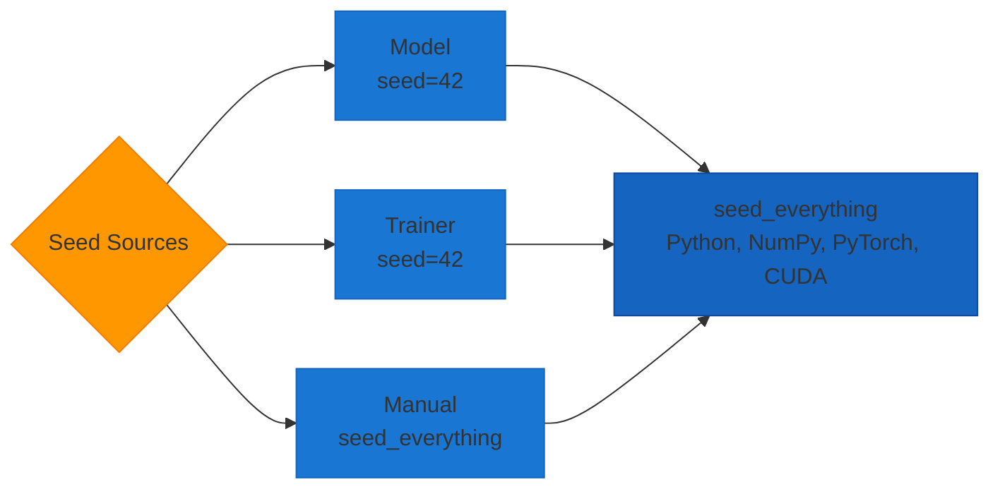
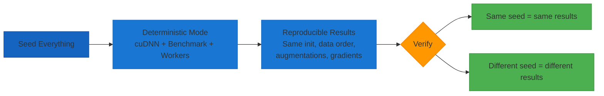

# Reproducibility Guide

AutoTimm is designed with reproducibility as a first-class feature. This guide covers everything you need to know about achieving consistent, reproducible results in your experiments.

## Reproducibility Workflow

### Seed Sources



### Deterministic Pipeline



## Why Reproducibility Matters

- **Research**: Essential for publishing papers and validating results
- **Debugging**: Makes it easier to isolate and fix issues
- **Collaboration**: Team members get identical results
- **Production**: Ensures consistent model behavior

## Quick Start

AutoTimm is reproducible by default:

```python
from autotimm import ImageClassifier, AutoTrainer

# Everything seeded with 42 by default
model = ImageClassifier(backbone="resnet50", num_classes=10)
trainer = AutoTrainer(max_epochs=10)

# Results will be identical across runs!
```

## Default Behavior

All AutoTimm models and trainers come with **seeding enabled by default**:

- **Default seed**: `42`
- **Deterministic mode**: `True` (full reproducibility)
- **Components seeded**: Python, NumPy, PyTorch, cuDNN

```python
from autotimm import ImageClassifier

# This is reproducible by default
model = ImageClassifier(
    backbone="resnet50",
    num_classes=10,
    # seed=42 (implicit)
    # deterministic=True (implicit)
)
```

## Seeding Levels

AutoTimm provides seeding at multiple levels:

### 1. Model-Level Seeding

Seeds when the model is created:

```python
from autotimm import ImageClassifier

model = ImageClassifier(
    backbone="resnet50",
    num_classes=10,
    seed=42,
    deterministic=True,
)
```

### 2. Trainer-Level Seeding

Seeds before training starts:

```python
from autotimm import AutoTrainer

trainer = AutoTrainer(
    max_epochs=10,
    seed=42,
    deterministic=True,
)
```

### 3. Manual Seeding

Complete control over seeding:

```python
from autotimm import seed_everything

# Seed everything manually
seed_everything(42, deterministic=True)

# Now create models
model = ImageClassifier(
    backbone="resnet50",
    num_classes=10,
    seed=None,  # Don't seed again
)
```

## Custom Seeds

Use custom seeds for different experiments:

```python
# Experiment 1: seed=42
model1 = ImageClassifier(backbone="resnet50", num_classes=10, seed=42)
trainer1 = AutoTrainer(max_epochs=10, seed=42)

# Experiment 2: seed=123
model2 = ImageClassifier(backbone="resnet50", num_classes=10, seed=123)
trainer2 = AutoTrainer(max_epochs=10, seed=123)

# Different seeds = different random initializations
```

## Deterministic Mode

Control the trade-off between speed and reproducibility:

### Full Reproducibility (Default)

```python
model = ImageClassifier(
    backbone="resnet50",
    num_classes=10,
    seed=42,
    deterministic=True,  # Full reproducibility
)

trainer = AutoTrainer(
    max_epochs=10,
    seed=42,
    deterministic=True,
)
```

**What it does:**

- Sets `torch.backends.cudnn.deterministic = True`
- Sets `torch.backends.cudnn.benchmark = False`
- Uses `torch.use_deterministic_algorithms(True)` (PyTorch 1.8+)

**Pros:**

- ✅ Fully reproducible results
- ✅ Identical outputs across runs
- ✅ Perfect for research

**Cons:**

- ❌ Slower training
- ❌ May impact performance by 10-30%

### Faster Training

```python
model = ImageClassifier(
    backbone="resnet50",
    num_classes=10,
    seed=42,
    deterministic=False,  # Faster training
)

trainer = AutoTrainer(
    max_epochs=10,
    seed=42,
    deterministic=False,
)
```

**What it does:**

- Enables cuDNN benchmark mode
- Allows non-deterministic algorithms
- Still seeds random number generators

**Pros:**

- ✅ Faster training
- ✅ Better GPU utilization
- ✅ Partially reproducible

**Cons:**

- ❌ Results may vary slightly between runs
- ❌ Small differences in final metrics

## Trainer Seeding Options

AutoTrainer supports two seeding approaches:

### PyTorch Lightning Seeding (Default)

```python
trainer = AutoTrainer(
    max_epochs=10,
    seed=42,
    use_autotimm_seeding=False,  # Default
)
```

Uses Lightning's built-in `seed_everything()`:
- Standard Lightning behavior
- Includes dataloader worker seeding
- Good integration with Lightning ecosystem

### AutoTimm Custom Seeding

```python
trainer = AutoTrainer(
    max_epochs=10,
    seed=42,
    use_autotimm_seeding=True,
)
```

Uses AutoTimm's custom `seed_everything()`:
- More comprehensive seeding
- Explicit control over deterministic mode
- Sets additional environment variables

**Both options work well!** Choose based on your preference.

## Complete Reproducible Workflow

```python
from autotimm import (
    ImageClassifier,
    AutoTrainer,
    ImageDataModule,
    MetricConfig,
    seed_everything,
)

# 1. Set global seed (optional but recommended)
SEED = 42
seed_everything(SEED, deterministic=True)

# 2. Create reproducible data module
data = ImageDataModule(
    data_dir="./data",
    batch_size=32,
    num_workers=4,
    seed=SEED,  # Seed for data splitting
)

# 3. Create reproducible model
model = ImageClassifier(
    backbone="resnet50",
    num_classes=10,
    seed=SEED,
    deterministic=True,
    metrics=[
        MetricConfig(
            name="accuracy",
            backend="torchmetrics",
            metric_class="Accuracy",
            params={"task": "multiclass", "num_classes": 10},
            stages=["val"],
        )
    ],
)

# 4. Create reproducible trainer
trainer = AutoTrainer(
    max_epochs=10,
    seed=SEED,
    deterministic=True,
)

# 5. Train - results will be identical across runs!
trainer.fit(model, datamodule=data)
```

## Disabling Seeding

Sometimes you want to explore model variance:

```python
# Disable seeding completely
model = ImageClassifier(
    backbone="resnet50",
    num_classes=10,
    seed=None,  # No seeding
)

trainer = AutoTrainer(
    max_epochs=10,
    seed=None,  # No seeding
)

# Results will vary between runs
```

## Reproducible Inference

Ensure consistent predictions:

```python
import torch
from autotimm import ImageClassifier

# Create model with seeding
model = ImageClassifier(
    backbone="resnet50",
    num_classes=10,
    seed=42,
    compile_model=False,  # Disable for consistency
)
model.eval()

# Load same model again
model2 = ImageClassifier(
    backbone="resnet50",
    num_classes=10,
    seed=42,
    compile_model=False,
)
model2.eval()

# Same input
x = torch.randn(1, 3, 224, 224)

# Same predictions
with torch.inference_mode():
    pred1 = model(x)
    pred2 = model2(x)

assert torch.allclose(pred1, pred2)  # True!
```

## Research Paper Setup

For maximum reproducibility in research:

```python
from autotimm import seed_everything, ImageClassifier, AutoTrainer

# Strict reproducibility settings
SEED = 42

# 1. Global seeding with deterministic mode
seed_everything(SEED, deterministic=True)

# 2. Model with strict settings
model = ImageClassifier(
    backbone="resnet50",
    num_classes=1000,
    seed=SEED,
    deterministic=True,
    compile_model=False,  # Disable for consistency
    mixup_alpha=0.0,      # Disable stochastic augmentations
)

# 3. Trainer with strict settings
trainer = AutoTrainer(
    max_epochs=100,
    seed=SEED,
    deterministic=True,
    precision=32,  # Full precision for reproducibility
)
```

**Additional tips for research:**

- Document PyTorch/CUDA versions
- Fix library versions in `requirements.txt`
- Disable stochastic augmentations if needed
- Use full precision (32-bit) instead of mixed precision
- Test reproducibility on multiple runs

## What Gets Seeded

AutoTimm's `seed_everything()` seeds:

### Random Number Generators
- Python's built-in `random` module
- NumPy's `np.random`
- PyTorch's `torch.random`
- PyTorch CUDA random: `torch.cuda.manual_seed_all()`

### Environment Variables
- `PYTHONHASHSEED` - Python hash randomization

### Backend Settings (when `deterministic=True`)
- `torch.backends.cudnn.deterministic = True`
- `torch.backends.cudnn.benchmark = False`
- `torch.use_deterministic_algorithms(True)` (PyTorch 1.8+)

## Verification

Test that seeding works:

```python
import torch
from autotimm import seed_everything

# Test 1: Same seed = same random numbers
seed_everything(42)
x1 = torch.randn(5)

seed_everything(42)
x2 = torch.randn(5)

assert torch.allclose(x1, x2)  # True!

# Test 2: Different seeds = different random numbers
seed_everything(42)
x3 = torch.randn(5)

seed_everything(123)
x4 = torch.randn(5)

assert not torch.allclose(x3, x4)  # True!
```

## Common Issues

Common reproducibility issues include:

- Results still vary slightly
- Training is too slow with deterministic mode
- Different results on different GPUs

## Performance Impact

Expected training time impact:

| Setting | Speed | Reproducibility |
|---------|-------|-----------------|
| `deterministic=True` | Baseline | 100% |
| `deterministic=False` | +10-30% faster | ~95% |
| `seed=None` | +10-30% faster | Variable |

## Best Practices

### For Research
- ✅ Use `seed=42, deterministic=True`
- ✅ Document all versions
- ✅ Test on multiple seeds
- ✅ Report mean ± std across seeds

### For Production
- ✅ Use `seed=42, deterministic=False`
- ✅ Prioritize speed
- ✅ Test on multiple seeds to ensure robustness

### For Debugging
- ✅ Use `seed=42, deterministic=True`
- ✅ Minimal training runs
- ✅ Compare outputs step-by-step

### For Exploration
- ✅ Use `seed=None` to explore variance
- ✅ Try multiple random initializations
- ✅ Analyze result distribution

## Examples

See complete working examples in the repository:

- `examples/utilities/reproducibility.py` - Comprehensive examples (9 patterns)
- `examples/utilities/test_seeding.py` - Seeding verification tests

## API Reference

- [`seed_everything()`](../../api/utils.md) - Manual seeding function
- [`ImageClassifier`](../models/image-classifier.md) - Model seeding parameters
- [`AutoTrainer`](../../api/trainer.md) - Trainer seeding parameters

## Summary

**Key Takeaways:**

1. AutoTimm is reproducible by default (`seed=42`)
2. Use `deterministic=True` for full reproducibility
3. Use `deterministic=False` for faster training
4. Both model and trainer support seeding
5. Choose seeding approach based on your use case

**Quick Reference:**


```python
# Research (strict reproducibility)
model = ImageClassifier(..., seed=42, deterministic=True)
trainer = AutoTrainer(..., seed=42, deterministic=True)

# Production (speed + partial reproducibility)
model = ImageClassifier(..., seed=42, deterministic=False)
trainer = AutoTrainer(..., seed=42, deterministic=False)

# Exploration (no reproducibility)
model = ImageClassifier(..., seed=None)
trainer = AutoTrainer(..., seed=None)
```

Happy reproducible training! 🎯
