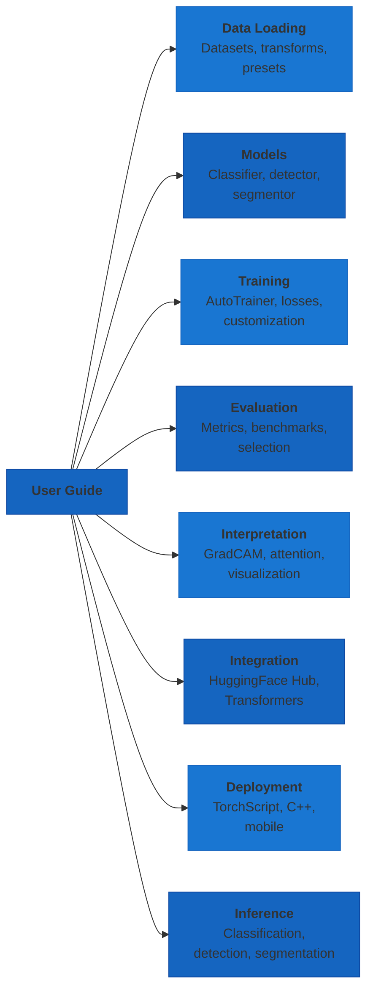

# User Guide

Comprehensive guides for using AutoTimm across all computer vision tasks — from data loading to deployment.

## Guide Organization

## Browse by Category

### 📦 Data Loading
Prepare and load data for any computer vision task.

- **[Overview](data-loading/index.md)** - Data module overview and architecture
- **[Image Classification Data](data-loading/image-classification-data.md)** - ImageDataModule for classification tasks
- **[Multi-Label Classification Data](data-loading/multilabel-classification-data.md)** - Multi-label image datasets
- **[Object Detection Data](data-loading/object-detection-data.md)** - Detection dataset formats (COCO, VOC)
- **[Segmentation Data](data-loading/segmentation-data.md)** - Semantic segmentation masks
- **[CSV Data Loading](data-loading/csv-data.md)** - Load datasets from CSV files
- **[Transforms](data-loading/transforms.md)** - Augmentation and preprocessing pipelines
- **[Preset Manager](data-loading/preset-manager.md)** - Pre-configured transform presets

### 🧠 Models
Task-specific model architectures built on timm.

- **[Overview](models/index.md)** - Model architecture overview
- **[ImageClassifier](models/image-classifier.md)** - Image classification with any timm backbone
- **[ObjectDetector](models/object-detector.md)** - Object detection with FCOS
- **[SemanticSegmentor](models/semantic-segmentation.md)** - Semantic segmentation with DeepLabV3+/FCN
- **[InstanceSegmentor](models/instance-segmentation.md)** - Instance segmentation with Mask R-CNN
- **[YOLOXDetector](models/yolox-detector.md)** - Real-time detection with YOLOX

### 🎓 Training
Configure and run training with AutoTrainer.

- **[Overview](training/training.md)** - AutoTrainer setup and configuration
- **[Dataset Preparation](training/dataset-preparation.md)** - Preparing data for training
- **[Loss Comparison](training/loss-comparison.md)** - Choosing the right loss function
- **[Advanced Customization](training/advanced-customization.md)** - Custom callbacks, schedulers, and more

### 📊 Evaluation
Measure and compare model performance.

- **[Metrics](evaluation/metrics.md)** - MetricConfig and MetricManager
- **[Metric Selection](evaluation/metric-selection.md)** - Choosing metrics per task
- **[Benchmarks](evaluation/benchmarks.md)** - Performance benchmarks and comparisons

### 👁️ Interpretation
Understand what your models learn.

- **[Overview](interpretation/index.md)** - Interpretation tools overview
- **[Interpretation Methods](interpretation/methods.md)** - GradCAM, attention, and more
- **[Quality Metrics](interpretation/metrics.md)** - Quantitative interpretation metrics
- **[Interactive Visualizations](interpretation/interactive-visualizations.md)** - Plotly-based interactive views
- **[Performance Optimization](interpretation/optimization.md)** - Efficient interpretation at scale
- **[Feature Visualization](interpretation/feature-visualization.md)** - Visualize learned features
- **[Training Callbacks](interpretation/callbacks.md)** - Log interpretations during training
- **[Task-Specific Adapters](interpretation/task-adapters.md)** - Adapters for detection and segmentation

### 🔌 Integration
Connect with HuggingFace ecosystem.

- **[Comparison Overview](integration/huggingface-integration-comparison.md)** - Compare integration approaches
- **[HF Hub Integration](integration/huggingface-hub-integration.md)** - Push/pull models from Hub
- **[HF Transformers Integration](integration/huggingface-transformers-integration.md)** - Use Transformers models

### ☁️ Deployment
Deploy models to production.

- **[Production Deployment](deployment/deployment.md)** - Full production deployment guide
- **[TorchScript Export](deployment/torchscript-export.md)** - Export models to TorchScript
- **[C++ Deployment](deployment/cpp-deployment.md)** - Deploy with LibTorch in C++
- **[Mobile Deployment](deployment/mobile-deployment.md)** - Deploy on iOS and Android

### ▶️ Inference
Run predictions with trained models.

- **[Overview](inference/index.md)** - Inference workflow overview
- **[Classification Inference](inference/classification-inference.md)** - Classify images
- **[Object Detection Inference](inference/object-detection-inference.md)** - Detect objects
- **[Segmentation Inference](inference/semantic-segmentation-inference.md)** - Segment images
- **[Model Export](inference/model-export.md)** - Export for optimized inference

### 🧭 Guides
Best practices and reference guides.

- **[Reproducibility](guides/reproducibility.md)** - Achieve reproducible results
- **[Logging](guides/logging.md)** - Configure experiment logging
- **[Migration Guide](guides/migration.md)** - Migrate from other frameworks
- **[YOLOX Quick Reference](guides/yolox-quick-reference.md)** - YOLOX cheat sheet
