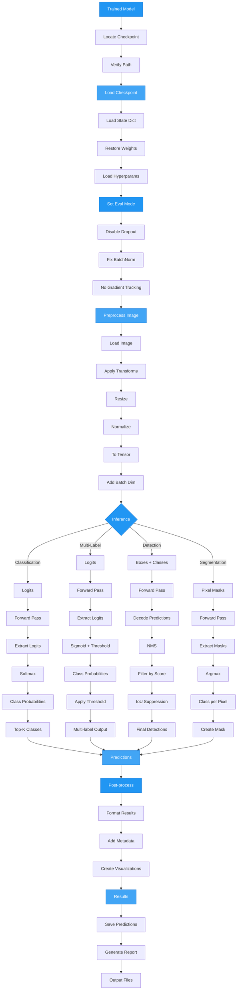

# Inference

This guide covers how to use trained AutoTimm models for inference and prediction.

## Inference Pipeline



## Quick Links

- **[Classification Inference](classification-inference.md)** - Image classification model inference
- **[Object Detection Inference](object-detection-inference.md)** - Object detection model inference
- **[Semantic Segmentation Inference](semantic-segmentation-inference.md)** - Semantic segmentation model inference
- **[Model Export](model-export.md)** - Export to TorchScript, ONNX, and quantization

---

## Quick Start

### Classification

```python
from autotimm import ImageClassifier, MetricConfig, TransformConfig
import torch
from PIL import Image

metrics = [MetricConfig(name="accuracy", backend="torchmetrics",
                        metric_class="Accuracy", params={"task": "multiclass"},
                        stages=["val"])]
model = ImageClassifier.load_from_checkpoint(
    "checkpoint.ckpt",
    backbone="resnet50",
    num_classes=10,
    metrics=metrics,
    transform_config=TransformConfig(),
)
model.eval()

image = Image.open("test.jpg").convert("RGB")
with torch.inference_mode():
    logits = model(model.preprocess(image))
    predicted_class = logits.argmax(dim=1).item()
```

### Multi-Label Classification

```python
from autotimm import ImageClassifier, MetricConfig, TransformConfig
import torch
from PIL import Image

model = ImageClassifier.load_from_checkpoint(
    "multilabel.ckpt",
    backbone="resnet50",
    num_classes=4,
    multi_label=True,
    threshold=0.5,
    transform_config=TransformConfig(),
)
model.eval()

image = Image.open("test.jpg").convert("RGB")
with torch.inference_mode():
    logits = model(model.preprocess(image))
    probs = logits.sigmoid().squeeze(0)        # per-label probabilities
    predicted = (probs > 0.5).nonzero().squeeze(-1).tolist()
```

### Object Detection

```python
from autotimm import ObjectDetector, MetricConfig, TransformConfig

model = ObjectDetector.load_from_checkpoint(
    "detector.ckpt",
    backbone="resnet50",
    num_classes=80,
    transform_config=TransformConfig(image_size=640),
)
model.eval()

with torch.inference_mode():
    detections = model.predict_step(model.preprocess(image), batch_idx=0)
```

### Model Export

```python
# TorchScript
traced = torch.jit.trace(model, torch.randn(1, 3, 224, 224))
traced.save("model.pt")

# ONNX
torch.onnx.export(model, torch.randn(1, 3, 224, 224), "model.onnx")
```

---

## Performance Tips

| Optimization | Speed Gain | When to Use |
|--------------|------------|-------------|
| Batch processing | 2-5x | Multiple images |
| GPU inference | 10-50x | GPU available |
| FP16 precision | 2-3x | Tensor core GPUs |
| TorchScript | 10-20% | Production |
| ONNX Runtime | 20-40% | Cross-platform |

**Checklist:**

- Use `model.eval()` before inference
- Wrap predictions in `torch.inference_mode()`
- Process multiple images in batches
- Use GPU when available

---

## Detailed Guides

- **[Classification Inference](classification-inference.md)** - Single/batch prediction, top-K, multi-label, pipelines
- **[Object Detection Inference](object-detection-inference.md)** - Bounding boxes, visualization, NMS tuning
- **[Model Export](model-export.md)** - TorchScript, ONNX, quantization
