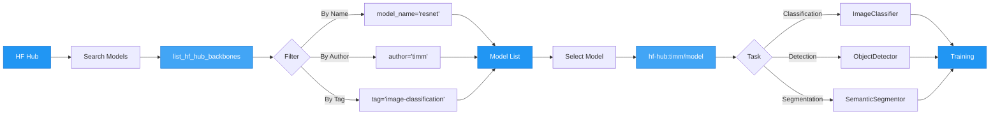

# Hugging Face Hub Integration

AutoTimm seamlessly integrates with Hugging Face Hub, giving you access to thousands of timm-compatible pretrained models with version control, model cards, and community contributions.

## HF Hub Integration Flow



## Overview

Load models directly from Hugging Face Hub using the `hf-hub:` prefix. This provides:

- **Centralized hosting**: Access thousands of pretrained models
- **Version control**: Use specific model versions and configurations
- **Model cards**: View training details, datasets, and performance
- **Community models**: Share and use custom trained models
- **Same API**: Works exactly like standard timm models

## Quick Start

```python
import autotimm
from autotimm import ImageClassifier

# Discover models on HF Hub
models = autotimm.list_hf_hub_backbones(model_name="resnet", limit=5)

# Use HF Hub model as backbone
model = ImageClassifier(
    backbone="hf-hub:timm/resnet50.a1_in1k",
    num_classes=10,
)
```

## Model Discovery

### Search by Architecture

```python
import autotimm

# ResNet models
resnets = autotimm.list_hf_hub_backbones(model_name="resnet", limit=10)

# Vision Transformers
vits = autotimm.list_hf_hub_backbones(model_name="vit", limit=10)

# ConvNeXt models
convnexts = autotimm.list_hf_hub_backbones(model_name="convnext", limit=10)
```

### Search by Author

```python
# Official timm models
timm_models = autotimm.list_hf_hub_backbones(author="timm", limit=20)

# Facebook models
fb_models = autotimm.list_hf_hub_backbones(author="facebook", limit=10)
```

## Supported Prefixes

You can use any of these formats:

- `hf-hub:timm/model_name`
- `hf_hub:timm/model_name`
- `timm/model_name`

## Usage with All Tasks

### Image Classification

```python
from autotimm import ImageClassifier

model = ImageClassifier(
    backbone="hf-hub:timm/resnet50.a1_in1k",
    num_classes=10,
)
```

### Semantic Segmentation

```python
from autotimm import SemanticSegmentor

model = SemanticSegmentor(
    backbone="hf-hub:timm/convnext_tiny.fb_in22k",
    num_classes=19,
    head_type="deeplabv3plus",
)
```

### Object Detection

```python
from autotimm import ObjectDetector

model = ObjectDetector(
    backbone="hf-hub:timm/resnet50.a1_in1k",
    num_classes=80,
)
```

### Instance Segmentation

```python
from autotimm import InstanceSegmentor

model = InstanceSegmentor(
    backbone="hf-hub:timm/resnext50_32x4d.a1_in1k",
    num_classes=80,
)
```

## PyTorch Lightning Compatibility

**Result: ✅ FULLY COMPATIBLE**

HF Hub models work seamlessly with PyTorch Lightning. All Lightning features are supported:

### Core Features

- ✅ LightningModule interface
- ✅ training_step/validation_step/test_step
- ✅ configure_optimizers
- ✅ Automatic gradient management
- ✅ Device placement (CPU/GPU/TPU)

### Advanced Features

- ✅ Mixed precision (AMP)
- ✅ Distributed training (DDP)
- ✅ Multi-GPU training
- ✅ Model checkpointing
- ✅ Resume from checkpoint
- ✅ Gradient accumulation

### Logging & Monitoring

- ✅ TensorBoard, MLflow, Weights & Biases
- ✅ Multiple loggers simultaneously
- ✅ Hyperparameter logging
- ✅ All Lightning callbacks

### Example: Distributed Training

```python
from autotimm import AutoTrainer, ImageClassifier

model = ImageClassifier(
    backbone="hf-hub:timm/resnet50.a1_in1k",
    num_classes=10,
)

# Multi-GPU training works out of the box
trainer = AutoTrainer(
    max_epochs=100,
    accelerator="gpu",
    devices=4,  # Use 4 GPUs
    strategy="ddp",  # Distributed Data Parallel
)

trainer.fit(model, datamodule=data)
```

### Example: Mixed Precision

```python
trainer = AutoTrainer(
    max_epochs=100,
    precision="16-mixed",  # FP16 mixed precision
)

trainer.fit(model, datamodule=data)
```

### Example: Checkpointing

```python
trainer = AutoTrainer(
    max_epochs=100,
    checkpoint_monitor="val/accuracy",
    checkpoint_mode="max",
)

trainer.fit(model, datamodule=data)

# Load from checkpoint
loaded_model = ImageClassifier.load_from_checkpoint(
    "checkpoints/best-epoch=42-val/accuracy=0.9543.ckpt",
    backbone="hf-hub:timm/resnet50.a1_in1k",
    metrics=metrics,
)
```

## Model Naming Convention

HF Hub models follow a structured naming convention:

```
hf-hub:timm/<architecture>_<variant>.<recipe>_<dataset>
```

### Examples

- `hf-hub:timm/resnet50.a1_in1k`
    - Architecture: ResNet-50
    - Recipe: a1 (training configuration)
    - Dataset: ImageNet-1k

- `hf-hub:timm/convnext_base.fb_in22k_ft_in1k`
    - Architecture: ConvNeXt Base
    - Recipe: fb (Facebook)
    - Pretraining: ImageNet-22k
    - Fine-tuned on: ImageNet-1k

- `hf-hub:timm/vit_small_patch16_224.augreg_in21k_ft_in1k`
    - Architecture: Vision Transformer Small
    - Patch size: 16x16
    - Input: 224x224
    - Recipe: augreg (augmentation + regularization)
    - Pretraining: ImageNet-21k
    - Fine-tuned on: ImageNet-1k

## Performance

### No Performance Impact

Using HF Hub models has **zero performance overhead** compared to standard timm models:

- **Training speed**: Identical
- **Inference speed**: Identical
- **Memory usage**: Identical
- **GPU utilization**: Identical

The only difference is the initial model download from Hugging Face Hub (cached after first use).

### Optimization Tips

1. **First Run**: Model is downloaded and cached
2. **Subsequent Runs**: Uses cached version (fast)
3. **Offline Mode**: Can use cached models without internet
4. **Version Control**: Pin specific model versions for reproducibility

## Troubleshooting

For HuggingFace Hub integration issues, see the [Troubleshooting - HuggingFace](../../troubleshooting/integration/huggingface.md) including:

- Model download is slow
- Checkpoint loading fails
- RuntimeError about Trainer attachment
- Model not found errors

## Resources

- [HF Hub Examples](../../examples/integration/huggingface-hub.md)
- [Hugging Face Hub](https://huggingface.co/timm)
- [timm Documentation](https://huggingface.co/docs/timm)
- [Model Cards](https://huggingface.co/docs/hub/model-cards)
