# Model Interpretation & Visualization

AutoTimm provides comprehensive tools for interpreting and visualizing deep learning models. Understanding what your models learn and how they make decisions is crucial for debugging, building trust, and improving performance.

## Interpretation Workflow

```mermaid
graph TD
    A[Model + Image] --> A1[Load Model]
    A1 --> A2[Preprocess Image]
    A2 --> A3[Set Eval Mode]
    A3 --> B{Method}
    
    B -->|GradCAM| C1[Gradient-based]
    C1 --> C1a[Forward Pass]
    C1a --> C1b[Target Layer Hook]
    C1b --> C1c[Backward to Target]
    C1c --> C1d[Compute Gradients]
    C1d --> C1e[Global Average Pool]
    C1e --> C1f[Weight Feature Maps]
    
    B -->|Integrated Gradients| C2[Path-based]
    C2 --> C2a[Create Baseline]
    C2a --> C2b[Generate Path]
    C2b --> C2c[Interpolate Inputs]
    C2c --> C2d[Compute Gradients]
    C2d --> C2e[Integrate Path]
    C2e --> C2f[Accumulate Attribution]
    
    B -->|Attention| C3[Attention-based]
    C3 --> C3a[Extract Attention]
    C3a --> C3b[Attention Rollout]
    C3b --> C3c[Aggregate Layers]
    C3c --> C3d[Normalize Scores]
    
    B -->|SmoothGrad| C4[Noise-based]
    C4 --> C4a[Generate Noise]
    C4a --> C4b[Add to Input]
    C4b --> C4c[Compute Gradients]
    C4c --> C4d[Average Results]
    C4d --> C4e[Smooth Attribution]
    
    C1f --> D[Heatmap]
    C2f --> D
    C3d --> D
    C4e --> D
    
    D --> D1[Resize to Input]
    D1 --> D2[Normalize Values]
    D2 --> D3[Apply Colormap]
    D3 --> E{Task Adapter}
    
    E -->|Classification| F1[Class Attribution]
    F1 --> F1a[Target Class]
    F1a --> F1b[Attribution Map]
    F1b --> F1c[Overlay on Image]
    
    E -->|Detection| F2[Box Attribution]
    F2 --> F2a[Per-Box Maps]
    F2a --> F2b[Localization]
    F2b --> F2c[Class-specific]
    
    E -->|Segmentation| F3[Pixel Attribution]
    F3 --> F3a[Dense Maps]
    F3a --> F3b[Per-class Maps]
    F3b --> F3c[Segmentation Overlay]
    
    F1c --> G[Visualization]
    F2c --> G
    F3c --> G
    
    G --> G1[Generate Plots]
    G1 --> G2[Add Annotations]
    G2 --> G3[Create HTML Report]
    G3 --> G4[Interactive Dashboard]
    
    G4 --> H[Quality Metrics]
    H --> H1[Faithfulness]
    H1 --> H1a[Perturbation Test]
    H --> H2[Sensitivity]
    H2 --> H2a[Input Variation]
    H --> H3[Localization]
    H3 --> H3a[Ground Truth IoU]
    
    H1a --> I[Analysis]
    H2a --> I
    H3a --> I
    I --> I1[Metric Scores]
    I1 --> I2[Comparison Report]
    I2 --> I3[Recommendations]
    
    style A fill:#2196F3,stroke:#1976D2,color:#fff
    style C1 fill:#42A5F5,stroke:#1976D2,color:#fff
    style C2 fill:#2196F3,stroke:#1976D2,color:#fff
    style C3 fill:#42A5F5,stroke:#1976D2,color:#fff
    style C4 fill:#2196F3,stroke:#1976D2,color:#fff
    style D fill:#42A5F5,stroke:#1976D2,color:#fff
    style G fill:#2196F3,stroke:#1976D2,color:#fff
    style H fill:#42A5F5,stroke:#1976D2,color:#fff
    style I fill:#2196F3,stroke:#1976D2,color:#fff
```



## Overview

The interpretation module offers:

- **Multiple Explanation Methods**: GradCAM, GradCAM++, Integrated Gradients, SmoothGrad, Attention Visualization
- **Task-Specific Adapters**: Support for classification, object detection, and semantic segmentation
- **Feature Visualization**: Analyze and visualize feature maps from any layer
- **Training Integration**: Automatic interpretation logging during training via callbacks
- **Quality Metrics**: Quantitatively evaluate explanation faithfulness, sensitivity, and localization
- **Interactive Visualizations**: Plotly-based HTML reports with zoom, pan, and hover capabilities
- **Performance Optimization**: Caching, batch processing, and profiling for up to 100x speedup
- **Production-Ready**: High-level API with sensible defaults and extensive customization options

## Quick Start

```python
from autotimm import ImageClassifier
from autotimm.interpretation import explain_prediction
from PIL import Image

# Load model
model = ImageClassifier.load_from_checkpoint("model.ckpt")

# Load image
image = Image.open("cat.jpg")

# Explain prediction
result = explain_prediction(
    model,
    image,
    method="gradcam",
    save_path="explanation.png"
)

print(f"Predicted class: {result['predicted_class']}")
```

## Interpretation Methods

### GradCAM (Gradient-weighted Class Activation Mapping)

GradCAM uses gradients flowing into the final convolutional layer to produce a localization map highlighting important regions.

```python
from autotimm.interpretation import GradCAM

explainer = GradCAM(model, target_layer="backbone.layer4")
heatmap = explainer.explain(image, target_class=5)
```

**Best for**: Quick visualizations, CNN models, class-discriminative localization

### GradCAM++

An improved version of GradCAM that provides better localization for multiple occurrences of objects.

```python
from autotimm.interpretation import GradCAMPlusPlus

explainer = GradCAMPlusPlus(model, target_layer="backbone.layer4")
heatmap = explainer.explain(image)
```

**Best for**: Multiple objects, overlapping objects, improved localization

### Integrated Gradients

Path-based attribution method that satisfies axioms like completeness and sensitivity.

```python
from autotimm.interpretation import IntegratedGradients

explainer = IntegratedGradients(
    model,
    baseline='black',  # or 'white', 'blur', 'random'
    steps=50
)
heatmap = explainer.explain(image, target_class=3)
```

**Best for**: Pixel-level attributions, theoretical guarantees, understanding feature importance

### SmoothGrad

Reduces noise in attribution maps by averaging over multiple noisy versions of the input.

```python
from autotimm.interpretation import SmoothGrad, GradCAM

base_explainer = GradCAM(model)
smooth_explainer = SmoothGrad(
    base_explainer,
    noise_level=0.15,
    num_samples=50
)
heatmap = smooth_explainer.explain(image)
```

**Best for**: Cleaner visualizations, reducing noise, improving visual quality

### Attention Visualization (Vision Transformers)

For Vision Transformers, visualize attention patterns to understand which patches the model focuses on.

```python
from autotimm.interpretation import AttentionRollout, AttentionFlow

# Attention Rollout (recursive aggregation)
rollout = AttentionRollout(vit_model, head_fusion='mean')
attention_map = rollout.explain(image)

# Attention Flow (patch-to-patch attention)
flow = AttentionFlow(vit_model, target_patch=0)
flow_map = flow.explain(image)
```

**Best for**: Vision Transformers, understanding attention patterns, patch-level analysis

## Task-Specific Interpretation

### Object Detection

Explain individual detections with bounding box highlighting:

```python
from autotimm.interpretation import explain_detection

results = explain_detection(
    detector_model,
    image,
    method='gradcam',
    detection_threshold=0.5,
    save_path='detection_explanation.png'
)
```

### Semantic Segmentation

Explain predictions with optional uncertainty visualization:

```python
from autotimm.interpretation import explain_segmentation

results = explain_segmentation(
    segmentation_model,
    image,
    target_class=5,  # Explain specific class
    show_uncertainty=True,
    uncertainty_method='entropy',
    save_path='segmentation_explanation.png'
)
```

## Feature Visualization

Analyze and visualize what features your model learns:

```python
from autotimm.interpretation import FeatureVisualizer

viz = FeatureVisualizer(model)

# Visualize feature maps
viz.plot_feature_maps(
    image,
    layer_name="backbone.layer3",
    num_features=16,
    sort_by="activation",
    save_path="features.png"
)

# Get feature statistics
stats = viz.get_feature_statistics(image, layer_name="backbone.layer4")
print(f"Mean activation: {stats['mean']:.3f}")
print(f"Sparsity: {stats['sparsity']:.2%}")

# Compare multiple layers
layer_stats = viz.compare_layers(
    image,
    ["backbone.layer2", "backbone.layer3", "backbone.layer4"],
    save_path="layer_comparison.png"
)

# Find most active channels
top_channels = viz.get_top_activating_features(
    image,
    layer_name="backbone.layer4",
    top_k=10
)
```

## Training Integration

### Automatic Interpretation Logging

Monitor model interpretations during training:

```python
from autotimm import AutoTrainer
from autotimm.interpretation import InterpretationCallback

# Sample images for monitoring
sample_images = [load_image(f"sample_{i}.jpg") for i in range(8)]

# Create callback
interp_callback = InterpretationCallback(
    sample_images=sample_images,
    method="gradcam",
    log_every_n_epochs=5,
    num_samples=8,
    colormap="viridis",
)

# Train with automatic interpretation
trainer = AutoTrainer(
    max_epochs=100,
    callbacks=[interp_callback],
    logger="tensorboard",  # or "wandb", "mlflow"
)
trainer.fit(model, datamodule=data)
```

### Feature Monitoring

Track feature statistics during training:

```python
from autotimm.interpretation import FeatureMonitorCallback

feature_callback = FeatureMonitorCallback(
    layer_names=["backbone.layer2", "backbone.layer3", "backbone.layer4"],
    log_every_n_epochs=1,
    num_batches=10,
)

trainer = AutoTrainer(
    max_epochs=100,
    callbacks=[feature_callback],
)
```

## High-Level API

### Explain Single Prediction

```python
from autotimm.interpretation import explain_prediction

result = explain_prediction(
    model,
    image,
    method="gradcam",
    target_class=None,  # Auto-detect
    target_layer=None,  # Auto-detect
    colormap="viridis",
    alpha=0.4,
    save_path="explanation.png",
    return_heatmap=True,
)
```

### Compare Multiple Methods

```python
from autotimm.interpretation import compare_methods

results = compare_methods(
    model,
    image,
    methods=["gradcam", "gradcam++", "integrated_gradients"],
    save_path="comparison.png",
)
```

### Batch Visualization

```python
from autotimm.interpretation import visualize_batch

images = [load_image(f"test_{i}.jpg") for i in range(10)]

results = visualize_batch(
    model,
    images,
    method="gradcam",
    output_dir="explanations/",
)
```

## Advanced Usage

### Custom Target Layer

Specify which layer to use for interpretation:

```python
# By name
explainer = GradCAM(model, target_layer="backbone.layer3.2.conv2")

# By module reference
explainer = GradCAM(model, target_layer=model.backbone.layer3)
```

### Customize Visualization

```python
from autotimm.interpretation.visualization import overlay_heatmap, apply_colormap

# Apply custom colormap
colored_heatmap = apply_colormap(heatmap, colormap="hot")

# Create custom overlay
overlayed = overlay_heatmap(
    image,
    heatmap,
    alpha=0.5,
    colormap="plasma",
    resize_heatmap=True,
)
```

### Receptive Field Analysis

Understand what input regions affect specific features:

```python
viz = FeatureVisualizer(model)

# Visualize receptive field for a specific channel
sensitivity = viz.visualize_receptive_field(
    image,
    layer_name="backbone.layer3",
    channel=42,
    save_path="receptive_field.png"
)
```

## Best Practices

### 1. Choose the Right Method

- **GradCAM**: Fast, good for CNNs, class-discriminative
- **GradCAM++**: Better for multiple objects
- **Integrated Gradients**: Theoretical guarantees, pixel-level attributions
- **Attention Visualization**: For Vision Transformers

### 2. Validate Explanations

```python
# Use multiple methods to cross-validate
methods = ["gradcam", "gradcam++", "integrated_gradients"]
results = compare_methods(model, image, methods=methods)

# Check for consistency across methods
```

### 3. Monitor During Training

```python
# Track both interpretations and feature statistics
callbacks = [
    InterpretationCallback(sample_images, log_every_n_epochs=5),
    FeatureMonitorCallback(layer_names, log_every_n_epochs=1),
]
```

### 4. Production Deployment

```python
# For production, use efficient methods
# GradCAM is fast and suitable for real-time systems
explainer = GradCAM(model, use_cuda=True)

# Pre-compute for batch inference
heatmaps = explainer.explain_batch(images, batch_size=32)
```

## Performance Considerations

### GPU Acceleration

```python
# Enable CUDA for faster computation
explainer = GradCAM(model, use_cuda=True)
```

### Batch Processing

```python
# Process multiple images at once
heatmaps = explainer.explain_batch(images, batch_size=16)
```

### Memory Management

```python
# For large images, reduce resolution before interpretation
from torchvision import transforms

resize = transforms.Resize((224, 224))
small_image = resize(image)
heatmap = explainer.explain(small_image)
```

## Troubleshooting

For interpretation issues, see the [Troubleshooting - Interpretation](../../troubleshooting/task-specific/interpretation.md) including:

- No heatmap visible
- Poor localization
- Slow performance
- Method-specific issues

## Examples

See the complete examples:

- `examples/interpretation/interpretation_demo.py` - Basic interpretation methods
- `examples/interpretation/interpretation_phase2_demo.py` - Advanced methods and task-specific adapters
- `examples/interpretation/interpretation_phase3_demo.py` - Training integration and feature visualization
- `examples/interpretation/interpretation_metrics_demo.py` - Quantitative evaluation of explanation quality

## API Reference

For detailed API documentation, see:

- [Interpretation Methods](methods.md)
- [Feature Visualization](feature-visualization.md)
- [Callbacks](callbacks.md)
- [Task-Specific Adapters](task-adapters.md)
- [Quality Metrics](metrics.md)
- [Interactive Visualizations](interactive-visualizations.md)
- [Performance Optimization](optimization.md)
