# Models

AutoTimm provides specialized model architectures for different computer vision tasks. Choose the model that best fits your use case.

## Model Architecture Overview

```mermaid
graph TD
    subgraph Classification
        A[ImageClassifier] --> A1[Backbone<br/>1000+ timm models]
        A1 --> A1a[Feature Extraction]
        A1a --> A1b[Global Pooling]
        A1b --> A2[Classification Head]
        A2 --> A2a[Linear Layer]
        A2a --> A2b[Dropout]
        A2b --> A3[Class Predictions]
        A3 --> A3a[Softmax/Sigmoid]
    end
    
    subgraph Detection
        B[ObjectDetector] --> B1[Backbone<br/>1000+ timm models]
        B1 --> B1a[Multi-scale Features]
        B1a --> B2[FPN]
        B2 --> B2a[Top-down Pathway]
        B2a --> B2b[Lateral Connections]
        B2b --> B3[Detection Head<br/>FCOS/YOLOX]
        B3 --> B3a[Classification Branch]
        B3 --> B3b[Regression Branch]
        B3 --> B3c[Centerness Branch]
        B3a --> B4[Boxes + Classes]
        B3b --> B4
        B3c --> B4
        B4 --> B4a[NMS Filtering]
        
        C[YOLOXDetector] --> C1[CSPDarknet]
        C1 --> C1a[Darknet Backbone]
        C1a --> C2[PAFPN]
        C2 --> C2a[Bottom-up Path]
        C2a --> C2b[Top-down Path]
        C2b --> C3[YOLOX Head]
        C3 --> C3a[Decoupled Head]
        C3a --> C3b[SimOTA Assignment]
        C3b --> C4[Boxes + Classes]
        C4 --> C4a[NMS Filtering]
    end
    
    subgraph Segmentation
        D[SemanticSegmentor] --> D1[Backbone<br/>1000+ timm models]
        D1 --> D1a[Encoder Features]
        D1a --> D2[DeepLabV3+/FCN]
        D2 --> D2a[ASPP/Decoder]
        D2a --> D2b[Upsampling]
        D2b --> D3[Pixel Masks]
        D3 --> D3a[Argmax]
        
        E[InstanceSegmentor] --> E1[Backbone<br/>1000+ timm models]
        E1 --> E1a[Multi-scale Features]
        E1a --> E2[FPN]
        E2 --> E2a[Region Proposals]
        E2a --> E2b[RoI Align]
        E2b --> E3[Mask Head]
        E3 --> E3a[Conv Layers]
        E3a --> E3b[Deconv Layers]
        E3b --> E4[Instance Masks]
        E4 --> E4a[Post-processing]
    end
    
    style A fill:#2196F3,stroke:#1976D2,color:#fff
    style B fill:#42A5F5,stroke:#1976D2,color:#fff
    style C fill:#2196F3,stroke:#1976D2,color:#fff
    style D fill:#42A5F5,stroke:#1976D2,color:#fff
    style E fill:#2196F3,stroke:#1976D2,color:#fff
    style A1 fill:#E3F2FD
    style B1 fill:#E3F2FD
    style C1 fill:#E3F2FD
    style D1 fill:#E3F2FD
    style E1 fill:#E3F2FD
```



## Available Models

### [ImageClassifier](image-classifier.md)

Image classification with any timm backbone and flexible training options.

**Key Features:**

- 1000+ pretrained backbones from timm
- Transfer learning with backbone freezing
- Optimizers: AdamW, SGD, Adam, and more
- Schedulers: Cosine, Step, OneCycle
- Regularization: Label smoothing, Mixup, Dropout
- Two-phase fine-tuning for transformers

**Use Cases:**

- Image categorization (CIFAR-10, ImageNet, custom datasets)
- Transfer learning from pretrained models
- Fine-tuning vision transformers (ViT, Swin, DeiT)
- Multi-class classification tasks

[Learn more about ImageClassifier →](image-classifier.md)

### [ObjectDetector](object-detector.md)

FCOS-style and YOLOX-style anchor-free object detection with flexible backbones.

**Key Features:**

- Any timm backbone (CNNs and transformers)
- FCOS or YOLOX detection architectures (anchor-free)
- Feature Pyramid Network (FPN) for multi-scale detection
- Focal loss for hard example mining
- Configurable inference thresholds and NMS
- Support for transformer backbones (Swin, ViT)

**Use Cases:**

- Object detection on COCO or custom datasets
- Real-time detection applications
- Multi-scale object detection
- Experimentation with different backbones

[Learn more about ObjectDetector →](object-detector.md)

### [YOLOXDetector](yolox-detector.md)

Official YOLOX object detection with CSPDarknet backbone and optimized training settings.

**Key Features:**

- Official YOLOX architecture (CSPDarknet + YOLOXPAFPN)
- All YOLOX variants: nano, tiny, s, m, l, x
- Official training settings (SGD, warmup, cosine decay)
- Optimized for COCO dataset
- Production-ready performance
- Matches official YOLOX paper results

**Use Cases:**

- Reproducing official YOLOX results
- Production deployments
- High-performance object detection
- Edge device deployment (nano, tiny)

[Learn more about YOLOXDetector →](yolox-detector.md)

## Quick Comparison

| Feature | ImageClassifier | ObjectDetector | YOLOXDetector |
|---------|-----------------|----------------|---------------|
| Task | Image classification | Object detection | Object detection |
| Output | Class labels + confidence | Bounding boxes + classes | Bounding boxes + classes |
| Architecture | Backbone + Classifier head | Backbone + FPN + Detection head | CSPDarknet + PAFPN + YOLOX head |
| Backbones | 1000+ timm models | 1000+ timm models | CSPDarknet (official) |
| Loss | CrossEntropy | Focal + GIoU + Centerness/None | Focal + GIoU |
| Training speed | Fast | Moderate | Moderate |
| Inference speed | Very fast | Fast | Fast |
| Memory usage | Low | Moderate | Moderate |
| Use case | Classification | Flexible detection | Official YOLOX |

## Common Concepts

Both models share several key concepts:

### Backbone Selection

Both models support 1000+ backbones from timm:

```python
import autotimm

# List all available backbones
autotimm.list_backbones()

# Search for specific backbones
autotimm.list_backbones("*resnet*")
autotimm.list_backbones("*vit*")
```

Popular backbone families: ResNet, EfficientNet, ConvNeXt, ViT, Swin, DeiT.

### Transfer Learning

Both models support transfer learning with backbone freezing:

```python
model = ImageClassifier(
    backbone="resnet50",
    freeze_backbone=True,  # Only train classifier head
    lr=1e-2,
)
```

### Optimizer & Scheduler Configuration

Both models share the same optimizer and scheduler configuration:

```python
model = ImageClassifier(
    backbone="resnet50",
    optimizer="adamw",
    lr=1e-3,
    scheduler="cosine",
)
```

### Metrics Integration

Both models use the same metrics configuration system:

```python
from autotimm import MetricConfig

metrics = [
    MetricConfig(
        name="accuracy",
        backend="torchmetrics",
        metric_class="Accuracy",
        params={"task": "multiclass"},
        stages=["train", "val", "test"],
    ),
]
```

## See Also

- [Image Classification Data](../data-loading/image-classification-data.md) - Data loading for classification
- [Object Detection Data](../data-loading/object-detection-data.md) - Data loading for detection
- [Classification Inference](../inference/classification-inference.md) - Making predictions with classifiers
- [Object Detection Inference](../inference/object-detection-inference.md) - Making predictions with detectors
- [Training Guide](../training/training.md) - Training models with AutoTrainer
- [Metrics](../evaluation/metrics.md) - Configuring metrics and logging
