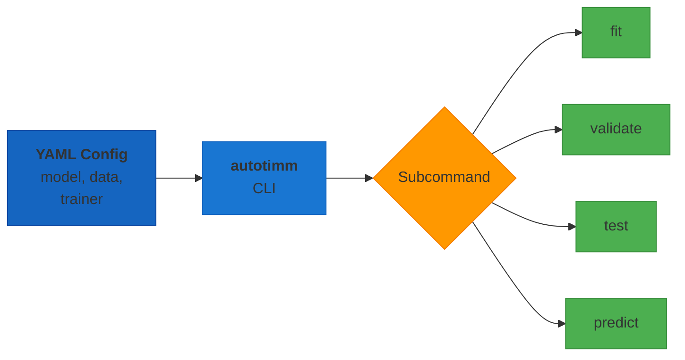

# Command-Line Interface (CLI)

AutoTimm provides a YAML-config-driven command-line interface built on [LightningCLI](https://lightning.ai/docs/pytorch/stable/cli/lightning_cli.html). Train, validate, test, and run predictions without writing Python scripts.

## CLI Workflow



## Installation

The CLI is available after installing AutoTimm. The only additional dependency is `jsonargparse`, which is included automatically:

```bash
pip install autotimm
```

## Quick Start

### 1. Create a Config File

```yaml title="config.yaml"
model:
  class_path: autotimm.ImageClassifier
  init_args:
    backbone: resnet18
    num_classes: 10

data:
  class_path: autotimm.ImageDataModule
  init_args:
    dataset_name: CIFAR10
    data_dir: ./data
    batch_size: 32
    image_size: 224
    num_workers: 4

trainer:
  max_epochs: 10
  accelerator: auto
  devices: auto
  precision: 32
```

### 2. Train

```bash
autotimm fit --config config.yaml
```

Or using the Python module:

```bash
python -m autotimm fit --config config.yaml
```

### 3. Override Parameters

Any config value can be overridden from the command line:

```bash
autotimm fit --config config.yaml \
    --model.init_args.lr 0.001 \
    --trainer.max_epochs 20 \
    --trainer.precision "bf16-mixed"
```

## Subcommands

| Subcommand | Description |
|------------|-------------|
| `fit` | Train the model (with optional auto-tuning) |
| `validate` | Run one validation epoch |
| `test` | Run one test epoch |
| `predict` | Run inference |

### Training

```bash
autotimm fit --config config.yaml
```

### Validation & Testing

```bash
autotimm validate --config config.yaml --ckpt_path path/to/checkpoint.ckpt
autotimm test --config config.yaml --ckpt_path path/to/checkpoint.ckpt
```

### Prediction

```bash
autotimm predict --config config.yaml --ckpt_path path/to/checkpoint.ckpt
```

## Getting Help

```bash
# Show available subcommands
autotimm --help

# Show all options for training
autotimm fit --help

# Print the resolved config (useful for debugging)
autotimm fit --config config.yaml --print_config
```

## Config File Structure

A config file has three main sections: `model`, `data`, and `trainer`.

### Model Section

Specify the task class and its arguments:

```yaml
model:
  class_path: autotimm.ImageClassifier  # or ObjectDetector, SemanticSegmentor, etc.
  init_args:
    backbone: resnet50
    num_classes: 10
    lr: 0.001
```

**Available task classes:**

| Class Path | Task |
|------------|------|
| `autotimm.ImageClassifier` | Image classification (single & multi-label) |
| `autotimm.ObjectDetector` | FCOS-style object detection |
| `autotimm.YOLOXDetector` | Official YOLOX object detection |
| `autotimm.SemanticSegmentor` | Semantic segmentation |
| `autotimm.InstanceSegmentor` | Instance segmentation |

### Data Section

Specify the data module and its arguments:

```yaml
data:
  class_path: autotimm.ImageDataModule  # or DetectionDataModule, etc.
  init_args:
    data_dir: ./data
    batch_size: 32
    image_size: 224
```

**Available data modules:**

| Class Path | Task |
|------------|------|
| `autotimm.ImageDataModule` | Image classification |
| `autotimm.MultiLabelImageDataModule` | Multi-label classification |
| `autotimm.DetectionDataModule` | Object detection |
| `autotimm.SegmentationDataModule` | Semantic segmentation |
| `autotimm.InstanceSegmentationDataModule` | Instance segmentation |

### Trainer Section

All `AutoTrainer` parameters are available:

```yaml
trainer:
  max_epochs: 10
  accelerator: auto
  devices: auto
  precision: 32
  seed: 42
  deterministic: true
  tuner_config: false
  enable_checkpointing: true
  logger: false
  fast_dev_run: false
```

## Task-Specific Examples

### Image Classification

```yaml title="classification.yaml"
model:
  class_path: autotimm.ImageClassifier
  init_args:
    backbone: efficientnet_b0
    num_classes: 10
    lr: 0.001

data:
  class_path: autotimm.ImageDataModule
  init_args:
    dataset_name: CIFAR10
    data_dir: ./data
    batch_size: 64
    image_size: 224
    num_workers: 4

trainer:
  max_epochs: 20
  accelerator: auto
  tuner_config: false
```

### Object Detection

```yaml title="detection.yaml"
model:
  class_path: autotimm.ObjectDetector
  init_args:
    backbone: resnet50
    num_classes: 80
    detection_arch: fcos
    fpn_channels: 256
    lr: 0.01

data:
  class_path: autotimm.DetectionDataModule
  init_args:
    data_dir: ./coco
    image_size: 640
    batch_size: 8

trainer:
  max_epochs: 50
  accelerator: auto
  precision: "16-mixed"
```

### Semantic Segmentation

```yaml title="segmentation.yaml"
model:
  class_path: autotimm.SemanticSegmentor
  init_args:
    backbone: resnet50
    num_classes: 19
    head_type: deeplabv3plus
    lr: 0.01

data:
  class_path: autotimm.SegmentationDataModule
  init_args:
    data_dir: ./cityscapes
    format: cityscapes
    image_size: 512
    batch_size: 4

trainer:
  max_epochs: 100
  accelerator: auto
```

## Tips

### Quick Smoke Test

Use `fast_dev_run` to verify your config works before a full training run:

```bash
autotimm fit --config config.yaml --trainer.fast_dev_run true
```

### Disable Auto-Tuning

AutoTrainer enables auto-tuning by default. Disable it in the config or from the CLI:

```bash
autotimm fit --config config.yaml --trainer.tuner_config false
```

### Use HuggingFace Hub Models

Specify HF Hub models in the backbone field:

```yaml
model:
  class_path: autotimm.ImageClassifier
  init_args:
    backbone: "hf-hub:timm/convnext_base.fb_in22k_ft_in1k"
    num_classes: 100
```

### Combine Multiple Configs

LightningCLI supports multiple `--config` flags for composing configs:

```bash
autotimm fit --config base.yaml --config overrides.yaml
```

---

See also: [AutoTrainer API](../../api/trainer.md) | [CLI API Reference](../../api/cli.md) | [Example Configs](https://github.com/theja-vanka/AutoTimm/tree/main/examples/cli)
