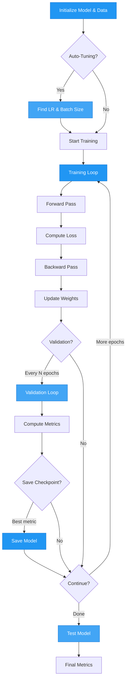

# Training

AutoTimm provides `AutoTrainer`, a configured PyTorch Lightning Trainer with sensible defaults and built-in support for auto-tuning, logging, and checkpointing.

## Training Workflow



## AutoTrainer

### Basic Training

```python
from autotimm import AutoTrainer

trainer = AutoTrainer(max_epochs=10)
trainer.fit(model, datamodule=data)
trainer.test(model, datamodule=data)
```

### With Checkpointing

Save the best model based on a metric:

```python
trainer = AutoTrainer(
    max_epochs=10,
    checkpoint_monitor="val/accuracy",
    checkpoint_mode="max",  # "max" for accuracy, "min" for loss
)
```

### GPU Training

```python
trainer = AutoTrainer(
    max_epochs=10,
    accelerator="gpu",
    devices=1,
)
```

### Mixed Precision

Speed up training with mixed precision:

```python
trainer = AutoTrainer(
    max_epochs=10,
    precision="bf16-mixed",  # or "16-mixed" for fp16
)
```

## Fast Development Run

Quickly test your code by running a single batch through training, validation, and testing:

```python
# Run 1 batch only (for debugging)
trainer = AutoTrainer(fast_dev_run=True)
trainer.fit(model, datamodule=data)

# Run N batches for more thorough testing
trainer = AutoTrainer(fast_dev_run=5)
trainer.fit(model, datamodule=data)
```

This is useful for:
- **Debugging**: Catch errors quickly without waiting for full epochs
- **Testing code changes**: Verify your model runs end-to-end
- **Development**: Iterate faster when building new features

## Auto-Tuning

### TunerConfig

Automatically find optimal learning rate and batch size:

```python
from autotimm import AutoTrainer, TunerConfig

trainer = AutoTrainer(
    max_epochs=10,
    tuner_config=TunerConfig(
        auto_lr=True,
        auto_batch_size=True,
        lr_find_kwargs={"min_lr": 1e-6, "max_lr": 1.0, "num_training": 100},
        batch_size_kwargs={"mode": "power", "init_val": 16},
    ),
)

trainer.fit(model, datamodule=data)  # Runs tuning before training
```

### LR Finding Only

```python
trainer = AutoTrainer(
    max_epochs=10,
    tuner_config=TunerConfig(
        auto_lr=True,
        auto_batch_size=False,
    ),
)
```

### TunerConfig Parameters

| Parameter | Description |
|-----------|-------------|
| `auto_lr` | Enable learning rate finder |
| `auto_batch_size` | Enable batch size finder |
| `lr_find_kwargs` | `min_lr`, `max_lr`, `num_training`, `mode`, `early_stop_threshold` |
| `batch_size_kwargs` | `mode` ("power" or "binsearch"), `steps_per_trial`, `init_val`, `max_trials` |

## Multi-GPU Training

### Data Parallel (DDP)

```python
trainer = AutoTrainer(
    max_epochs=10,
    accelerator="gpu",
    devices=2,              # Number of GPUs
    strategy="ddp",         # Distributed Data Parallel
    precision="bf16-mixed",
)
```

### Multi-Node Training

```python
trainer = AutoTrainer(
    max_epochs=10,
    accelerator="gpu",
    devices=4,
    num_nodes=2,            # 2 nodes with 4 GPUs each
    strategy="ddp",
)
```

## Gradient Accumulation

Simulate larger batches on limited memory:

```python
trainer = AutoTrainer(
    max_epochs=10,
    accumulate_grad_batches=4,  # Effective batch = batch_size * 4
)
```

## Gradient Clipping

Prevent exploding gradients:

```python
trainer = AutoTrainer(
    max_epochs=10,
    gradient_clip_val=1.0,      # Clip to max norm of 1.0
)
```

## Validation Frequency

Control how often validation runs:

```python
# Every epoch (default)
trainer = AutoTrainer(max_epochs=10, val_check_interval=1.0)

# Every 500 steps
trainer = AutoTrainer(max_epochs=10, val_check_interval=500)

# Every 25% of an epoch
trainer = AutoTrainer(max_epochs=10, val_check_interval=0.25)
```

## Callbacks

Add custom callbacks:

```python
from pytorch_lightning.callbacks import EarlyStopping, LearningRateMonitor

trainer = AutoTrainer(
    max_epochs=100,
    callbacks=[
        EarlyStopping(monitor="val/loss", patience=10, mode="min"),
        LearningRateMonitor(logging_interval="step"),
    ],
)
```

## Resume Training

Resume from a checkpoint:

```python
trainer = AutoTrainer(max_epochs=20)
trainer.fit(model, datamodule=data, ckpt_path="path/to/checkpoint.ckpt")
```

## Full Training Example

```python
from autotimm import (
    AutoTrainer,
    ImageClassifier,
    ImageDataModule,
    LoggerConfig,
    LoggingConfig,
    MetricConfig,
    TunerConfig,
)
from pytorch_lightning.callbacks import EarlyStopping

# Data
data = ImageDataModule(
    data_dir="./data",
    dataset_name="CIFAR10",
    image_size=224,
    batch_size=64,
    num_workers=8,
)

# Metrics
metrics = [
    MetricConfig(
        name="accuracy",
        backend="torchmetrics",
        metric_class="Accuracy",
        params={"task": "multiclass"},
        stages=["train", "val", "test"],
        prog_bar=True,
    ),
]

# Model with enhanced logging
model = ImageClassifier(
    backbone="resnet50",
    num_classes=10,
    metrics=metrics,
    logging_config=LoggingConfig(
        log_learning_rate=True,
        log_gradient_norm=True,
    ),
)

# Trainer with all features
trainer = AutoTrainer(
    max_epochs=50,
    accelerator="gpu",
    devices=1,
    precision="bf16-mixed",
    logger=[LoggerConfig(backend="tensorboard", params={"save_dir": "logs"})],
    tuner_config=TunerConfig(auto_lr=True, auto_batch_size=False),
    checkpoint_monitor="val/accuracy",
    gradient_clip_val=1.0,
    callbacks=[EarlyStopping(monitor="val/loss", patience=10, mode="min")],
)

trainer.fit(model, datamodule=data)
trainer.test(model, datamodule=data)
```

## Optimizers and Schedulers

### Available Optimizers

AutoTimm supports all PyTorch and timm optimizers. Use `list_optimizers()` to discover available options:

```python
import autotimm

# List all optimizers
optimizers = autotimm.list_optimizers()
print("PyTorch optimizers:", optimizers["torch"])
print("Timm optimizers:", optimizers.get("timm", []))
```

**Common optimizers:**

- **AdamW** (recommended): `optimizer="adamw"`
- **SGD**: `optimizer="sgd"`
- **AdamP** (timm): `optimizer="adamp"`
- **LAMB** (timm): `optimizer="lamb"`

### Available Schedulers

Use `list_schedulers()` to discover available learning rate schedulers:

```python
# List all schedulers
schedulers = autotimm.list_schedulers()
print("PyTorch schedulers:", schedulers["torch"])
print("Timm schedulers:", schedulers.get("timm", []))
```

**Common schedulers:**

- **CosineAnnealingLR**: `scheduler="cosineannealinglr"`
- **CosineAnnealingWarmRestarts**: `scheduler="cosineannealingwarmrestarts"`
- **MultiStepLR**: `scheduler="multisteplr"`
- **OneCycleLR**: `scheduler="onecyclelr"`
- **ReduceLROnPlateau**: `scheduler="reducelronplateau"`
- **StepLR**: `scheduler="steplr"`

### Using Custom Optimizers

```python
model = ImageClassifier(
    backbone="resnet50",
    num_classes=10,
    metrics=metrics,
    optimizer="adamw",  # or any optimizer from list_optimizers()
    lr=1e-3,
    weight_decay=1e-4,
)
```

### Using Custom Schedulers

```python
model = ImageClassifier(
    backbone="resnet50",
    num_classes=10,
    metrics=metrics,
    lr=1e-3,
    scheduler="cosineannealinglr",
    scheduler_kwargs={"T_max": 50, "eta_min": 1e-6},
)

# MultiStepLR scheduler
model = ImageClassifier(
    backbone="resnet50",
    num_classes=10,
    metrics=metrics,
    lr=1e-3,
    scheduler="multisteplr",
    scheduler_kwargs={"milestones": [30, 60, 90], "gamma": 0.1},
)
```

## Object Detection Training

Object detection models have different training requirements compared to classification models.

### Standard COCO Training

```python
from autotimm import AutoTrainer, DetectionDataModule, ObjectDetector, MetricConfig

# Data
data = DetectionDataModule(
    data_dir="./coco",
    image_size=640,
    batch_size=16,
    augmentation_preset="default",
)

# Metrics
metrics = [
    MetricConfig(
        name="mAP",
        backend="torchmetrics",
        metric_class="MeanAveragePrecision",
        params={"box_format": "xyxy", "iou_type": "bbox"},
        stages=["val", "test"],
        prog_bar=True,
    ),
]

# Model
model = ObjectDetector(
    backbone="resnet50",
    num_classes=80,
    metrics=metrics,
    lr=1e-4,
    scheduler="multistep",
    scheduler_kwargs={"milestones": [8, 11], "gamma": 0.1},
)

# Trainer - gradient clipping is important for detection
trainer = AutoTrainer(
    max_epochs=12,
    gradient_clip_val=1.0,
    checkpoint_monitor="val/map",
    checkpoint_mode="max",
)

trainer.fit(model, datamodule=data)
```

### Two-Phase Detection Training (Recommended)

For better results, train the detection head first, then fine-tune the entire model:

```python
# Phase 1: Train FPN and detection head only (3-5 epochs)
model = ObjectDetector(
    backbone="resnet50",
    num_classes=80,
    metrics=metrics,
    freeze_backbone=True,  # Freeze backbone
    lr=1e-3,               # Higher LR for head-only training
)

trainer_phase1 = AutoTrainer(max_epochs=3)
trainer_phase1.fit(model, datamodule=data)

# Phase 2: Fine-tune entire model (12 epochs)
for param in model.backbone.parameters():
    param.requires_grad = True

model._lr = 1e-4  # Lower LR for full model training

trainer_phase2 = AutoTrainer(
    max_epochs=12,
    gradient_clip_val=1.0,
    checkpoint_monitor="val/map",
    checkpoint_mode="max",
)
trainer_phase2.fit(model, datamodule=data)
```

### Transformer-Based Detection

When using Vision Transformers for detection:

```python
# Smaller batch size for transformers
data = DetectionDataModule(
    data_dir="./coco",
    image_size=640,
    batch_size=8,  # Reduced from 16
)

# Lower learning rate for transformers
model = ObjectDetector(
    backbone="swin_tiny_patch4_window7_224",
    num_classes=80,
    metrics=metrics,
    lr=1e-5,  # Lower LR than CNNs
    scheduler="cosine",
)

# Gradient clipping is even more important with transformers
trainer = AutoTrainer(
    max_epochs=12,
    gradient_clip_val=1.0,
    precision="bf16-mixed",  # Mixed precision helps with memory
)
```

### Detection Training Tips

**Batch Size:**

- CNNs: 16-32 (depends on GPU memory)
- Transformers: 4-16 (higher memory requirements)
- Use gradient accumulation if you need larger effective batch sizes

**Learning Rate:**

- CNN backbones: 1e-4 (standard)
- Transformer backbones: 1e-5 (lower)
- Frozen backbone (head-only): 1e-3 (higher)

**Gradient Clipping:**

- Always use `gradient_clip_val=1.0` for detection
- Prevents gradient explosions, especially with transformers

**Scheduler:**

- MultiStep: Standard for COCO (drop at 8 and 11 epochs for 12-epoch training)
- Cosine: Alternative that works well with transformers

**Image Size:**

- Standard: 640×640 for COCO
- Smaller objects: Try 800×800 or 1024×1024
- Faster training: 512×512

## Full Parameter Reference

```python
AutoTrainer(
    max_epochs=10,                  # Training epochs
    accelerator="auto",             # "auto", "gpu", "cpu", "tpu"
    devices="auto",                 # Number of devices or "auto"
    precision=32,                   # 32, 16, "bf16-mixed", "16-mixed"
    logger=False,                   # LoggerManager, list of LoggerConfig, or False
    tuner_config=None,              # TunerConfig for auto-tuning
    checkpoint_monitor=None,        # Metric to monitor for checkpointing
    checkpoint_mode="max",          # "max" or "min"
    callbacks=None,                 # List of Lightning callbacks
    default_root_dir=".",           # Root directory for logs/checkpoints
    gradient_clip_val=None,         # Gradient clipping value
    accumulate_grad_batches=1,      # Gradient accumulation steps
    val_check_interval=1.0,         # Validation frequency
    enable_checkpointing=True,      # Save checkpoints
    fast_dev_run=False,             # True, False, or int (number of batches)
    # ... any other pl.Trainer argument
)
```
